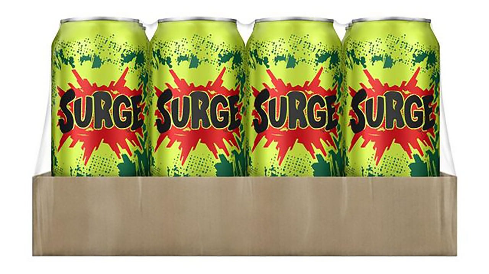

# Surge

Here, we Surge. Ever heard of the Cola? Yeah. Like that, but proving. Proving zero-knowledge succinctness things.

# Todo
- [ ] Generalize `SubtableEvaluations` beyond eq table
- [ ] Generalize `Densified.materialize_table()` beyond eq: Evaluate $T[k] \forall k \in [0, ... M]$ 
- [ ] Generalize `SparseLookupMatrix.evaluate_mle()` beyond eq (reuse `Densified.materialize_table()`)
- [ ] Investigate multiple dense PCS (notably IPA)
- [ ] Investigate MSM speedups ([paper](https://eprint.iacr.org/2022/1400.pdf), [arkworks](https://github.com/arkworks-rs/algebra/blob/c015ea331674368461ff466bc7cbc69806f61628/ec/src/scalar_mul/variable_base/mod.rs#L112-L122))

# Table construction options
- `Densified` generic param: `DensifiedRepresentation<F: PrimeField, const C: usize, T: TableConstructor>` 

## Questions
- Deal with 'k' cleanly?