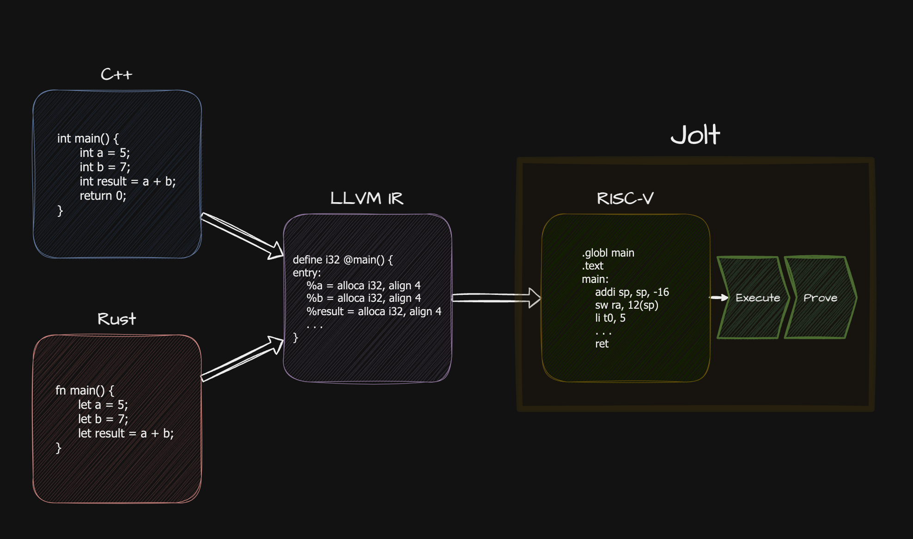

# RISC-V

[RISC-V](https://en.wikipedia.org/wiki/RISC-V) is an open source [instruction set architecture](https://en.wikipedia.org/wiki/Instruction_set_architecture) (ISA) based on established [reduced instruction set computer](https://en.wikipedia.org/wiki/Reduced_instruction_set_computer) (RISC) principles. Every RISC-V implementation must include the base integer ISA, with optional extensions available for additional functionality.

Jolt implements the base RISC-V instruction set, making it a RISC-V-compliant virtual machine. This means Jolt can execute and prove any code that compiles to RISC-V.

## Supported Instruction Sets
#### **`Current ISA Configuration: RV32IM`**

### Base Sets
#### __RV32I__
The RV32I is the base 32-bit integer instruction set. It's designed to be sufficient for a complete software toolchain while being simple and minimal. Everything else in RISC-V (multiplication, floating point, atomic operations)q is built as extensions on top of this base ISA.
##### Key properties:
- 32-bit fixed-width instructions

- 32 integer registers (`x0-x31`), where `x0` is hardwired to zero. Register `x1/ra` is reserved for return address linkage by jump-and-link instructions, `x2/sp` is conventionally used as __stack pointer__. Each register is 32 bits wide and used for both integer and memory address computations.

- 32-bit address space (byte-addressed and little-endian). Memory accesses can be to byte (8-bit), halfword (16-bit), or word (32-bit) sized values

- Basic arithmetic operations (add, subtract, shift, logical operations)

- Load/store architecture means memory can only be accessed through dedicated load and store instructions - all other instructions operate only on registers

- Simple addressing mode of base register plus 12-bit signed immediate offset. No complex memory addressing modes or memory-to-memory operations

- Conditional branches and jumps are supported

For detailed instruction formats and encoding, refer to the __chapter 2__ of [specification](https://riscv.org/wp-content/uploads/2019/12/riscv-spec-20191213.pdf)

### Extensions
#### __"M" Standard Extension for Integer Multiplication and Division__

##### Key properties:

- Multiplication operations generate 32-bit (lower) or 64-bit (full) results

- Separate signed and unsigned multiply instructions

- Hardware division with both signed and unsigned variants

- All operations work on values in integer registers

- Divide-by-zero results in a well-defined result (maximum unsigned value)

- Maintains the simple register-based architecture of RV32I

- Results always written to a single 32-bit register (for upper/lower multiplication results, two separate instructions are used)

- All instructions in this extension are encoded in the standard 32-bit RISC-V format

##### Core Operations:

- `MUL`: Multiplication, lower 32-bit result

- `MULH/MULHU/MULHSU`: Upper 32-bit multiplication (signed×signed, unsigned×unsigned, signed×unsigned)

- `DIV/DIVU`: Signed and unsigned division

- `REM/REMU`: Signed and unsigned remainder

For detailed instruction formats and encoding, refer to __chapter 7__ of [specification](https://riscv.org/wp-content/uploads/2019/12/riscv-spec-20191213.pdf)

## LLVM
[LLVM](https://llvm.org/) is a versatile compiler infrastructure that supports a variety of languages and architectures. RISC-V is fully supported by the LLVM compiler infrastructure:
- Official RISC-V backend in LLVM

- Support for all standard extensions (M, A, F, D, C)

- Integration with standard LLVM tools (clang, lld, lldb)

- Support for both 32-bit and 64-bit targets

One of the key features of LLVM is its __Intermediate Representation (IR)__. IR serves as a bridge between high-level languages and machine code.
This means any language that compiles to LLVM IR (like C, C++, Rust, etc.) can be compiled to RISC-V and subsequently proven by jolt:

## References
- [RISC-V Specifications](https://riscv.org/technical/specifications/)
- [RV32I Base ISA Specification](https://github.com/riscv/riscv-isa-manual/releases/download/Ratified-IMAFDQC/riscv-spec-20191213.pdf)
- [RISC-V Assembly Programmer's Manual](https://github.com/riscv-non-isa/riscv-asm-manual/blob/main/src/asm-manual.adoc)
- [LLVM RISC-V Backend Documentation](https://llvm.org/docs/RISCVUsage.html)
