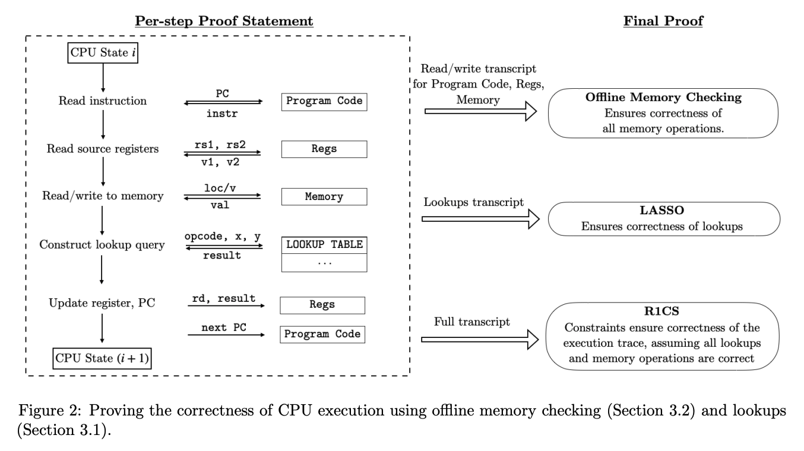
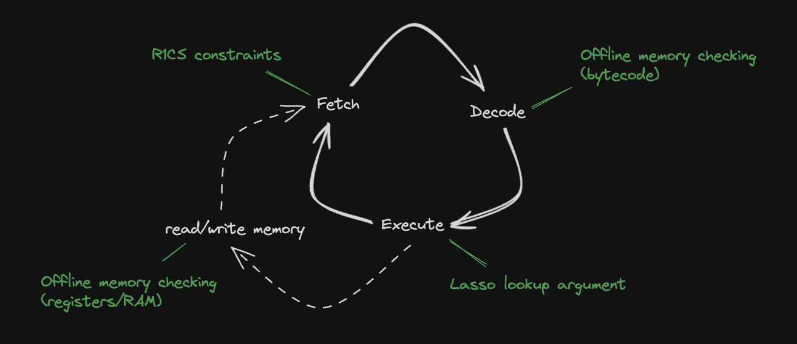

# Architecture overview

This section gives an overview of the core components of Jolt.

## Jolt's four components

A VM does two things:

- Repeatedly execute the fetch-decode-execute logic of its instruction set architecture.
- Perform reads and writes to Random Access Memory (RAM).

The Jolt paper depicts these two tasks mapped to three components in the final Jolt proof:

The Jolt codebase is similarly organized, but instead separates read-write memory (comprising registers and RAM) from program code (aka bytecode, which is read-only), for a total of four components:

### Read-write memory

To handle reads/writes to RAM (and registers) Jolt uses a memory checking argument from Spice, which is closely related to Lasso itself. They are both based on "offline memory checking" techniques, the main difference being that Lasso supports read-only memory while [Spice](https://eprint.iacr.org/2018/907.pdf) supports read-write memory, making it slightly more expensive. This is implemented in [`read_write_memory.rs`](https://github.com/a16z/jolt/blob/main/jolt-core/src/jolt/vm/read_write_memory.rs).

*For more details: [Read-write memory](./read_write_memory.md)*

### R1CS constraints

To handle the "fetch" part of the fetch-decode-execute loop, there is a minimal R1CS instance (about 60 constraints per cycle of the RISC-V VM). These constraints handle program counter (PC) updates and serves as the "glue" enforcing consistency between polynomials used in the components below. Jolt uses [Spartan](https://eprint.iacr.org/2019/550), optimized for the highly-structured nature of the constraint system (e.g., the R1CS constraint matrices are block-diagonal with blocks of size only about 60 x 80). This is implemented in [jolt-core/src/r1cs](../../../jolt-core/src/r1cs/).

*For more details: [R1CS constraints](./r1cs_constraints.md)*

### Instruction lookups

To handle the "execute" part of the fetch-decode-execute loop, Jolt invokes the Lasso lookup argument. The lookup argument maps every instruction (including its operands) to its output. This is implemented in [instruction_lookups.rs](https://github.com/a16z/jolt/blob/main/jolt-core/src/jolt/vm/instruction_lookups.rs).

*For more details: [Instruction lookups](./instruction_lookups.md)*

### Bytecode

To handle the "decode" part of the fetch-decode-execute loop, Jolt uses another instance of (read-only) offline memory-checking, similar to Lasso. The bytecode of the guest program is "decoded" in preprocessing, and the prover subsequently invokes offline memory-checking on the sequence of reads from this decoded bytecode corresponding to the execution trace being proven. This is implemented in [bytecode.rs](https://github.com/a16z/jolt/blob/main/jolt-core/src/jolt/vm/bytecode.rs).

*For more details: [Bytecode](./bytecode.md)*
