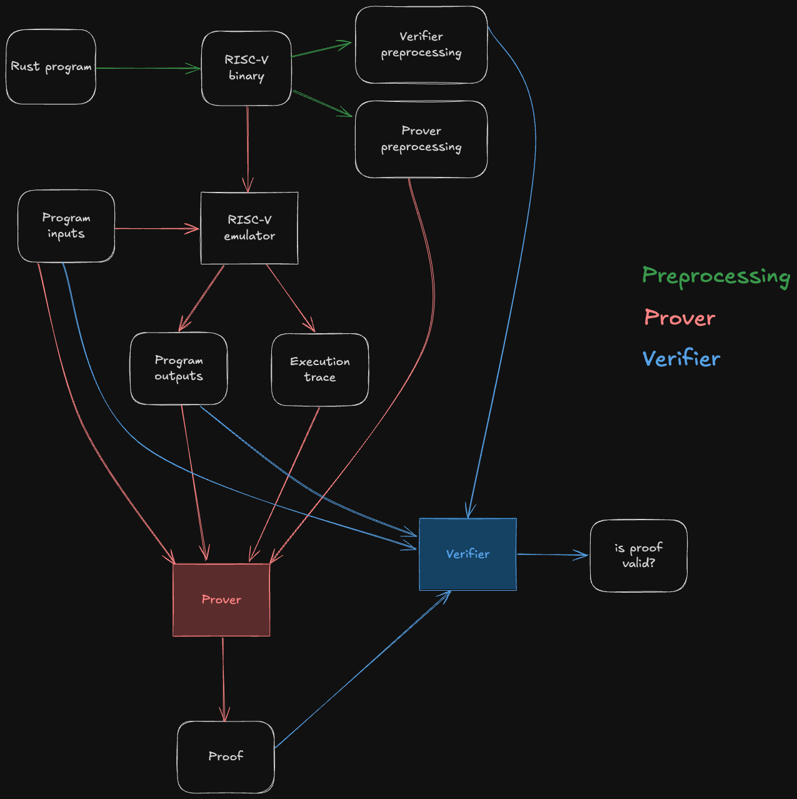
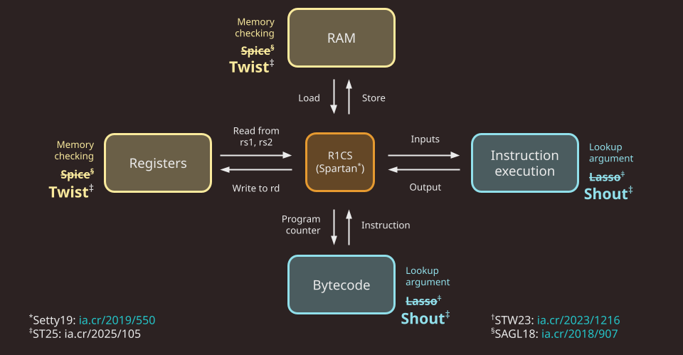
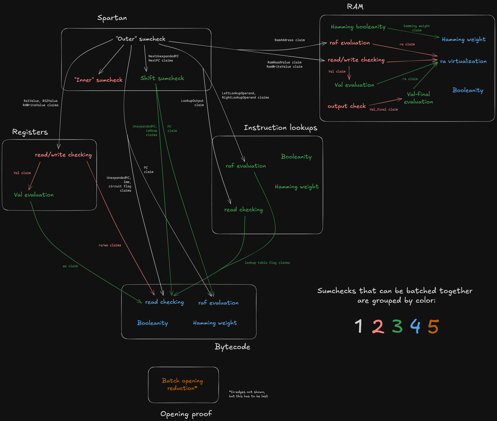

# Architecture overview

This section gives a overview of the architecture of the Jolt codebase.

The following diagram depicts the end-to-end Jolt pipeline, which is typical of RISC-V zkVMs.

The green steps correspond to **preprocessing** steps, which can be computed ahead of time from the guest program's bytecode.
Note that they do not depend on the program inputs, so the preprocessing data can be reused across multiple invocations of the Jolt prover/verifier.

The red steps correspond to the **prover's** workflow: it runs the guest program on some inputs inside of a [RISC-V emulator](./emulation.md), producing the output of the program as well as an execution trace.
This execution trace, along with the inputs, outputs, and preprocessing, are then passed to the Jolt prover, which uses them to generate a succinct proof that the outputs are the result of correctly executing the given guest program on the inputs.

The blue steps correspond to the **verifier's** workflow. The verifier does _not_ emulate the guest program, not does it receive the execution trace (which may be billions of cycles long) from the prover. Instead, it receives the proof from the prover, and uses it to check that the guest program produces claimed  outputs when run on the given inputs.

For the sake of readability, the diagram above abstracts away all of Jolt's proof system machinery.
The rest of this section aims to disassemble the underlying machinery in useful-but-not-overwhelming detail.

As a starting point, we will present two useful mental models of the Jolt proof system: Jolt as a CPU, and Jolt as a DAG (a different DAG than the one above; we love DAGs).

## Jolt as a CPU

One way to understand Jolt is to map the components of the proof system to the components of the virtual machine (VM) whose functionality they prove.

### Jolt's five components

A VM does two things:

- Repeatedly execute the fetch-decode-execute logic of its instruction set architecture.
- Perform reads and writes to memory.

The Jolt paper depicts these two tasks mapped to three components in the Jolt proof system:

The Jolt codebase is similarly organized, but instead distinguishes read-write memory (comprising registers and RAM) from program code (aka bytecode, which is read-only), for a total of five components:

Note that in Jolt as described in the paper, as well as in the first version of the Jolt implementation ([v0.1.0](../appendix/jolt-classic.md)), the memory checking and lookup argument used are [Spice](https://eprint.iacr.org/2018/907) and [Lasso](https://eprint.iacr.org/2023/1216), respectively. As of v0.2.0, Jolt replaces Spice and Lasso with [Twist and Shout](../twist-shout.md), respectively.

#### R1CS constraints

To handle the "fetch" part of the fetch-decode-execute loop, there is a minimal R1CS instance (about 30 constraints per cycle of the RISC-V VM). These constraints handle program counter (PC) updates and serves as the "glue" enforcing consistency between polynomials used in the components below. Jolt uses [Spartan](https://eprint.iacr.org/2019/550), optimized for the highly-structured nature of the constraint system (i.e. the same small set of constraints are applied to every cycle in the execution trace).

*For more details: [R1CS constraints](./r1cs_constraints.md)*

#### RAM

To handle reads/writes to RAM Jolt uses the Twist memory checking argument.

*For more details: [RAM](./ram.md)*

#### Registers

Similar to RAM, Jolt uses the Twist memory checking argument to handle reads/writes to registers.

*For more details: [Registers](./registers.md)*

#### Instruction execution

To handle the "execute" part of the fetch-decode-execute loop, Jolt invokes the Shout lookup argument. The lookup table, in this case, effectively maps every instruction to its correct output.

*For more details: [Instruction execution](./instruction_execution.md)*

#### Bytecode

To handle the "decode" part of the fetch-decode-execute loop, Jolt uses another instance of Shout. The bytecode of the guest program is "decoded" in preprocessing, and the prover subsequently invokes offline memory-checking on the sequence of reads from this decoded bytecode corresponding to the execution trace being proven.

*For more details: [Bytecode](./bytecode.md)*

## Jolt as a DAG

One useful way to understand Jolt is to view it as a directed acyclic graph (DAG). That might sound surprising -- how can a zkVM be represented as a DAG? The key lies in the structure of its sumchecks, and in particular, the role of virtual polynomials.

### Virtual vs. Committed Polynomials

**Virtual polynomials**, introduced in the [Binius paper](https://eprint.iacr.org/2023/1784), are used heavily in Jolt.

A virtual polynomial is a part of the witness that is never committed directly. Instead, any claimed evaluation of a virtual polynomial is proven by a subsequent sumcheck.
In contrast, committed polynomials are committed to explicitly and their evaluaions are proven using the opening proof of the PCS.

### Sumchecks as Nodes

Each sumcheck in Jolt corresponds to a node in the DAG. Consider the following hypothetical sumcheck expression:

$$
\textsf{InputClaim} \stackrel{?}{=} \sum_{x \in \{0,1\}^n} f(x) \cdot g(x) + h(x)
$$

Here, the left-hand side is the input claim, and the right-hand side is a sum over the Boolean hypercube of a multivariate polynomial of degree 2, involving three multilinear terms $f$, $g$, and $h$.
The sumcheck protocol reduces this _input_ claim to three _output_ claims about $f$, $g$, and $h$:

$$
  \textsf{OutputClaim}_f \stackrel{?}{=} f(r) \\
  \textsf{OutputClaim}_g \stackrel{?}{=} g(r) \\
  \textsf{OutputClaim}_h \stackrel{?}{=} h(r)
$$

where $r \in \mathbb{F}^n$ consists of the random challenges obtained over the course of the sumcheck.

An output claim of one sumcheck might be the input claim of another sumcheck.
Recall that [by definition](#virtual-vs-committed-polynomials), the output claim for a virtual polynomial is necessarily the input claim of another sumcheck.

It follows that input claims can be viewed as in-edges and output claims as out-edges, thus defining the graph structure. This is what the Jolt sumcheck dag looks like:

Note the white boxes corresponding to the five components of Jolt under the CPU paradigm –– plus an extra component for the [opening proof](./opening-proof.md), which doesn't have a CPU analogue.

In the diagaram above, sumchecks are color-coded based on "batch"; sumchecks in the same batch are "run in parallel" (see [Batched sumcheck](../optimizations/batched-sumcheck.md)).
Note that a given component may include sumchecks in different batches. For example, the three sumchecks in Spartan span stages 1, 2, and 3.

This is codified by the `SumcheckStages` trait, which defines methods `stage1_prove`, `stage1_verify`, `stage2_prove`, `stage2_verify`, etc.
Each component implements `SumcheckStages`, declaring each sumcheck in its subgraph and which stage it belongs to. Observe that the DAG defines a partial ordering over the nodes (sumchecks), which consequently defines the minimum number of batches -- two sumchecks cannot be batched together if one "depends" on the other.

The batched opening proof subprotocol involves a batched sumcheck which is necessarily last (i.e. stage 5), because its input claims are obtained from all the committed polynomial evaluations from the previous stages.
For more details on the batched opening proof subprotocol, see [Opening proof](./opening-proof.md).

### Managing state and data flow

The `StateManager` is responsible for tracking and managing the state persisted across all the sumcheck stages in Jolt.
In particular, it contains an `Openings` map to manage the flow of claimed evaluations –– the edges of the DAG. It's a mapping from an `OpeningId` to a claimed polynomial evaluation. As sumchecks are proven, their output claims (for both virtual and committed polynomials) are inserted into the map. Later sumchecks can then consume the virtual polynomial openings as input claims.

While virtual polynomial claims are used internally and passed between sumchecks, committed polynomial claims are tracked because they must ultimately be verified via a batched [Dory](../dory.md) opening proof at the end of the protocol.
