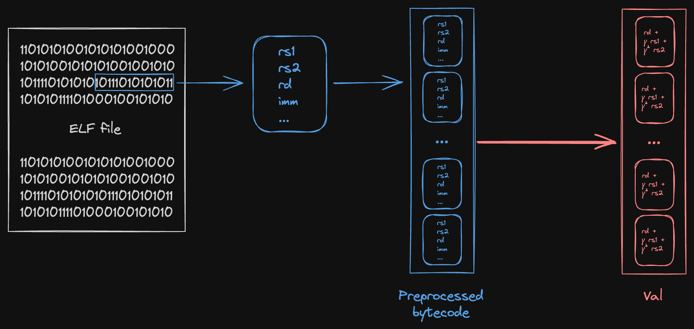

# Bytecode

At each cycle of the RISC-V virtual machine, the current instruction (as indicated by the program counter) is "fetched" from the bytecode and decoded.
In Jolt, this is proven by treating the bytecode as a lookup table, and fetches as lookups.
To prove the correctness of these lookups, we use the [Shout](../twist-shout.md) lookup argument.

One distinguishing feature of the bytecode Shout instance is that we have multiple instances of the read-checking and $\widetilde{\textsf{raf}}$-evaluation sumchecks.
Intuitively, the bytecode serves as the "ground truth" of what's being executed, so one would expect many virtual polynomial claims to eventually lead back to the bytecode.
And this holds in practice –– in the Jolt sumcheck [DAG](./architecture/architecture.md##sumchecks-as-nodes) diagram, we see that there are five stages of read-checking claims pointing to the bytecode read-checking node, and two RAF (read-at-frequency) evaluation claims folded into stages 1 and 3.

Each stage has its own unique opening point, so having in-edges of different colors implies that multiple instances of that sumcheck must be run in [parallel](../optimizations/batched-sumcheck.md) to prove the different claims.

## Read-checking

Another distinguishing feature of the bytecode Shout instance is that we treat each entry of lookup table as containing a tuple of values, rather than a single value.
Intuitively, this is because each instruction in the bytecode encodes multiple pieces of information: opcode, operands, etc.

The figure below loosely depicts the relationship between bytecode and $\widetilde{\textsf{Val}}$ polynomial.

We start from some ELF file, compiled from the guest program. For each instruction in the ELF (raw bytes), we decode/preprocess the instruction into a structured format containing the individual witness values used in Jolt:

- The instruction operands `rs1`, `rs2`, `rd`, `imm`
- Circuit and lookup table [flags](#flags)
- The instruction [address](#instruction-address)

Then, we compute a [Reed-Solomon fingerprint](https://publish.obsidian.md/matteo/3.+Permanent+notes/Reed-Solomon+Fingerprinting) of some subset of the values in the tuple, depending on what $\widetilde{\textsf{rv}}$ claims are being proven. These fingerprints serve as the coefficients of the $\widetilde{\textsf{Val}}$ polynomial for that read-checking instance.

## Multi-stage Architecture

The bytecode read-checking sumcheck combines five stages of claims into a single batched sumcheck, using two levels of random linear combinations (RLCs):

1. **Stage-level RLC (using $\gamma$)**: Combines the five stages together
2. **Per-stage RLC (using $\beta_s$)**: Combines multiple claims within each stage

The five stages are:

- **Stage 1**: Spartan outer sumcheck claims (program counter, immediate values, circuit flags)
- **Stage 2**: Product virtualization claims (jump/branch flags, register write flags)
- **Stage 3**: Shift sumcheck claims (instruction operand flags, virtual instruction metadata)
- **Stage 4**: Register read-write checking claims (register addresses)
- **Stage 5**: Register value evaluation and instruction lookup claims (register addresses, lookup table flags)

Additionally, RAF (read-at-frequency) claims for the program counter are folded into stages 1 and 3 using the identity polynomial.

### Combined Sumcheck Expression

The overall sumcheck proves the following identity:

$$
\sum_{s=1}^{5} \gamma^{s-1} \cdot \widetilde{\textsf{rv}}_s(r_s) + \gamma^5 \cdot \widetilde{\textsf{raf}}_1(r_1) + \gamma^6 \cdot \widetilde{\textsf{raf}}_3(r_3) = \sum_{j, k} \widetilde{\textsf{ra}}(k, j) \cdot \left[\sum_{s=1}^{5} \gamma^{s-1} \cdot \widetilde{\textsf{eq}}_s(r_s, j) \cdot \widetilde{\textsf{Val}}_s(k) + \gamma^5 \cdot \widetilde{\textsf{eq}}_1(r_1, j) \cdot \widetilde{\textsf{Int}}(k) + \gamma^6 \cdot \widetilde{\textsf{eq}}_3(r_3, j) \cdot \widetilde{\textsf{Int}}(k)\right]
$$

where:
- $k$ ranges over bytecode indices (address space)
- $j$ ranges over cycle indices (time dimension)
- $\widetilde{\textsf{ra}}(k, j)$ is the read access polynomial indicating cycle $j$ accesses bytecode row $k$
- $\widetilde{\textsf{Val}}_s(k)$ is the stage-specific value polynomial encoding instruction data
- $\widetilde{\textsf{Int}}(k) = 1$ for all $k$ (identity polynomial, used for RAF claims)
- $\gamma$ is the stage-folding challenge
- $\beta_s$ challenges are used within each $\widetilde{\textsf{Val}}_s(k)$ to combine multiple sub-claims

Note that the RAF claims use the $\widetilde{\textsf{PC}}$ virtual polynomial (the expanded program counter), not $\widetilde{\textsf{UnexpandedPC}}$.

### Stage Value Polynomials

Each stage has its own $\widetilde{\textsf{Val}}_s(k)$ polynomial that encodes different instruction properties. Using per-stage challenges $\beta_s$, these are defined as:

**Stage 1** (Spartan outer sumcheck):
$$
\widetilde{\textsf{Val}}_1(k) = \texttt{unexpanded\_pc}(k) + \beta_1 \cdot \texttt{imm}(k) + \sum_{t} \beta_1^{2+t} \cdot \texttt{circuit\_flag}_t(k)
$$

**Stage 2** (Product virtualization):
$$
\widetilde{\textsf{Val}}_2(k) = \texttt{jump\_flag}(k) + \beta_2 \cdot \texttt{branch\_flag}(k) + \beta_2^2 \cdot \texttt{is\_rd\_not\_zero}(k) + \beta_2^3 \cdot \texttt{write\_lookup\_to\_rd}(k)
$$

**Stage 3** (Shift sumcheck):
$$
\begin{align*}
\widetilde{\textsf{Val}}_3(k) = &\texttt{imm}(k) + \beta_3 \cdot \texttt{unexpanded\_pc}(k) + \beta_3^2 \cdot \texttt{left\_is\_rs1}(k) \\
&+ \beta_3^3 \cdot \texttt{left\_is\_pc}(k) + \beta_3^4 \cdot \texttt{right\_is\_rs2}(k) + \beta_3^5 \cdot \texttt{right\_is\_imm}(k) \\
&+ \beta_3^6 \cdot \texttt{is\_noop}(k) + \beta_3^7 \cdot \texttt{virtual\_instruction}(k) + \beta_3^8 \cdot \texttt{is\_first\_in\_sequence}(k)
\end{align*}
$$

**Stage 4** (Register read-write checking):
$$
\widetilde{\textsf{Val}}_4(k) = \widetilde{\textsf{eq}}(\texttt{rd}[k], r_\text{register}) + \beta_4 \cdot \widetilde{\textsf{eq}}(\texttt{rs1}[k], r_\text{register}) + \beta_4^2 \cdot \widetilde{\textsf{eq}}(\texttt{rs2}[k], r_\text{register})
$$

**Stage 5** (Register value evaluation and instruction lookups):
$$
\widetilde{\textsf{Val}}_5(k) = \widetilde{\textsf{eq}}(\texttt{rd}[k], r_\text{register}) + \beta_5 \cdot \texttt{not\_interleaved}(k) + \sum_{i} \beta_5^{2+i} \cdot \texttt{lookup\_table\_flag}_i(k)
$$

where:
- $\texttt{unexpanded\_pc}(k)$ is the instruction's ELF/memory address (not the bytecode index $k$)
- $\widetilde{\textsf{eq}}(\texttt{rd}[k], r_\text{register})$ equals 1 if instruction $k$ has destination register $\texttt{rd}[k] = r_\text{register}$, and 0 otherwise
- Similarly for $\texttt{rs1}$ and $\texttt{rs2}$
- Various boolean flags indicate instruction properties (jump, branch, noop, etc.)

### Instruction address

Each instruction in the bytecode has two associated "addresses":

- **Bytecode index $k$**: its index in the **expanded** bytecode. "Expanded" bytecode refers to the preprocessed bytecode, after instructions are expanded to their [virtual sequences](./emulation.md#virtual-instructions-and-sequences). This is what the $\widetilde{\textsf{ra}}(k, j)$ polynomial uses to indicate which bytecode row is accessed.
- **ELF/memory address $\texttt{unexpanded\_pc}(k)$**: its memory address as given by the ELF. All the instructions in a virtual sequence are assigned the address of the "real" instruction they were expanded from. This is stored as part of the instruction data in bytecode row $k$.

The bytecode index $k$ is used for addressing within the sumcheck (the $k$ variable in the double sum).
The ELF address $\texttt{unexpanded\_pc}(k)$ is used to enforce program counter updates in the [R1CS constraints](./r1cs_constraints.md), and is treated as a part of the tuple of values in the preprocessed bytecode.

The "outer" and shift sumchecks in Spartan output claims about the virtual `UnexpandedPC` polynomial, which corresponds to the ELF address. These claims are proven using bytecode read-checking (specifically, they appear in the Stage 1 and Stage 3 value polynomials).

### Flags

There are two types of Boolean flags used in Jolt:

- [Circuit flags](./r1cs_constraints.md#circuit-flags), used in R1CS constraints
- [Lookup table flags](./instruction_execution.md#multiplexing-between-instructions), used in the instruction execution Shout

The associated flags for a given instruction in the bytecode can be computed a priori (i.e. in preprocessing), so any claims about these flags arising from Spartan or instruction execution Shout are also proven using bytecode read-checking. Circuit flags appear in Stages 1, 2, and 3, while lookup table flags appear in Stage 5.

## RAF-evaluation

RAF (read-at-frequency) evaluation claims for the program counter are folded into the multi-stage read-checking sumcheck rather than being handled separately. There are two RAF claims:

- **RAF claim 1**: From the Spartan "outer" sumcheck, folded into Stage 1 with weight $\gamma^5$
- **RAF claim 3**: From the Spartan "shift" sumcheck, folded into Stage 3 with weight $\gamma^6$

The RAF polynomial in the context of bytecode is the expanded program counter ($\widetilde{\textsf{PC}}$), which maps each cycle to the bytecode index being executed. This is distinct from $\widetilde{\textsf{UnexpandedPC}}$, which is the ELF/memory address.

These RAF claims are proven by using the identity polynomial $\widetilde{\textsf{Int}}(k) = 1$ for all $k$, which when multiplied by the appropriate $\widetilde{\textsf{eq}}$ and $\widetilde{\textsf{ra}}$ polynomials, sums to the number of times each bytecode row is accessed—exactly what the RAF evaluation computes.

Note the "offset trick" for Stage 3's RAF weight: the prover uses $\gamma^4 \cdot \texttt{raf\_shift\_claim}$ within the Stage 3 per-stage claim, then the stage itself is folded with outer factor $\gamma^2$, yielding the overall weight $\gamma^6$.

## Sumcheck Structure and Binding Order

The bytecode read-checking sumcheck proceeds in two phases:

### Phase 1: Address Variables (first $\log K$ rounds)

In the first $\log K$ rounds, address variables are bound in **low-to-high** order. During this phase:

1. The $\widetilde{\textsf{Val}}_s(k)$ polynomials for each stage are bound, eventually reducing to scalar values
2. Intermediate "F" polynomials are computed: $F_s[k] = \sum_{j: \texttt{PC}(j) = k} \widetilde{\textsf{eq}}_s(r_s, j)$, representing the weighted frequency that each bytecode row is accessed
3. These F polynomials are also bound during the address phase

The sumcheck univariate in this phase has degree 2 (quadratic).

### Phase 2: Cycle Variables (final $\log T$ rounds)

In the final $\log T$ rounds, cycle variables are bound, also in **low-to-high** order. During this phase:

1. The $\widetilde{\textsf{ra}}(k, j)$ polynomial is computed as a product of $d$ chunked one-hot polynomials: $\widetilde{\textsf{ra}}(k, j) = \prod_{i=0}^{d-1} \texttt{ra}_i(k_i, j)$
2. Each stage uses a `GruenSplitEqPolynomial` to efficiently handle the per-stage $\widetilde{\textsf{eq}}_s$ evaluations
3. The bound $\widetilde{\textsf{Val}}_s$ and $\widetilde{\textsf{Int}}$ values from Phase 1 are used as coefficients

The sumcheck univariate in this phase has degree $d + 1$, which is cubic (degree 3) when $d = 2$.

The chunking parameter $d$ is chosen based on the bytecode size to balance prover time and proof size. Larger $d$ reduces the number of committed RA polynomials but increases the degree (and thus the cost per round) of the sumcheck.

## One-hot checks

Jolt enforces that the $\widetilde{\textsf{ra}}_i$ polynomials used for bytecode Shout are [one-hot](../twist-shout.md#one-hot-polynomials), using a Booleanity and Hamming weight sumcheck as described in the paper.
These implementations follow the Twist and Shout paper closely, with no notable deviations.
