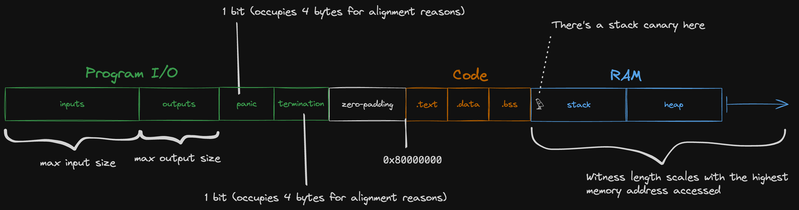

# RAM

Jolt proves the correctness of RAM operations using the [Twist](../twist-shout.md) memory checking algorithm, specifically utilizing the "local" prover algorithm.

## Dynamic parameters

In Twist, the parameter $K$ determines the size of the memory. For RAM, unlike registers, $K$ is dynamic and depends on the memory usage of the guest program.
Consequently, the parameter $d$, dictating how the memory address space is partitioned into chunks, must also be dynamically tuned.
This ensures that no committed polynomial exceeds a maximum size defined by $T \times K^{1/d}$.

Jolt is currently configured so that $K^{1/d} = 2^8$.

## Address remapping

We treat each 4-byte-aligned word in the guest memory as one "cell" for the purposes of memory checking.
Our RISC-V [emulator](./emulation.md) is configured to use `0x80000000` as the DRAM start addresss -- the stack and heap occupy addresses above the start address, while Jolt reserves some memory below the start address for program inputs and outputs.



For the purposes of the memory checking argument, we remap the memory address to a witness index:

```rust
(address - memory_layout.input_start) / 4 + 1
```

where `input_start` is the left-most address depicted in the diagram above.
The division by four reflects the fact that we treat guest memory as "word-addressable" for the purposes of memory-checking.
Any load or store instructions that access less than a full word (e.g. `LB`, `SH`) are expanded into [virtual sequences](./emulation.md#virtual-instructions-and-sequences) that use the `LW` or `SW` instead.

## Deviations from the Twist algorithm as described in the paper

Our implementation of the Twist prover algorithm differs from the description given in the Twist and Shout [paper](https://eprint.iacr.org/2025/105) in a couple of ways. The deviations are described below.

### Single operation per cycle

The Twist algorithm as described in the paper assumes one read and one write per cycle, with corresponding polynomials $\textsf{ra}$ (read address) and $\textsf{wa}$ (write address).
However, in the context of the RV32IM instruction set, only a single memory operation -- either a read or a write (or neither) -- is performed per cycle.
Thus, a single polynomial (merging $\textsf{ra}$ and $\textsf{wa}$) suffices, simplifying and optimizing the algorithm.

### No-op cycles

Additionally, many instructions do not access memory, represented by rows of zeros in the ra/wara/wa polynomial rather than one-hot encoding. This modification necessitates adjustments to:
Hamming Booleanity Sumcheck: Unlike the original Twist algorithm, which uses separate Hamming weight and Booleanity sumchecks to enforce one-hot encoding, Jolt employs a combined Hamming Booleanity sumcheck. This verifies that the coefficients are Boolean (either 0 or 1), accommodating zeroed rows.

The Hamming Booleanity sumcheck outputs a claim regarding the virtual Hamming weight polynomial, subsequently proven using the standard Hamming weight sumcheck. Unlike the original algorithm, where the sumcheck claim is always one, here it is dynamically generated from the Hamming Booleanity sumcheck.

### ra virtualization

In cases where the decomposition parameter dd exceeds 1, Twist traditionally increases the sumcheck degree for read checking, write checking, and rafraf evaluation sumchecks. To avoid this complexity, Jolt uses a "monolithic" virtual rara polynomial (as if d=1d=1), simplifying the related sumchecks.
At the conclusion of these sumchecks, a claim about the virtual rara polynomial emerges, which is uncommitted. To validate evaluations of this polynomial, Jolt employs a separate sumcheck that expresses rara's evaluation in terms of committed constituent raira_i polynomials, leveraging their tensor decomposition and an additional equality term.


## Output Check

Jolt ensures correctness of guest program outputs via the output check mechanism. Guest I/O operations, including outputs, inputs, and termination or panic bits, occur within a designated memory region. At execution completion, outputs and relevant status bits are written into this region.
The verifier compares the claimed final state against the final memory state using:
Output Check Sumcheck: Employs masking polynomials to isolate the I/O memory region, allowing a zero-check between masked memory states and expected outputs.


This output check sumcheck generates a claim about the final memory state polynomial (Val-final\text{Val-final}), which, being virtual, is proven using the Val-final Evaluation Sumcheck. Notably, both the Val-final\text{Val-final} and Val-evaluation\text{Val-evaluation} sumchecks use the virtual rara polynomial, with claims subsequently proven via the RA virtualization approach.
