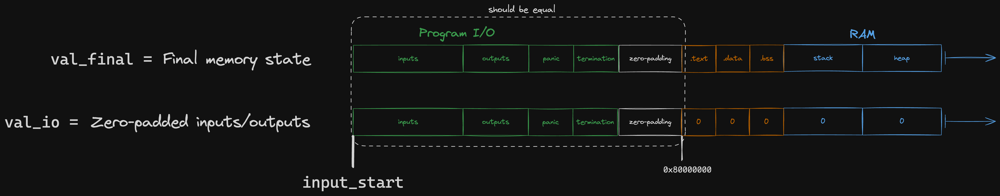

# RAM

Jolt proves the correctness of RAM operations using the [Twist](../twist-shout.md) memory checking algorithm, specifically utilizing the "local" prover algorithm.

## Dynamic parameters

In Twist, the parameter $K$ determines the size of the memory. For RAM, unlike registers, $K$ is not known a priori and depends on the memory usage of the guest program.
Consequently, the parameter $d$, dictating how the memory address space is partitioned into chunks, must also be dynamically tuned.
This ensures that no committed polynomial exceeds a maximum size defined by $T \times K^{1/d}$.

Jolt is currently configured so that $K^{1/d} = 2^8$.

## Address remapping

We treat each 4-byte-aligned word in the guest memory as one "cell" for the purposes of memory checking.
Our RISC-V [emulator](./emulation.md) is configured to use `0x80000000` as the DRAM start address -- the stack and heap occupy addresses above the start address, while Jolt reserves some memory below the start address for program inputs and outputs.


For the purposes of the memory checking argument, we remap the memory address to a witness index:

```rust
(address - memory_layout.input_start) / 4 + 1
```

where `input_start` is the left-most address depicted in the diagram above.
The division by four reflects the fact that we treat guest memory as "word-addressable" for the purposes of memory-checking.
Any load or store instructions that access less than a full word (e.g. `LB`, `SH`) are expanded into [virtual sequences](./emulation.md#virtual-instructions-and-sequences) that use the `LW` or `SW` instead.

## Deviations from the Twist algorithm as described in the paper

Our implementation of the Twist prover algorithm differs from the description given in the Twist and Shout [paper](https://eprint.iacr.org/2025/105) in a couple of ways. One such deviation is [wv virtualization](../twist-shout.md#wv-virtualization). Other, RAM-specific deviations are described below.

### Single operation per cycle

The Twist algorithm as described in the paper assumes one read and one write per cycle, with corresponding polynomials $\widetilde{\textsf{ra}}$ (read address) and $\widetilde{\textsf{wa}}$ (write address).
However, in the context of the RV32IM instruction set, only a single memory operation -- either a read or a write (or neither) -- is performed per cycle.
Thus, a single polynomial (merging $\widetilde{\textsf{ra}}$ and $\widetilde{\textsf{wa}}$) suffices, simplifying and optimizing the algorithm.
This polynomial is referred to as $\widetilde{\textsf{ra}}$ for the rest of this document.

### No-op cycles

Many instructions do not access memory, so we represent them using a row of zeros in the $\widetilde{\textsf{ra}}$ polynomial rather than the one-hot encoding of the accessed address.
Having more zeros in $\widetilde{\textsf{ra}}$ makes it cheaper to commit to and speeds up some of the other Twist sumchecks.
This modification necessitates adjustments to the [Hamming weight](../twist-shout.md#one-hot-polynomials) sumcheck, which would otherwise enforce that the Hamming weight for each "row" in $\widetilde{\textsf{ra}}$ is 1.

We introduce an additional **Hamming Booleanity** sumcheck:

$$
0 = \sum_{j \in \{0, 1\}^{\log(T)}} \widetilde{\textsf{eq}}(r', j) \cdot \left(\widetilde{\textsf{hw}}(j)^2 - \widetilde{\textsf{hw}}(j)\right)
$$

where $\widetilde{\textsf{hw}}$ is the Hamming weight polynomial, which can be virtualized using the original Hamming weight sumcheck expression:

$$
\widetilde{\textsf{hw}}(r_\text{cycle}) = \sum_{k = (k_1, \dots, k_d) \in \left(\{0, 1\}^{\log(K) / d}\right)^d} \widetilde{\textsf{ra}}(k, r_\text{cycle})
$$

For simplicity, these equations are presented for the $d=1$ case, but as described [above](#dynamic-parameters), $d$ for RAM is dynamic and can be greater than one.

### ra virtualization

In Twist as described in the paper, a higher $d$ parameter would translate to higher sumcheck degree for the read checking, write checking, and $\widetilde{\textsf{raf}}$ evaluation sumchecks.
Moreover, $d > 1$ is fundamentally incompatible with the [local](../twist-shout.md#local-vs-alternative-algorithm) prover algorithm for the read/write checking sumchecks.

To leverage the local algorithm while still supporting $d > 1$, Jolt simply carries out the read checking, write checking, and $\widetilde{\textsf{raf}}$ evaluation sumchecks *as if* $d = 1$, i.e. with a single (virtual) $\widetilde{\textsf{ra}}$ polynomial.

At the conclusion of these sumchecks, we are left with claims about the virtual $\widetilde{\textsf{ra}}$ polynomial.
Since the polynomial is uncommitted, Jolt invokes a separate sumcheck that expresses an evaluation $\widetilde{\textsf{ra}}$ in terms of the constituent $\widetilde{\textsf{ra}}_i$ polynomials.
The $\widetilde{\textsf{ra}}_i$ polynomials are, by definition, a tensor decomposition of $\widetilde{\textsf{ra}}$, so the "ra virtualization" sumcheck is the following:

$$
\widetilde{\textsf{ra}}(r, r') = \sum_{j \in \{0, 1\}^{\log(T)}} \widetilde{\textsf{eq}}(r', j) \cdot \left( \prod_{i=1}^d \widetilde{\textsf{ra}}_i(r_i, j) \right)
$$


## Output Check

Jolt ensures correctness of guest program outputs via the **output check** sumcheck.
Guest I/O operations, including outputs, inputs, and termination or panic bits, occur within a designated [memory region](#address-remapping).
At execution completion, outputs and relevant status bits are written into this region.

Verifying that the claimed outputs and status bits are correct amounts to checking that the following polynomials agree at the indices corresponding to the program I/O memory region:



Note that `val_io` is only contains information known by the verifier.
To check that these two polynomials are equal, we use the following sumcheck:

$$
0 = \sum_{k \in \{0, 1\}^{\log K}} \widetilde{\textsf{eq}}(r_\text{address}, k) \cdot \widetilde{\textsf{io-range}}(k) \cdot \left( \widetilde{\textsf{Val}}_\text{final}(k) - \widetilde{\textsf{Val}}_\text{io}(k) \right)
$$

where $\widetilde{\textsf{io-range}}$ is a "masking" polynomial, equal to 1 at all the indices corresponding to the program I/O region and 0 elsewhere.
The MLE for a masking polynomial that isolates the range $[\text{start}, \text{end})$ can be written as follows:

$$
\widetilde{\textsf{mask}}_\text{start, end}(r) = \widetilde{\textsf{LT}}(r, \text{end}) - \widetilde{\textsf{LT}}(r, \text{start})
$$

It is implemented in code as `RangeMaskPolynomial`.

This output check sumcheck generates a claim about the final memory state polynomial ($\widetilde{\textsf{Val}}_\text{final}$), which, being virtual, is proven using the $\widetilde{\textsf{Val}}_\text{final}$ evaluation sumcheck:

$$
\widetilde{\textsf{Val}}_\text{final}(r) - \widetilde{\textsf{Val}}_\text{init}(r) = \sum_{j \in \{0, 1\}^{\log(T)}} \widetilde{\textsf{Inc}}(j) \cdot \widetilde{\textsf{ra}}(r, j)
$$

Intuitively, the delta between the final and initial state of some memory cell is the sum of all increments to that cell.

You may have noticed in the above expression that $\widetilde{\textsf{Inc}}(j)$ if a polynomial only over cyclce variables, while the book describes $\widetilde{\textsf{Inc}}: \mathbb{F}^{\log K} \times \mathbb{F}^{\log T} \rightarrow \mathbb{F}$.
This change is explained in [wv virtualization](../twist-shout.md#wv-virtualization).

Both the $\widetilde{\textsf{Val}}_\text{final}$ and $\widetilde{\textsf{Val}}$ evaluation sumchecks use the virtual $\widetilde{\textsf{ra}}$ polynomial, with claims subsequently proven via [ra virtualization](#ra-virtualization) sumcheck.
