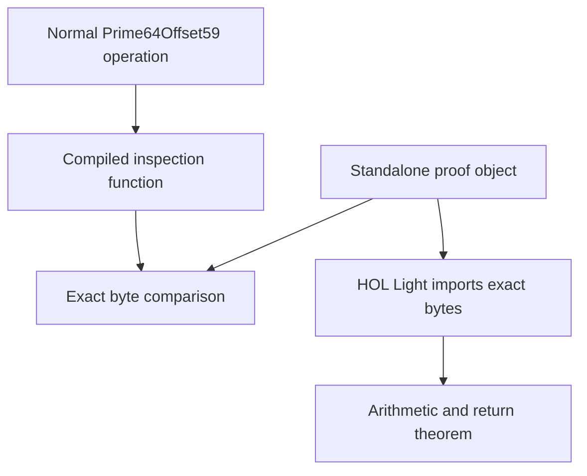

# Scalar Fp64 proofs

This page describes the first formal verification slice for Jolt's 64 bit
Solinas fields. It covers the base field `Prime64Offset59`, whose modulus is

```text
p = 2^64 - 59
  = 18446744073709551557.
```

HOL Light proves scalar addition, subtraction, and multiplication for exact
AArch64 and x86-64 instruction sequences. A separate theorem proves that `p`
is prime. The byte checker connects each proved object to one compiled Rust
inspection function.

This is not yet a proof of every Fp64 operation in Jolt. The extension field,
the `Prime63Offset259` field, packed arithmetic, and delayed reduction remain
outside this slice.

## What is proved

Each arithmetic theorem quantifies over every pair of 64 bit input words. If
both inputs are less than `p`, the theorem proves that the result is the unique
canonical value for the requested operation modulo `p`.

| Operation | Result |
| --- | --- |
| Addition | `(a + b) mod p` |
| Subtraction | `(a + p - b) mod p` |
| Multiplication | `(a * b) mod p` |

The subtraction expression uses natural numbers. Adding `p` before subtracting
avoids a negative intermediate value. It denotes the same field subtraction.

The callable theorems also prove the return instruction and the procedure call
convention. The AArch64 result is in `x0`. The System V x86-64 result is in
`rax`. Each theorem states which registers and flags may change. State that is
not listed must remain unchanged.

## Coverage by architecture

| Architecture | Addition | Subtraction | Multiplication |
| --- | --- | --- | --- |
| AArch64 | Proved baseline object | Proved baseline object | Proved baseline object |
| x86-64 | Proved baseline object | Proved baseline object | Proved baseline object |
| x86-64 with BMI2 | Same addition theorem | Same subtraction theorem | Separate proved `mulx` object |

The BMI2 multiplication needs BMI2 but does not need ADX. It uses `mulx` for
the widening products. The baseline x86-64 object uses `mulq`. There is no
AVX, AVX2, or AVX-512 code in this proof slice.

## Why the production Rust code stays unchanged

The normal `Prime64Offset59` operations use generic Rust arithmetic. LLVM
inlines and optimizes those operations in their callers.

We tested replacing that code with inline assembly on an AMD Ryzen 9 9950X.
The base field addition result was neutral. Subtraction became about 9 percent
slower, and multiplication became about 6 percent slower. Extension field
addition became about 6 percent slower. Extension field subtraction became
about 21 percent slower. Extension field multiplication was neutral. These are
measurements from one host and one build, not part of the theorem. We therefore
reverted the experiment.

The committed proof objects are not part of normal production dispatch. Cargo
builds them only when the `fp64-proof-linkage` feature is enabled. The normal
field path has no new call, branch, assertion, or assembly block.

This design preserves current performance. It also creates an important proof
boundary, which the next section explains.

## The connection to production Rust

The proof uses a small inspection program. It exposes stable functions such as
`jolt_fp64_mul_production_witness`. Each function constructs canonical field
values and calls the normal public Rust operation.



The compiler emits the same arithmetic sequence for the inspection function
as the standalone object. The Python checker compares those bytes. HOL Light
independently checks the bytes that it imports from the standalone object.

For Linux x86-64 and AArch64, the checker requires the complete optimized
inspection symbol to equal the complete proved object. On Darwin x86-64, the
compiler adds a fixed stack frame. The checker accepts only that exact wrapper
around the proved sequence. The current x86 theorem does not prove the Darwin
frame instructions.

## What this connection does and does not establish

The strongest current Fp64 statement has two parts.

1. HOL Light proves the exact standalone instruction sequence for all
   canonical inputs.
2. The artifact checker confirms that one optimized inspection function has
   those same bytes for the pinned build.

This catches arithmetic errors in the exact sequence and compiler changes in
the inspection build. It also catches a wrong result register, a changed
return sequence, and an unexpected instruction in the checked symbol.

The normal field operations are usually inlined into larger functions. LLVM
may optimize each surrounding function differently. Jolt does not compare
every such copy with the proof object. The theorem therefore does not prove
every production caller or the final Jolt binary.

A release claim needs one more integration check. That check must identify the
actual field type and call path in the final binary. It must then confirm that
the machine code at that path is the reviewed sequence or prove the complete
compiled function that contains it.

The current Jolt verifier does not instantiate `Prime64Offset59`. The legacy
Akita verifier path still uses the external Akita Fp128 field. A final binary
scan therefore cannot yet connect these Fp64 theorems to that verifier. Adding
an unused call only to make the sequence appear would not close this gap. The
first release check should run after an actual verifier path selects the Fp64
field.

## Canonical inputs and the unsafe constructor

The theorem assumes `a < p` and `b < p`. This is the field representation
rule. The result theorem also proves a value below `p`, because `MOD p` returns
a canonical residue.

The inspection program uses `from_canonical_u64`. This constructor is unsafe
because it does not check the range at run time. Its safety comment states the
same condition as the theorem. Marking this constructor unsafe prevents safe
Rust code from creating an invalid field value without acknowledging that
obligation.

This change does not add a release check to a hot path. Debug builds retain
the existing assertion. Release builds still execute no range assertion in
the constructor.

The machine theorem does not prove that every safe Rust operation preserves
this type rule across the whole program. The scalar result theorems are one
part of that argument. Checked decoding, constructor review, and proofs for the
remaining operations are still needed.

## Addition

Because `p` is only 59 below `2^64`, reduction can replace an overflow past
`2^64` with an addition of 59.

The proof records the equations produced by the machine carry flags. It then
uses `JOLT_FP64_ADD_REDUCTION` to show that the selected output equals
`(a + b) mod p`. This includes the boundary cases where the first addition
wraps and where a correction addition wraps.

## Subtraction

The instruction sequence first computes the wrapped 64 bit difference. If it
borrows, it adds `p`, which is the same as subtracting 59 from the wrapped
word.

`JOLT_FP64_SUB_REDUCTION` connects the actual borrow flag and corrected word
to `(a + p - b) mod p`. The proof derives the borrow from the executed
instruction. It does not assume that the correction decision is right.

## Multiplication

A 64 by 64 bit product has a low word and a high word.

```text
a * b = low + 2^64 * high.
```

Since `2^64` equals 59 modulo `p`, the first fold replaces the high word with
`59 * high`. That sum can still cross the 64 bit boundary, so the code folds a
second time. The proof establishes both exact fold equations and the bounds
needed to show that no information was lost.

After the second fold, the value is less than `2p`. One conditional correction
therefore produces the unique canonical residue. The shared lemmas
`JOLT_FP64_FOLD_TWICE` and `JOLT_FP64_FINAL_REDUCTION` state these arithmetic
steps once. Each architecture proof obtains their premises from the actual
instruction trace.

The x86-64 baseline and BMI2 proofs establish the same mathematical result.
They differ only in how the processor computes the widening products and
temporary carry values.

## The modulus certificate

`JOLT_FP64_PRIME` proves `prime p`. The kernel theorems would still make sense
for a composite modulus, so primality must be checked separately. Field
operations such as inversion rely on this extra fact.

## Proof file layout

| File | Purpose |
| --- | --- |
| `fp64_common.ml` | Modulus and shared arithmetic lemmas |
| `fp64_x86_64_common.ml` | Shared facts about x86 carry and compare instructions |
| `fp64_*_object.ml` | Exact object bytes and instruction execution rule |
| `fp64_*_correct.ml` | Body theorem and callable subroutine theorem |
| `fp64_mul_x86_64_bmi2_*.ml` | Separate BMI2 multiplication object and theorems |
| `fp64_prime.ml` | Checked primality certificate |
| `check-fp64.sh` | Byte check and clean combined proof runner |
| `dev-fp64.sh` | Persistent development session for one theorem |

The common files contain definitions and lemmas that HOL Light should load
once. The correctness files contain theorem bindings that a developer can
reload after an edit. This keeps the processor model in memory and avoids a
full rebuild for each tactic or syntax change.

## Running the checks

Run the fast byte check after changing Rust arithmetic, proof assembly, or the
artifact checker.

```sh
./proofs/hol-light/check-fp64.sh bytes x86_64
```

Use `aarch64` to check that architecture.

Start one persistent theorem session with

```sh
HOL_LIGHT_DIR=/path/to/hol-light \
S2N_BIGNUM_DIR=/path/to/s2n-bignum \
  ./proofs/hol-light/dev-fp64.sh x86_64 mul_bmi2
```

The first load imports the processor model. After an edit, use the reload
command printed by the session. You can replace `mul_bmi2` with `add`, `sub`,
or `mul`.

Run the clean release check with

```sh
HOL_LIGHT_DIR=/path/to/hol-light \
S2N_BIGNUM_DIR=/path/to/s2n-bignum \
  ./proofs/hol-light/check-fp64.sh all x86_64 --clean
```

The clean runner builds fresh proof objects and inspection functions. It checks
their bytes, loads the processor model once, proves every covered operation,
and checks the primality certificate. CI runs the AArch64 and x86-64 jobs
separately.

## Work that remains

This first slice does not cover the following code.

* `Prime63Offset259` scalar arithmetic.
* Degree two extension field operations.
* Packed subword kernels.
* Wide products and delayed reduction.
* Squaring, inversion, serialization, and decoding as complete operations.
* Every optimized downstream caller and the final application binary.

Extension addition and subtraction are built from base field operations, but
that source level composition is not yet a machine theorem. Extension
multiplication also includes the extension field formula and several base
field operations. A complete extension claim must prove that composition and
connect its compiled bytes to the right base field theorems.
