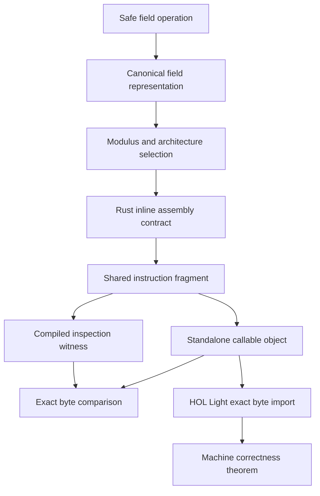

# From Rust to machine bytes

This page explains how a field operation reaches the exact bytes used by a
machine proof. It also explains which parts Rust checks and which parts the
machine proof checks.

The Fp128 production kernels use shared inline assembly fragments. The Fp64
production kernels use generic Rust arithmetic. For Fp64, the compiler emits a
fixed sequence in a separate inspection function. The artifact checker compares
that compiled sequence with a standalone proof object. Both designs stop short
of proving every optimized downstream caller.

## The path through the program



The public `Field` operation is safe Rust. Fp128 stores a value as two 64 bit
limbs. Fp64 stores one 64 bit word. In both cases, the representation rule says
that the represented integer is less than the modulus.

The compiler knows the modulus because it is a constant parameter of the field
type. It also knows the target architecture and the target CPU features. It can
therefore remove unused branches. An `Fp128` multiplication on x86-64 reaches
one of two instruction fragments.

* A baseline fragment takes the modulus offset in a register and works for
  every valid `Fp128` offset on every supported x86-64 processor.
* A BMI2 and ADX fragment embeds the A7F7 offset and is selected only for that
  field when the build enables both CPU features.

The baseline body theorem quantifies over the offset register and proves the
fragment for every valid Fp128 offset. A separate callable-object corollary
covers the fixture's literal A7F7 load and return sequence. The BMI2 and ADX
fragment remains A7F7-specific because its bytes embed that offset. Both public
offsets and a test-only generic offset 173 are also differentially tested
against portable Rust to exercise the Rust dispatch and inline-assembly
contract.

`Prime64Offset59` uses portable Rust because an inline assembly experiment made
several measured operations slower. Its proof objects are inspection artifacts
and are not called by normal production dispatch.

## What `include_str!` does for Fp128

The Rust source contains code of this form.

```rust,ignore
asm!(
    include_str!("../../asm/x86_64/fp128_mul_body.inc"),
    // register declarations
);
```

`include_str!` runs during compilation. It copies the text from the named file
into the `asm!` input. The assembler converts that text into machine
instructions while Jolt is built.

The running program does not open the file. It does not parse assembly text,
load a plugin, or create executable memory. The final program contains ordinary
machine instructions in its code section.

The x86-64 fragment uses `.byte` directives instead of instruction names. Each
directive inserts the listed byte into the code section. The AArch64 fragment
uses `.inst` to insert one fixed 32 bit instruction word. Both forms fix the
exact encoding. Each sequence has an adjacent comment with the decoded
instruction so a reviewer can read it. The artifact checker independently
decodes the compiled result.

## Safe Rust and arithmetic correctness are different claims

Safe Rust prevents many invalid memory operations. It tracks ownership and
borrowing. It checks array bounds unless code uses an explicitly unsafe
operation.

Safe Rust does not prove that every carry and borrow is correct for every field
input. It does not prove that a multiplication returns the right residue modulo
the prime. Tests can cover many inputs, but this field has about `2^128`
possible values.

The machine theorem proves the arithmetic result for every canonical input and
every offset satisfying the Fp128 bounds. It does so for one exact
register-parameterized instruction sequence; literal-load and BMI2/ADX
corollaries remain constant-specific.

The assembly boundary is still unsafe. Rust must place each input in the stated
register. Rust must also be told about every register and flag that the
instructions change. A missing changed register can let the compiler keep a
live value in a register that the assembly overwrites. The program can then
produce a wrong result even when the instruction fragment is correct by itself.

The machine theorem and the Rust type checker therefore address different
risks. We need both boundaries to be correct.

## Inputs, outputs, and changed state

An `asm!` declaration tells the compiler four important things.

1. It states which registers contain the inputs.
2. It states which registers contain the outputs.
3. It states which registers the instructions may overwrite.
4. Its options state whether the instructions use memory or the stack.

The Fp128 fragments use only caller saved registers. The procedure call
convention already permits a called function to change those registers. The
fragments do not read or write data memory. The standalone x86-64 object ends
with `ret`, which reads the return address from the stack. The theorem accounts
for that stack read and the change to `rsp`.

The Rust options have precise but limited meanings.

| Option | What Jolt tells the compiler |
| --- | --- |
| `pure` | The outputs depend only on the declared inputs and the assembly has no other visible effect |
| `nomem` | The fragment does not read or write data memory |
| `nostack` | The inline fragment does not use the stack |

Rust assumes that inline assembly may change the condition flags unless the
declaration includes `preserves_flags`. These kernels do not use that option.
The HOL Light frame condition also permits the flags changed by the exact
instructions.

These words are part of the trusted compiler contract. HOL Light proves that
the fixed instruction bytes have the matching behavior. It does not prove that
Rust or LLVM interprets the declaration correctly.

## Why there is a standalone object

HOL Light imports an ordinary object file. The object gives the proof a fixed
start address, fixed instruction bytes, and a `ret` instruction.

The baseline x86-64 object includes the arithmetic fragment, two result moves,
and `ret`. The BMI2 and ADX object forms its result directly in `rax:rdx`, so it
contains only the shared fragment followed by `ret`.

The object is not linked as a second production implementation. Fp128 uses the
inline fragment to avoid an extra function call in a hot loop. Fp64 keeps the
compiler generated Rust path because it was faster in the native benchmark.
The objects exist so HOL Light can state and prove complete callable functions.

## Why several byte lists exist

There is deliberate duplication.

| Representation | Purpose |
| --- | --- |
| Shared `.inc` file | Input to production inline assembly and the standalone object |
| Python byte list | Independent artifact expectation |
| HOL Light byte list | Exact bytes accepted by the theorem |
| Compiled inspection witness | Evidence for one optimized Rust compilation |

For Fp128, the shared fragment reduces accidental divergence. For Fp64, the
compiler output and proof source can diverge, so exact byte comparison is the
required connection. The independent lists make changes visible. If one
instruction changes, the artifact check fails until a reviewer updates the
expected bytes. HOL Light then rejects the object until the proof byte list is
updated. Updating the list does not prove the new code. The theorem must run
again and succeed.

A byte match proves identity. It does not prove arithmetic correctness. The
HOL Light theorem supplies the arithmetic claim.

## The inspection witness

The inspection witness is a small function with a stable symbol name. It calls
the normal field operation and prevents the compiler from removing the result.
It is not a separate arithmetic implementation and it is not a public API for
applications.

On Linux x86-64, the checker requires the complete optimized witness symbol to
equal the proved callable object. On Darwin x86-64, the compiler adds a fixed
frame setup and teardown. The checker accepts only that exact wrapper around
the proved sequence.

This check covers one deliberately compiled instance. Normal field operations
inline the fragment into larger callers. We still trust Rust and LLVM to honor
the assembly declaration at those other call sites.

## CPU feature selection

The baseline sequence is the fallback for x86-64 builds. The optimized
sequence uses `mulx`, `adcx`, and `adox`. A processor without BMI2 or ADX would
raise an illegal instruction fault if it executed those bytes.

Jolt selects the optimized path at compile time. The path is compiled only when
both target features are enabled. There is no feature check inside each field
multiplication. Such a check would be large compared with the operation itself.

This choice has a deployment consequence. A binary built with both features
requires a compatible processor wherever that code can run. A portable binary
must omit the global features or perform selection at a larger boundary. The
instruction theorem does not prove CPU feature detection or deployment policy.

## The final executable

Jolt checks its standalone objects and inspection witnesses. It does not yet
inspect every executable that depends on Jolt.

A downstream release claim needs two further facts.

1. The final binary contains the expected field operation from the reviewed
   Jolt revision.
2. The program reaches that operation on the path being claimed.

Finding the byte sequence is useful evidence. It does not by itself prove
reachability. A downstream integration check must also identify the selected
field type and the call path that uses it.
