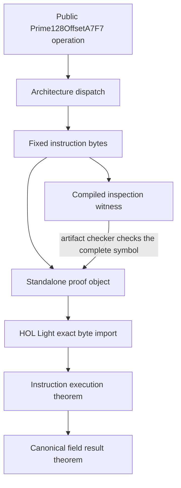

# Formal verification of field kernels

HOL Light proves that the exact register-parameterized AArch64 and baseline
x86-64 instruction bodies compute scalar addition, subtraction, and
multiplication correctly for every valid Fp128 offset. It also proves complete
callable A7F7 objects and the A7F7-specific BMI2 and ADX multiplication object.
Jolt checks that deliberately compiled inspection functions contain the
expected bytes. The proof does not cover every inlined caller or a downstream
executable. This chapter explains the exact claim, its connection to Rust, and
its limits.

This page focuses on `Prime128OffsetA7F7`. The
[scalar Fp64 page](field-kernels-fp64.md) describes the separate
`Prime64Offset59` proofs.

The `jolt-field/asm` feature opts into these architecture kernels. A `solinas`
build without `asm` uses portable Rust even on AArch64 and x86-64. The
inspection-only `fp128-proof-linkage` feature implies `asm`.

No product crate in this workspace enables `jolt-field/asm` in this change.
The benchmark, fuzz, and proof workflows enable it explicitly to validate the
library option. A product that adopts the Solinas backend must make a separate
rollout decision and forward `asm` from its own feature configuration.

For an offset `C`, the modulus is

```text
p(C) = 2^128 - C
```

The generic theorems assume `0 < C < 2^32` and the reduction bound used by
the Rust type. Both public offsets, 275 and A7F7 (`2^32 - 22537`), satisfy
those assumptions. A separate certificate proves that the A7F7 modulus
`0xffffffffffffffffffffffff00005809` is prime.

Every field value has one canonical integer representative from `0` through
`p - 1`. Each kernel accepts two canonical values in two 64 bit limbs. It
returns the canonical sum, difference, or product modulo `p`, according to the
operation.

## From the public Rust operation to a theorem



Rust and the standalone proof object include the same instruction fragment.
The artifact checker and HOL Light keep independent expected byte lists. This
small amount of duplication makes an instruction change visible to review.
HOL Light imports the object and refuses to load it if one byte differs.

When a kernel changes intentionally, update each expected list from the
reviewed instruction source as a separate transcription. Do not make both
lists pass by copying bytes from the compiled object. The review must compare
the source instructions, checker list, and HOL Light import before accepting
the new proof artifact.

The inspection witness calls the normal `Prime128OffsetA7F7` operation. It does
not call a separate proof function. The checker disassembles each optimized
witness. The complete AArch64 and Linux x86-64 witness symbols must match the
proved objects exactly. The Darwin x86-64 witness must have one exact frame
wrapper around the same proved arithmetic and result sequence.

[From Rust to machine bytes](field-kernels-source-to-bytes.md) follows this
connection one boundary at a time and explains `include_str!`, inline assembly
declarations, and the standalone proof object.

## Why the theorem names physical registers

The arithmetic theorem covers every canonical input value. It does not cover
every possible assignment of physical registers.

x86 instruction bytes contain register numbers. For example, changing `rdi`
to `rax` changes the encoded bytes. One byte string therefore cannot describe
arbitrary register choices.

Jolt separates these concerns. The arithmetic proof uses variables for the
input values. The machine proof fixes the registers that carry those values.
The fixed registers use the caller saved part of the procedure call
convention, so the body does not corrupt registers that a function must
preserve.

## AArch64 register contract

The AArch64 body uses the following registers.

| Role | Registers |
| --- | --- |
| Input `a` and output | `x0:x1` |
| Input `b` | `x2:x3` |
| Offset `C = 2^128 - p` | `x4` after the fixed load instruction |
| Addition temporary values | `x5:x9` |
| Subtraction temporary values | `x5:x7` |

Each fixture object includes the A7F7 constant load, arithmetic body, and
`ret`. The generic body theorem starts after that load with an arbitrary valid
`C` in `x4`; the A7F7 corollary proves the literal load as well. Multiplication
also uses `x10:x12` as temporary registers. None of the proved bodies accesses
memory or the stack. The subroutine theorems prove the return through `x30`
and use the normal AArch64 set of registers that a callee may change.

## x86-64 register contract

The x86-64 body uses the following registers.

| Role | Registers |
| --- | --- |
| Input `a` | `rdi:rsi` |
| Input `b` | `rdx:rcx` |
| Addition and subtraction output | `rdi:rsi` |
| Baseline multiplication output | `rdi:rcx` |
| BMI2 and ADX multiplication output | `rax:rdx` |
| System V function result | `rax:rdx` |
| Baseline offset `C = 2^128 - p` | `r8` after the fixed load instruction |
| BMI2 and ADX offset `C = 2^128 - p` | `rdx` after the initial products |
| Addition temporary values | `r9:r11` |
| Subtraction mask | `r9` |
| Multiplication temporary values | `rax`, `rdx`, and `r9:r11` |

These registers are caller saved in the System V x86-64 procedure call
convention. Each standalone object includes its constant load. The generic
baseline theorem starts after the `r8d` load with an arbitrary valid `C`; its
A7F7 corollary proves that load too. The BMI2 and ADX object loads its embedded
A7F7 value into `edx` after it has used the second input. The body does not
access memory or the stack. The subroutine theorem also proves
that `ret` reads the return address from the stack, updates `rsp` by eight
bytes, and transfers control to that address.

The baseline x86-64 object continues through two moves that copy its internal
result into `rax:rdx`, then executes `ret`. The BMI2 and ADX object creates its
result directly in `rax:rdx`. HOL Light proves each complete System V function.
On Linux, the checker requires every byte of the corresponding optimized Rust
witness symbol to match its object. If the compiler changes the setup, result
moves, or return sequence, the check fails.

The Darwin x86-64 compiler adds a fixed frame setup and teardown. The checker
requires that exact wrapper and ignores only decoded padding after `ret`. The
arithmetic sequence inside it matches the proved object. The current HOL Light
theorem does not cover the Darwin frame instructions.

This closes the compiler wrapper gap for the inspection witness. Normal field
operations still inline the arithmetic body into their callers. HOL Light
does not prove the machine code around every inlined copy. At that boundary,
we still trust Rust and LLVM to honor the declared assembly inputs, outputs,
and changed registers. A final executable check must also confirm that the
application reaches the expected Jolt field operation.

## Native x86-64 performance measurements

We compared commit `586e6b347` with its parent on an AMD Ryzen 9 9950X. Both
builds used Rust 1.95.0. Criterion measured batches of 4,096 field products on
one pinned CPU. We alternated the portable and assembly binaries for three
rounds.

| Build | Time for 4,096 products | Time per product |
| --- | ---: | ---: |
| Portable parent | 9.418 microseconds | 2.30 nanoseconds |
| Proved baseline assembly | 8.104 microseconds | 1.98 nanoseconds |

The assembly path took 13.95 percent less time. Its throughput was 16.2
percent higher. With `-C target-cpu=native`, the portable path used `mulx` but
not `adcx` or `adox`. It took 9.388 microseconds, while the proved baseline
body took 8.111 microseconds under the same setting.

We then compared the baseline body with a handwritten BMI2 and ADX body on the
same processor. This benchmark used the production operation in batches of
4,096 products. It ran on one pinned CPU and alternated the two binaries.

| x86-64 assembly body | Time for 4,096 products | Time per product |
| --- | ---: | ---: |
| Baseline | 8.223 to 8.226 microseconds | 2.008 nanoseconds |
| BMI2 and ADX | 8.023 to 8.030 microseconds | 1.960 nanoseconds |

The body that uses BMI2 and ADX took about 2.4 percent less time. A separate
test program measured 4.1 percent more throughput for a batch. It also measured
4.5 percent less time when each product depended on the previous product. The
same program compared one million random canonical input pairs and the edge
matrix with the portable implementation. Every result matched. These
measurements and tests cover one machine and one build. They are not part of
the correctness theorem.

## Addition

For canonical inputs `m` and `n`, the addition theorem states

```text
result = (m + n) mod p
```

The code first adds the two 128 bit inputs. This produces a wrapped 128 bit
sum and a carry bit. It then adds the offset `C = 2^32 - 22537` to make a
candidate reduced value.

The final instructions choose the candidate when either addition says that
reduction is needed. AArch64 records this condition with `ccmp` and uses
`csel`. x86-64 converts the first carry into a mask, combines it with the
second carry, and uses `cmovne`.

The proof symbolically executes each instruction. It derives the two carry
equations and proves that the selected value is the canonical residue.

## Subtraction

For canonical inputs `m` and `n`, the subtraction theorem states

```text
result = (m + p - n) mod p
```

This expression is equal to `(m - n) mod p`. It uses natural numbers, so adding
`p` before subtracting avoids a negative intermediate value.

The code first computes the wrapped 128 bit difference. If the subtraction
borrows, it subtracts the offset `C` from that wrapped difference. This has the
same modular effect as adding `p`.

The x86-64 proof makes the mask step explicit.

```text
borrow flag
    |
    v
sbb r9, r9        gives 0 or 0xffffffffffffffff
    |
    v
and r9, r8        gives 0 or C
    |
    v
sub and sbb       apply the selected correction
```

`JOLT_FP128_X86_64_BORROW_MASK` proves the middle fact once. The machine proof
gets its borrow bit and mask value from the actual instruction trace. It then
uses the named lemma to prove the final modular result. Replacing the machine
value with an assumption would not be sufficient.

## Multiplication

The multiplication theorems state

```text
result = (m * n) mod p
```

The machine proof follows the same stages as the code.

1. Four widening multiplications and their carry chains reconstruct the exact
   256 bit product. The proof also shows that the apparent carry above bit 255
   is zero for two 128 bit inputs.
2. The first Solinas fold replaces the high 128 bits by their product with
   `C`, using `2^128 = C mod p`.
3. The remaining high limb is at most `C`. Its product with `C` therefore fits
   in one 64 bit word. This justifies the second fold without a hidden
   overflow assumption.
4. The value after two folds is below `2p`. The last add, compare, and select
   instructions either keep it or subtract `p` once.

The final result is therefore both congruent to `m * n` and in the canonical
range. The generic AArch64 theorem covers the exact 35-instruction arithmetic
body for every valid `C`. One generic x86-64 theorem covers the baseline
`mulq`, `add`, and `adc` sequence. A separate A7F7 theorem covers the
31-instruction BMI2 and ADX sequence built from `mulx`, `adcx`, and `adox`.
Each architecture also has an A7F7 theorem for the callable body followed by
`ret`.

With `asm`, the register kernels take `C = 2^128 - p` as an operand and run for
every valid `Fp128` offset. The type-level checks require `C < 2^32`, which is
the bound used by the two Solinas folds. A test-only offset 173, outside the
published aliases, exercises this parameterized path in differential tests and
fuzzing against portable Rust, alongside the public offsets 275 and A7F7.

The generic HOL Light theorem uses the same offset bounds, so adding another
valid field alias does not require a new baseline arithmetic proof or dispatch
case. A new alias still needs evidence that its offset satisfies those bounds
and, if it is intended to be a field, a separate primality argument. On
x86-64, the BMI2 and ADX fragment remains A7F7-specific because its instruction
bytes embed that offset directly.

## The modulus is prime

`JOLT_FP128_A7F7_PRIME` proves `prime p` with a checked Pocklington
certificate. This is separate from the kernel theorems. Addition,
subtraction, and multiplication modulo a number do not themselves prove that
the number is prime. Field algorithms such as inversion rely on this extra
fact.

## The theorem layers

Each baseline operation has three theorem levels.

The generic body theorem starts immediately after the constant-load
instruction and stops before `ret`. Its precondition fixes the loaded bytes,
program counter, input registers, and a symbolic offset register. Its
postcondition states the result modulo `2^128 - C` for every valid `C`.

The A7F7 body corollary starts at the literal load. It proves that load and
specializes the generic theorem to A7F7.

The AArch64 subroutine theorem adds `ret` and the procedure call convention.
It states where the return address comes from and which registers a caller
must treat as changed.

The x86-64 subroutine theorem proves the complete optimized Linux witness
function. It starts with System V inputs in `rdi:rsi` and `rdx:rcx`. The
arithmetic body forms its internal result in fixed registers. The final moves
place the two result limbs in `rax:rdx`. The theorem also proves the `ret`
stack behavior and permits only state changes allowed by the ABI.

The notation `ensures x86` or `ensures arm` means that every execution which
starts in the stated precondition reaches the stated postcondition while
changing only the listed state. HOL Light checks the final theorem with its
small logical kernel.

[Reading a machine theorem](field-kernels-reading-theorem.md) explains each
part of this statement for readers who do not use HOL Light.

## Proof source layout

| File | Purpose |
| --- | --- |
| `fp128_common.ml` | Generic modulus, offset bounds, and reduction lemmas shared by both architectures |
| `fp128_x86_64_common.ml` | x86 model and the named borrow mask lemma |
| `fp128_add_x86_64_object.ml` | Exact addition bytes and instruction execution rule |
| `fp128_sub_x86_64_object.ml` | Exact subtraction bytes and instruction execution rule |
| `fp128_add_x86_64_correct.ml` | Reloadable addition theorems |
| `fp128_sub_x86_64_correct.ml` | Reloadable subtraction theorems |
| `fp128_mul_x86_64_object.ml` | Exact x86-64 multiplication bytes and execution rule |
| `fp128_mul_x86_64_correct.ml` | Reloadable x86-64 multiplication theorems |
| `fp128_mul_x86_64_bmi2_adx_object.ml` | Exact BMI2 and ADX multiplication bytes and execution rule |
| `fp128_mul_x86_64_bmi2_adx_correct.ml` | Reloadable BMI2 and ADX multiplication theorems |
| `fp128_mul_object.ml` | Exact AArch64 multiplication words and execution rule |
| `fp128_mul_correct.ml` | Reloadable AArch64 multiplication theorems |
| `fp128_prime.ml` | Checked primality certificate for the A7F7 modulus |
| Generated combined entry | One process per architecture that proves all covered operations |

The AArch64 proof files retain one source file per operation. The runner loads
them into one proof process, so the processor model is initialized once. Both
architectures use the same inspection witness and artifact checker.

## Exact claim

| Architecture | Proved instruction scope | Rust connection |
| --- | --- | --- |
| AArch64 baseline bodies | Generic add, subtract, and multiply bodies for every valid `C` | Production passes `C` in the proved register contract and uses the shared instruction bodies |
| AArch64 A7F7 functions | Constant load, complete body, and `ret` | The proof object and complete optimized witness are byte identical |
| Linux x86-64 baseline bodies | Generic add, subtract, and multiply bodies for every valid `C` | Production passes `C` in the proved register contract and uses the shared instruction bodies |
| Linux x86-64 A7F7 functions | Constant load, complete body, ABI result moves, and `ret` | The proof object and complete optimized witness are byte identical |
| Linux x86-64 BMI2 and ADX multiply | Complete BMI2 and ADX body with direct ABI result and `ret` | The proof object and witness built with both features are byte identical |
| Darwin x86-64 add, subtract, and multiply | Arithmetic and ABI result sequence | The checker requires one exact unproved Darwin frame wrapper around the proved sequence |

The generic claims cover every offset satisfying the stated Fp128 bounds; the
full callable-object and BMI2/ADX claims specialize to A7F7. Both current
offsets and the test-only generic offset 173 are also differentially tested
against portable Rust, which checks the dispatch and inline-assembly interface
outside the isolated machine theorem.
The claims do not cover packed SIMD arithmetic, squaring, inversion, the full
proof system, or an arbitrary downstream executable.

## Unreduced arithmetic is a separate obligation

The prover also delays reductions while it sums many products. Those paths do
not call the proved scalar multiplication kernel for every term. They widen
values into larger integer accumulators, add many terms, and reduce once at
the end.

For `Fp128`, the wide accumulator has eight signed `i32` lanes. A fresh field
value contributes less than `2^16` to each lane, so at most 32,768 terms with the same sign
unit additions fit before a lane can overflow. The product accumulators have
four wrapping `u128` slots. Their documented limit for nonnegative products is
`2^64 - 1` terms, subject to the final value of every slot remaining in the
ordinary `u128` range when subtraction is involved.

Callers must satisfy these limits. Debug builds catch some signed lane overflow,
but release builds do not add checks to the hot loop. Jolt declares
`MAX_COMMIT_ACCUMULATIONS`, but current production code does not consume that
constant; only tests do. A production cutover must either prove that every
batch is within its applicable bound or split longer batches and reduce
between chunks.

The differential tests cover the widening products, reductions, signed lane
operations, and boundary examples. They are not a formal proof. Closing this
part of the field claim requires three layers: prove each widening and
reduction schedule, prove or enforce the caller's term and scale bounds, and
connect the compiled implementation to those theorems.

The proved scalar kernels have an additional differential fuzz target. It
compares assembly with portable addition, subtraction, and multiplication on
AArch64, baseline x86-64, and x86-64 with BMI2 and ADX. The AArch64 target also
compares squaring and fused multiply-add. The corpus is interpreted in both
public fields and a test-only offset outside the published aliases. This testing
exercises dispatch, inline assembly constraints, and edge cases around the
proof boundary; the HOL Light theorem and exact-byte checks remain the
exhaustive correctness and linkage evidence for the proved sequences.

## Trust boundary

[Trust boundary and review guide](field-kernels-trust-boundary.md) separates
what is proved, checked, tested, and trusted. The short list below is only a
summary.

The result relies on the following assumptions.

* The field type maintains the canonical input invariant.
* Rust and the linker honor the declared inline assembly inputs, outputs, and
  clobbers.
* The HOL Light processor models match the processors.
* HOL Light and its host software execute the checker correctly.
* A downstream application checks that its final optimized binary reaches the
  proved operation from the pinned Jolt revision.

Jolt owns the kernel, theorem, proof object, and inspection witness. This
does not yet prove every executable that depends on Jolt. In particular, the
current legacy `akita` feature in `jolt-prover` still reaches the external
Akita field implementation instead of `Prime128OffsetA7F7`. These theorems do
not cover that path. The final cutover must route the production prover or
verifier through this field type and inspect that final binary before making
a claim about the complete production path.

## Running the checks

Check only the object and inspection witness bytes with

```sh
./proofs/hol-light/check.sh bytes x86_64
```

Develop one x86-64 theorem in a persistent HOL Light session with

```sh
HOL_LIGHT_DIR=/path/to/hol-light \
S2N_BIGNUM_DIR=/path/to/s2n-bignum \
  ./proofs/hol-light/dev.sh x86_64 mul
```

Use `mul_bmi2_adx` to work on the BMI2 and ADX multiplication theorem.

The first bytecode load imports the x86 model and object and can take several
minutes. After an edit, reload only the correctness file with the command
printed by the session. Reloads take seconds because the model stays in memory.

For AArch64 multiplication, use

```sh
HOL_LIGHT_DIR=/path/to/hol-light \
S2N_BIGNUM_DIR=/path/to/s2n-bignum \
  ./proofs/hol-light/dev.sh aarch64 mul
```

Run the complete clean check with

```sh
HOL_LIGHT_DIR=/path/to/hol-light \
S2N_BIGNUM_DIR=/path/to/s2n-bignum \
  ./proofs/hol-light/check.sh all x86_64 --clean
```

The clean check uses fresh Cargo output and one combined proof process for the
selected architecture. A local run without `--clean` caches that native proof
program when its inputs are unchanged. CI runs the clean check independently
for AArch64 and x86-64.
