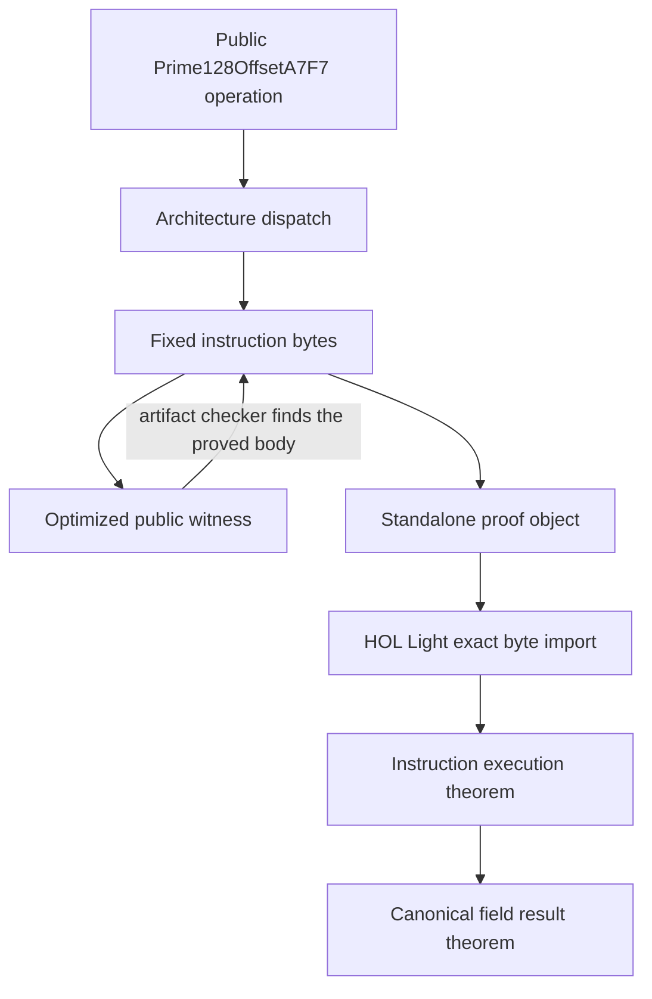

# Formal verification of field kernels

Jolt proves the scalar addition and subtraction kernels for
`Prime128OffsetA7F7` on AArch64 and x86-64. It also proves scalar
multiplication on AArch64. This chapter explains the claim, the connection to
Rust, and the limits of the proof.

The field modulus is

```text
p = 2^128 - 2^32 + 22537
  = 0xffffffffffffffffffffffff00005809
```

Every field value has one canonical integer representative from `0` through
`p - 1`. Each kernel accepts two canonical values in two 64 bit limbs. It
returns the canonical sum or difference modulo `p`.

## From the public Rust operation to a theorem



The fixed instruction body is the source of truth for the proved machine
code. Rust includes the body with `asm!`. The standalone object includes the
same body with the system assembler. The artifact checker independently lists
the expected words or bytes. HOL Light imports the object and refuses to load
it if one byte differs.

The public witness calls the normal `Prime128OffsetA7F7` operation. It does not
call a separate proof function. The checker disassembles this optimized
witness and checks that it contains the proved body.

## Why the theorem names physical registers

The arithmetic theorem covers every canonical input value. It does not cover
every possible assignment of physical registers.

x86 instruction bytes contain register numbers. For example, changing `rdi`
to `rax` changes the encoded bytes. One byte string therefore cannot describe
arbitrary register choices.

Jolt separates these concerns. The arithmetic proof uses variables for the
input values. The machine proof fixes the registers that carry those values.
The fixed registers use the caller saved part of the procedure call
convention, so the body does not corrupt registers that a function must
preserve.

## AArch64 register contract

The AArch64 body uses the following registers.

| Role | Registers |
| --- | --- |
| Input `a` and output | `x0:x1` |
| Input `b` | `x2:x3` |
| Offset `C = 2^128 - p` | `x4` |
| Addition temporary values | `x5:x9` |
| Subtraction temporary values | `x5:x7` |

Multiplication also uses `x10:x12` as temporary registers. None of the proved
bodies accesses memory or the stack. Each standalone object adds one `ret`
instruction. The subroutine theorem proves the return through `x30` and uses
the normal AArch64 set of registers that a callee may change.

## x86-64 register contract

The x86-64 body uses the following registers.

| Role | Registers |
| --- | --- |
| Input `a` and output | `rdi:rsi` |
| Input `b` | `rdx:rcx` |
| Offset `C = 2^128 - p` | `r8` |
| Addition temporary values | `r9:r11` |
| Subtraction mask | `r9` |

These registers are caller saved in the System V x86-64 procedure call
convention. The body does not access memory or the stack. The subroutine
theorem also proves that `ret` reads the return address from the stack, updates
`rsp` by eight bytes, and transfers control to that address.

The optimized Rust witness has compiler generated setup and return moves
around the body. The checker requires the `r8d` constant load followed by the
exact proved body to occur once in the witness symbol. HOL Light proves the
body and `ret` in the standalone object. It does not prove the compiler
generated witness wrapper.

## Addition

For canonical inputs `m` and `n`, the addition theorem states

```text
result = (m + n) mod p
```

The code first adds the two 128 bit inputs. This produces a wrapped 128 bit
sum and a carry bit. It then adds the offset `C = 2^32 - 22537` to make a
candidate reduced value.

The final instructions choose the candidate when either addition says that
reduction is needed. AArch64 records this condition with `ccmp` and uses
`csel`. x86-64 converts the first carry into a mask, combines it with the
second carry, and uses `cmovne`.

The proof symbolically executes each instruction. It derives the two carry
equations and proves that the selected value is the canonical residue.

## Subtraction

For canonical inputs `m` and `n`, the subtraction theorem states

```text
result = (m + p - n) mod p
```

This expression is equal to `(m - n) mod p`. It uses natural numbers, so adding
`p` before subtracting avoids a negative intermediate value.

The code first computes the wrapped 128 bit difference. If the subtraction
borrows, it subtracts the offset `C` from that wrapped difference. This has the
same modular effect as adding `p`.

The x86-64 proof makes the mask step explicit.

```text
borrow flag
    |
    v
sbb r9, r9        gives 0 or 0xffffffffffffffff
    |
    v
and r9, r8        gives 0 or C
    |
    v
sub and sbb       apply the selected correction
```

`JOLT_FP128_X86_64_BORROW_MASK` proves the middle fact once. The machine proof
gets its borrow bit and mask value from the actual instruction trace. It then
uses the named lemma to prove the final modular result. Replacing the machine
value with an assumption would not be sufficient.

## Multiplication

The AArch64 multiplication theorem states

```text
result = (m * n) mod p
```

The machine proof follows the same stages as the code.

1. Four widening multiplications and their carry chains reconstruct the exact
   256 bit product. The proof also shows that the apparent carry above bit 255
   is zero for two 128 bit inputs.
2. The first Solinas fold replaces the high 128 bits by their product with
   `C`, using `2^128 = C mod p`.
3. The remaining high limb is at most `C`. Its product with `C` therefore fits
   in one 64 bit word. This justifies the second fold without a hidden
   overflow assumption.
4. The twice-folded value is below `2p`. The last add, compare, and select
   instructions either keep it or subtract `p` once.

The final result is therefore both congruent to `m * n` and in the canonical
range. The theorem covers the exact 35-instruction A7F7 body and the callable
body followed by `ret`.

The generic AArch64 multiplication body still exists for other moduli. The
A7F7 dispatch uses the fixed-register shared body because that exact byte
sequence is what HOL Light imports. The modulus check is a compile-time
constant after monomorphization.

## The modulus is prime

`JOLT_FP128_A7F7_PRIME` proves `prime p` with a checked Pocklington
certificate. This is separate from the kernel theorems. Addition,
subtraction, and multiplication modulo a number do not themselves prove that
the number is prime. Field algorithms such as inversion rely on this extra
fact.

## The theorem layers

Each operation has two theorem levels.

The body theorem starts at the first arithmetic instruction and stops before
`ret`. Its precondition fixes the loaded bytes, program counter, input
registers, and offset. Its postcondition states the field result. Its frame
condition lists every part of processor state that may change.

The subroutine theorem adds `ret` and the procedure call convention. It states
where the return address comes from and which registers a caller must treat as
changed.

The notation `ensures x86` or `ensures arm` means that every execution which
starts in the stated precondition reaches the stated postcondition while
changing only the listed state. HOL Light checks the final theorem with its
small logical kernel.

## Proof source layout

| File | Purpose |
| --- | --- |
| `fp128_common.ml` | Modulus shared by both architectures |
| `fp128_x86_64_common.ml` | x86 model and the named borrow mask lemma |
| `fp128_add_x86_64_object.ml` | Exact addition bytes and instruction execution rule |
| `fp128_sub_x86_64_object.ml` | Exact subtraction bytes and instruction execution rule |
| `fp128_add_x86_64_correct.ml` | Reloadable addition theorems |
| `fp128_sub_x86_64_correct.ml` | Reloadable subtraction theorems |
| `fp128_mul_object.ml` | Exact AArch64 multiplication words and execution rule |
| `fp128_mul_correct.ml` | Reloadable AArch64 multiplication theorems |
| `fp128_prime.ml` | Checked primality certificate for the A7F7 modulus |
| Generated combined entry | One process per architecture that proves all covered operations |

The AArch64 proof files retain one source file per operation. The runner loads
them into one proof process, so the processor model is initialized once. Both
architectures use the same public witness and artifact checker.

## Exact claim

| Architecture | Proved object | Public Rust connection |
| --- | --- | --- |
| AArch64 add, subtract, multiply | Complete fixed body and `ret` | The complete optimized witness words match the constant load, body, and `ret` |
| x86-64 | Complete fixed body and `ret` | The constant load and fixed body occur exactly once inside the optimized witness |

These claims cover the A7F7 register kernels. They do not cover the small
offset immediate kernels or the generic register fallback used by other field
types. They also do not cover packed SIMD arithmetic, x86-64 multiplication,
squaring, inversion, the full proof system, or an arbitrary downstream
executable.

## Trust boundary

The result relies on the following assumptions.

* The field type maintains the canonical input invariant.
* Rust and the linker honor the declared inline assembly inputs, outputs, and
  clobbers.
* The HOL Light processor models match the processors.
* HOL Light and its host software execute the checker correctly.
* A downstream application checks that its final optimized binary reaches the
  proved operation from the pinned Jolt revision.

Jolt owns the kernel, theorem, proof object, and public operation witness. This
does not yet prove every executable that depends on Jolt. In particular, the
current legacy `akita` feature in `jolt-prover` still reaches the external
Akita field implementation instead of `Prime128OffsetA7F7`. These theorems do
not cover that path. The final cutover must route the production prover or
verifier through this field type and inspect that final binary before making
an end-to-end production claim.

## Running the checks

Check only the object and public witness bytes with

```sh
./proofs/hol-light/check.sh bytes x86_64
```

Develop one x86-64 theorem in a persistent HOL Light session with

```sh
HOL_LIGHT_DIR=/path/to/hol-light \
S2N_BIGNUM_DIR=/path/to/s2n-bignum \
  ./proofs/hol-light/dev.sh x86_64 sub
```

The first bytecode load imports the x86 model and object and can take several
minutes. After an edit, reload only the correctness file with the command
printed by the session. Reloads take seconds because the model stays in memory.

For AArch64 multiplication, use

```sh
HOL_LIGHT_DIR=/path/to/hol-light \
S2N_BIGNUM_DIR=/path/to/s2n-bignum \
  ./proofs/hol-light/dev.sh aarch64 mul
```

Run the complete clean check with

```sh
HOL_LIGHT_DIR=/path/to/hol-light \
S2N_BIGNUM_DIR=/path/to/s2n-bignum \
  ./proofs/hol-light/check.sh all x86_64 --clean
```

The clean check uses fresh Cargo output and one combined proof process for the
selected architecture. A local run without `--clean` caches that native proof
program when its inputs are unchanged. CI runs the clean check independently
for AArch64 and x86-64.
