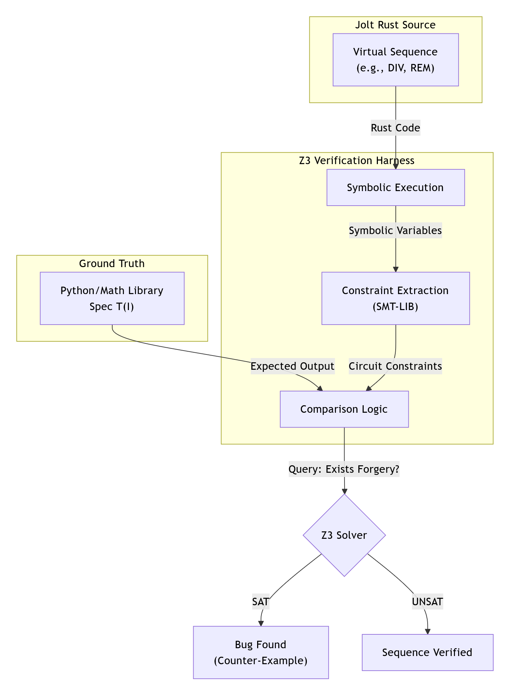
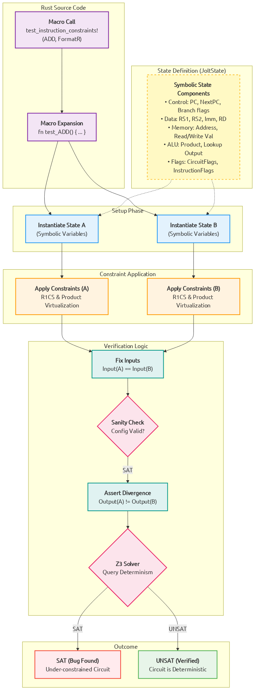

# Z3 Verifier

The `z3-verifier` crate provides a formal verification suite for Jolt. It uses the Z3 SMT solver to mathematically prove properties about Jolt's execution logic and constraint systems. Unlike standard unit tests that check specific inputs, this tool proves properties for *all* possible inputs.


## Structure

The crate is organized into two primary verification modules, sharing common utilities in `lib.rs`.

*   `src/virtual_sequences.rs`: Verifies the decomposed logic of complex instructions.
*   `src/cpu_constraints.rs`: Verifies the R1CS constraints of the CPU state machine.
*   `src/lib.rs`: Defines the `template_format!` macro, which simplifies test generation by providing default operand structures (e.g., `FormatR`, `FormatI`) for instructions.


## 1. Virtual Sequences (`virtual_sequences.rs`)

Jolt handles complex RISC-V instructions (like `DIV`, `REM`) by decomposing them into sequences of simpler Jolt primitives. This module verifies that these sequences are **correct** (match the spec) and **consistent** (deterministic).
Some Virtual sequences make use of `VirtualAdvice`, which when incorrectly constrained, allow a malicious prover to arbitrarily forge values in destination register for the virtualized instruction.



### The Symbolic CPU
The core component is the `SymbolicCpu` struct. Unlike the standard emulator which operates on `u64`, this CPU operates on Z3 **BitVectors** (`BV`).
*   **Registers:** Tracks $x_0, \dots, x_{31}$ as symbolic 64-bit values.
*   **Advice:** Maintains a set of advice variables $A = \{a_0, a_1, \dots \}$. When a `VirtualAdvice` instruction is executed, a new unconstrained symbolic variable is created and injected into the register file.
*   **Asserts:** Collects boolean constraints (e.g., `VirtualAssertEQ`) generated during execution.

### Symbolic Execution
The `symbolic_exec` function acts as an interpreter, mapping Jolt `Instruction` variants to Z3 bit-vector operations `BV`
```text
symbolic_exec(Instruction, State) -> NextState
```
Standard operations map directly (e.g., `ADD` -> `bvadd`), while virtual operations utilize Z3's logic for shifting and arithmetic.

### Verification Macros
The `test_sequence!` macro generates two distinct tests for each instruction:

#### A. Correctness (`test_correctness`)
Proves that the Jolt sequence matches the RISC-V specification.

**Property:** `Jolt(input) == RISC-V-Spec(input)`

1.  **Setup:** Creates a `SymbolicCpu`.
2.  **Spec Execution:** Runs the "Ground Truth" closure on `cpu_expected`.
3.  **Jolt Execution:** Expands the instruction into its virtual sequence and symbolically executes it on the main `cpu`.
4.  **Query:**
    ```text
    Exists input s.t. (cpu.regs != cpu_expected.regs) AND (Asserts are satisfied)
    ```
    *   **UNSAT:** The sequence is correct.
    *   **SAT:** A bug was found. The solver provides a counter-example.

#### B. Consistency (`test_consistency`)
Proves that the sequence is deterministic, even when relying on prover advice. We define the consistency query by duplicating the execution with independent advice variables `A1` and `A2`.

**Property:** `(Asserts(A1) AND Asserts(A2)) => Out(A1) == Out(A2)`

1.  **Setup:** Creates two CPUs with identical initial registers (`x1 == x2`).
2.  **Dual Execution:** Executes the sequence on both. `VirtualAdvice` generates distinct variables (`a1` for CPU 1, `a2` for CPU 2).
3.  **Query:**
    ```text
    Exists input, A1, A2 s.t. (cpu1.regs != cpu2.regs) AND (Asserts1 AND Asserts2 are satisfied)
    ```
    *   **UNSAT:** The constraints are strong enough to force a single unique result.
    *   **SAT:** The sequence is **under-constrained**, allowing multiple valid outputs.


## 2. R1CS Constraints (`cpu_constraints.rs`)

This module verifies the lowest-level circuits that enforce the CPU's state transitions, ensuring **Consistency**: for a given state $S$ and input $I$, there exists exactly one valid next state $S'$.



### What defines a State?
In the R1CS verifier, a state (`JoltState`) is a complete symbolic snapshot of a single execution cycle. It is defined by the following variables (modeled as Z3 **Integers**):

*   **Control Flow:** `pc` (current), `next_pc` (next), `unexpanded_pc`, and `next_is_noop` (padding indicator).
*   **Data Flow:** `rs1_value`, `rs2_value` (read inputs), `rd_write_value` (write-back), and `imm` (instruction immediate).
*   **Memory Context:** `ram_addr` (destination address), `ram_read_value`, and `ram_write_value`.
*   **ALU Witnesses:** `left_input`, `right_input`, `product` (multiplier output), and `lookup_output`.
*   **System Signals:** `CircuitFlags` (e.g., `Add`, `Store`, `Jump`) and `InstructionFlags` (e.g., `IsRdNotZero`, `Branch`).


### Consistency Check (`do_test`)
The verifier searches for non-deterministic transitions. We verify that the transition function is well-defined:

**Property:** `C(S, I, S1) AND C(S, I, S2) => S1 == S2`

1.  **Dual States:** Create symbolic states `S1` and `S2`.
2.  **Constrain:** Apply both R1CS and Product constraints to both states.
3.  **Fix Inputs:** Force both states to have identical inputs (same PC, flags, memory reads, and register values).
4.  **Query:**
    ```text
    Exists S, I, S1, S2 s.t. S1.outputs != S2.outputs
    ```
    *   **UNSAT:** The circuit is sound (Deterministic).
    *   **SAT:** The circuit is **under-constrained**. The solver found a non-deterministic transition where the same input allows multiple valid next states.


> NOTE: All the symbolic variables are modelled using integer arithmetic instead of finite field, which could cause slightly different behaviours. The harness only enforces consistency checks on the r1cs constraints, full formal verification is only guaranteed after correctness modelling against correct RISC-V spec.


## Interpreting Results

When the test suite runs (`cargo test -p z3-verifier -- --nocapture`), it outputs `SAT` or `UNSAT`. A `SAT` result indicates a failure in verification.

### 1. Correctness Failures (Logic Bugs)
**Symptom:** `test_..._correctness` fails.
**Meaning:** The verifier found a concrete set of inputs where Jolt's output disagrees with the Spec.
**Fix:** Analyze the provided counter-example. If the logic in `symbolic_exec` is correct, the virtual sequence in `jolt-core` is likely buggy.

### 2. Consistency Failures (Under-Constrained Advice)
**Symptom:** `test_..._consistency` fails.
**Meaning:** A malicious prover can choose different advice values to produce different final results, satisfying all constraints. Usually consistency failures in advice also lead to correctness failures since we can find an advice which leads to incorrect results.
**Fix:** The virtual sequence is missing validation. Add assertions (e.g., `VirtualAssertEQ`) to tightly constrain the advice.

### 3. R1CS Consistency Failures 
**Symptom:** `test_...` in `cpu_constraints` fails.
**Meaning:** The R1CS constraints allow multiple next states for the same input.
**Fix:** Identify the unconstrained variable (e.g., `rd_write_value`). Add a constraint in `jolt-core/src/zkvm/r1cs/constraints.rs` to force this value to a deterministic state.
