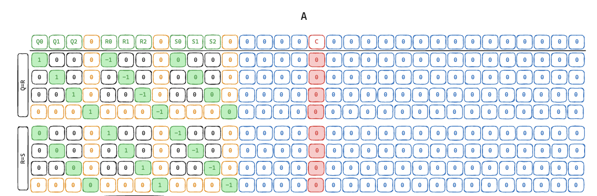
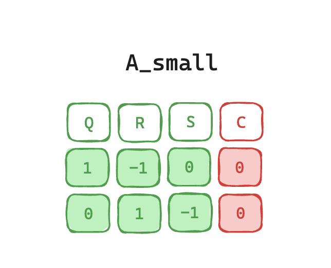

# R1CS constraints

Jolt usees R1CS constraints to enforce certain rules of the RISC-V fetch-decode-execute loop 
and to ensure 
consistency between the proofs for the different modules of Jolt ([instruction lookups](./instruction_lookups.md), [read-write memory](./read_write_memory.md), and [bytecode](./bytecode.md)). Jolt uses a modified instance of [Spartan](https://eprint.iacr.org/2019/550) to prove R1CS using the sumcheck protocol.

## Simple sketch of Spartan
**First sumcheck**

$F(q) = \sum_{x \ in \{0,1\}^{log_2(height)}}{\widetilde{eq}(q,x) \cdot [ \widetilde{Az}(x) \cdot \widetilde{Bz}(x) - \widetilde{Cz}(x)]}$  

Outputs a claimed evaluation of 

$\widetilde{Az}(r_x), \widetilde{Bz}(r_x), \widetilde{Cz}(r_x)$  

**Second sumcheck**

Now the verifier needs to evaluate $\widetilde{Az}(r_x), \widetilde{Bz}(r_x), \widetilde{Cz}(r_x)$. The verifier only has a representation of $A, B,C, Z$, but does not have the matrix vector products $Az, Bz, Cz$. So we'll use sumcheck again.

$Az(r_x) = \sum_y A(r_x, y) * z(y)$

$Bz(r_x) = \sum_y B(r_x, y) * z(y)$

$Cz(r_x) = \sum_y C(r_x, y) * z(y)$

We could run a sumcheck for each of these but it's more efficient from both a prover and verifier perspective to combine into a single sumcheck by pulling a random variable $r_c$ from the Fiat-Shamir transcript and combining the linear terms.

$ABCz(r_x) = \widetilde{Az}(r_x) + r_c * \widetilde{Bz}(r_x)  + r_c^2 * \widetilde{Cz}(r_x) = \sum_y{[ A(r_x, y) + r_c * B(r_x, y) + r_c^2 * C(r_x, y] ) * \widetilde{Z}(y)}$

Outputs a claimed evaluation of $A(r_x, r_y), B(r_x, r_y), C(r_x, r_y), Z(r_y)$, specifically in the form $A(r_x,r_y) + r_c * B(r_x, r_y) + r_c^2 * C(r_x, r_y)$.

The verifier does have a representation of these is able to evaluate without assistance.

## Uniform Spartan
Jolt's Spartan instance is highly patterned. We run the same R1CS for each cycle of the RISC-V program. We can leverage this property to increase prover and verifier efficiency.

Think of a simple constraint system with the following inputs: $Q, R, S$. Each of these inputs is repeated $nc = num\_cycles$ times. 

The witness vector, $Z$ now looks like $[Q_0, ... Q_{nc}, R_0, ... R_{nc}, S_{0}, ... S_{nc}, 1]$. The one in the final slot allows constants in the constraints.

> [!NOTE]
> Syntax: For bitvector $x=x_0, x_1, ... x_n$, $x_0$ represents the most-significant bit, and $x_n$ represents the least significant bit. By default sumchecks will bind from the "top", where they bind the MSB first. For some sumchecks, notably sparse ones we'll bind from the "bottom" for algorithmic efficiency reasons. 

We want a property where we can easily index the Z's $cycle$ and $variable$ separately. To do so we'll pad the number of cycles to a power of two and the number of variables to a power of two.

Concretely for $nc=3$ the $Z$ vector looks like $[Q_0, Q_1, Q_2, 0, R_0, R_1, R_2, 0, S_0, S_1, S_2, 0, 0, 0, 0, 0, 1]$.

Now we can index by $cycle$ and $variable$ independently.
- $Z[v_0, v_1, v_2, c_0, c_1]$ 
- $v_0, v_1, v_2$ index the variable
- $c_0, c_1$ index the cycle
- $Z[0, 0, 1, c_0, c_1]$ allows you to index into all of R's values using $c_0, c_1$
- $Z[v_0, v_1, v_2, 1, 0]$ allows you to index $Q_2, R_2, S_2$ using $v_0, v_1, v_2$ 

Note that Z is also padded to a power of two, so the full Z vector is $[Q_0, Q_1, Q_2, 0, R_0, R_1, R_2, 0, S_0, S_1, S_2, 0, 0, 0, 0, 0, 1, 0, 0, 0, 0, 0, 0, 0, 0, 0, 0, 0, 0, 0, 0, 0]$ 

$v_0$ indexes constant vs non-constant columns.

The $A, B, C$ matrices follow a similar pattern where the constraints are repeated $nc$ times and the variables are repeated $nc$ times. For example, given a 2 constraint system over the variables $Q, R, S$.

Notice that the matrix follows a sparse-diagonal pattern. We can use this to define $A_{small}$.

`TODO: We leverage this to make the prover and verifier computations more efficient.`

## Cross-Cycle Uniform Spartan
`TODO: We also have a small number of non-uniform constraints that reference a cycle directly adjacent to the current cycle. We can use similar tricks to maintain the general uniformity.`

### Reusing commitments 

As with most SNARK backends, Spartan requires computing a commitment to the inputs 
to the constraint system. 
A catch (and an optimization feature) in Jolt is that most of the inputs 
are also used as inputs to proofs in the other modules. For example, 
the address and values pertaining to the bytecode are used in the bytecode memory-checking proof, 
and the lookup chunks, output and flags are used in the instruction lookup proof. 
For Jolt to be sound, it must be ensured that the same inputs are fed to all relevant proofs. 
We do this by re-using the commitments themselves. 
This can be seen in the `format_commitments()` function in the `r1cs/snark` module. 
Spartan is adapted to take pre-committed witness variables. 