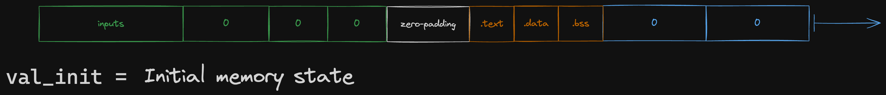

# Read-write memory (registers and RAM)

Jolt proves the validity of registers and RAM using offline memory checking.
In contrast to our usage of offline memory checking in other modules, registers and RAM are *writable* memory.

## Memory layout

For the purpose of offline memory checking, Jolt treats registers, program inputs/outputs, and RAM as occupying one unified address space.
This remapped address space is laid out as follows:

The zero-padding depicted above is sized so that RAM starts at a power-of-two offset (this is explained [below](#handling-program-io)).
As noted in the diagram, the size of the witness scales with the highest memory addressed over the course of the program's execution.
In addition to the zero-padding between the "Program I/O" and "RAM" sections, the end of the witness is zero-padded to a power of two.

## Handling program I/O

### Inputs

Program inputs and outputs (plus the panic and termination bits, which indicate whether the program has panicked or otherwise terminated, respectively) live in the same memory address space as RAM.
Program inputs populate the designated input space upon initialization:

The verifier can efficiently compute the MLE of this initial memory state on its own (i.e. in time proportional to the IO size, not the total memory size).

### Outputs and panic

On the other hand, the verifier cannot compute the MLE of the final memory state on its own –– though the program I/O is known to the verifier, the final memory state contains values written to registers/RAM over the course of program execution, which are *not* known to the verifier.

The verifier is, however, able to compute the MLE of the program I/O values (padded on both sides with zeros) –– this is denoted `v_io` below.
If the prover is honest, then the final memory state (`v_final` below) should agree with `v_io` at the indices corresponding to program I/O.

To enforce this, we invoke the sumcheck protocol to perform a "zero-check" on the difference between `v_final` and `v_io`:

This also motivates the zero-padding between the "Program I/O" and "RAM" sections of the witness. The zero-padding ensures that both `input_start` and `ram_witness_offset` are powers of two, which makes it easier for the verifier to compute the MLEs of `v_init` and `v_io`.

## Timestamp range check

Registers and RAM are *writable* memory, which introduces additional requirements compared to offline memory checking in a read-only context.

The multiset equality check for read-only memory, typically expressed as $I \cdot W = R \cdot F$, is not adequate for ensuring the accuracy of read values. It is essential to also verify that each read operation retrieves a value that was written in a *previous* step (not a future step). (Here, $I$ denotes the tuples capturing initialization of memory and $W$ the tuples capturing all of the writes to memory following initialization. $R$ denotes the tuples capturing all read operations, and $F$ denotes tuples capturing a final read pass over all memory cells).

To formalize this, we assert that the timestamp of each read operation, denoted as $\text{read\_timestamp}$, must not exceed the global timestamp at that particular step.
The global timestamp starts at 0 and is incremented once per step.

The verification of $\text{read\_timestamp} \leq \text{global\_timestamp}$ is equivalent to confirming that $\text{read\_timestamp}$ falls within the range $[0, \text{TRACE\_LENGTH})$ and that the difference $(\text{global\_timestamp} - \text{read\_timestamp})$ is also within the same range.

The process of ensuring that both $\text{read\_timestamp}$ and $(\text{global\_timestamp} - \text{read\_timestamp})$ lie within the specified range is known as range-checking. This is the procedure implemented in [`timestamp_range_check.rs`](https://github.com/a16z/jolt/blob/main/jolt-core/src/jolt/vm/timestamp_range_check.rs), using a modified version of Lasso.

Intuitively, checking that each read timestamp does not exceed the global timestamp prevents an attacker from answering all read operations to a given cell with "the right set of values, but out of order". Such an attack requires the attacker to "jump forward and backward in time". That is, for this attack to succeed, at some timestamp $t$ when the cell is read, the attacker would have to return a value that will be written to that cell in the future (and at some later timestamp t' when the same cell is read the attacker would have to return a value that was written to that cell much earlier). This attack is prevented by confirming that all values returned have a timestamp that does not exceed the current global timestamp.

## Word-addressable memory

According to the RISC-V specification, the RISC-V memory is **byte-addressable**,
i.e. load and store instructions can access any memory address, with no restrictions on whether the address is aligned to a 4-byte word.
However, the specification caveats that unaligned accesses may incur performance penalties on hardware,
and some RISC-V implementations may choose to disallow unaligned memory accesses entirely.
This means that `LW` and `SW` must access memory addresses that are word-aligned (i.e. multiples of 4),
and `LH`, `LHU`, and `SH` must access memory addresses that are halfword-aligned (i.e. multiples of 2).
There are no such restrictions on `LB`, `LBU` and `SB`, as they only access a single byte.

Jolt disallows unaligned memory accesses for prover performance reasons;
one cannot generate a valid Jolt proof for an execution trace that includes unaligned memory accesses.
Enforcing aligned accesses allows Jolt to treat memory as **word-addressable**,
which reduces the number of committed polynomials and instances of offline memory-checking.

In more detail, Jolt
1. constrains all `LW` and `SW` instructions to only allow word-aligned accesses, and
constrains all `LH`, `LHU`, and `SH` instructions to only allow halfword-aligned accesses.
This is accomplished using virtual `ASSERT` instructions (see Section 6.1.1 of the Jolt paper).
2. replaces all `LH`, `LHU`, `SH`, `LB`, `LBU`, and `SB` instructions with [virtual sequences](./m-extension.md)
that only perform word-aligned accesses.

### `LB` virtual sequence

1. `ADDI` `rs1`, --, `imm`, $v_0$   `// Compute the memory address being accessed`
1. `ANDI` $v_0$, --, `(1 << 32) - 4`, $v_1$   `// Mask out the lower bits to obtain the word-aligned address`
1. `LW` $v_1$, --, 0, $v_2$   `// Load the full word`
1. `XORI` $v_2$, --, `0b11`, $v_3$   `// Compute the number of bytes to shift the word (in the lower 2 bits)`
1. `SLLI` $v_3$, --, 3, $v_3$   `// Compute the number of bits to shift the word (in the lower 5 bits)`
1. `SLL` $v_2$, $v_3$, --, `rd`   `// Shift the word so that the desired byte is left-aligned`
1. `SRAI` `rd`, --, 24, `rd`   `// Right arithmetic shift to sign-extend and right-align the byte`

### `LBU` virtual sequence

1. `ADDI` `rs1`, --, `imm`, $v_0$   `// Compute the memory address being accessed`
1. `ANDI` $v_0$, --, `(1 << 32) - 4`, $v_1$   `// Mask out the lower bits to obtain the word-aligned address`
1. `LW` $v_1$, --, 0, $v_2$   `// Load the full word`
1. `XORI` $v_2$, --, `0b11`, $v_3$   `// Compute the number of bytes to shift the word (in the lower 2 bits)`
1. `SLLI` $v_3$, --, 3, $v_3$   `// Compute the number of bits to shift the word (in the lower 5 bits)`
1. `SLL` $v_2$, $v_3$, --, `rd`   `// Shift the word so that the desired byte is left-aligned`
1. `SRLI` `rd`, --, 24, `rd`   `// Right logical shift to zero-extend and right-align the byte`

### `LH` virtual sequence

1. `ASSERT_HALFWORD_ALIGNMENT` `rs1`, --, `imm`, -- `// Virtual instruction to enforce aligned memory access`
1. `ADDI` `rs1`, --, `imm`, $v_0$   `// Compute the memory address being accessed`
1. `ANDI` $v_0$, --, `(1 << 32) - 4`, $v_1$   `// Mask out the lower bits to obtain the word-aligned address`
1. `LW` $v_1$, --, 0, $v_2$   `// Load the full word`
1. `XORI` $v_2$, --, `0b10`, $v_3$   `// Compute the number of bytes to shift the word (in the lower 2 bits)`
1. `SLLI` $v_3$, --, 3, $v_3$   `// Compute the number of bits to shift the word (in the lower 5 bits)`
1. `SLL` $v_2$, $v_3$, --, `rd`   `// Shift the word so that the desired halfword is left-aligned`
1. `SRAI` `rd`, --, 16, `rd`   `// Right arithmetic shift to sign-extend and right-align the halfword`

### `LHU` virtual sequence

1. `ASSERT_HALFWORD_ALIGNMENT` `rs1`, --, `imm`, -- `// Virtual instruction to enforce aligned memory access`
1. `ADDI` `rs1`, --, `imm`, $v_0$   `// Compute the memory address being accessed`
1. `ANDI` $v_0$, --, `(1 << 32) - 4`, $v_1$   `// Mask out the lower bits to obtain the word-aligned address`
1. `LW` $v_1$, --, 0, $v_2$   `// Load the full word`
1. `XORI` $v_2$, --, `0b10`, $v_3$   `// Compute the number of bytes to shift the word (in the lower 2 bits)`
1. `SLLI` $v_3$, --, 3, $v_3$   `// Compute the number of bits to shift the word (in the lower 5 bits)`
1. `SLL` $v_2$, $v_3$, --, `rd`   `// Shift the word so that the desired halfword is left-aligned`
1. `SRLI` `rd`, --, 16, `rd`   `// Right logical shift to zero-extend and right-align the halfword`

### `SB` virtual sequence

1. `ADDI` `rs1`, --, `imm`, $v_0$   `// Compute the memory address being accessed`
1. `ANDI` $v_0$, --, `(1 << 32) - 4`, $v_1$   `// Mask out the lower bits to obtain the word-aligned address`
1. `LW` $v_1$, --, 0, $v_2$   `// Load the full word`
1. `SLLI` $v_0$, --, 3, $v_3$   `// Compute the number of bits to shift the byte (in the lower 5 bits)`
1. `LUI` --, --, `0xff`, $v_4$   `// Load the bitmask into a virtual register`
1. `SLL` $v_4$, $v_3$, --, $v_4$   `// Shift the bitmask into the position of the desired byte`
1. `SLL` `rs2`, $v_3$, --, $v_5$   `// Shift the value being stored to align with the bitmask`
1. `XOR` $v_2$, $v_5$, --, $v_5$
1. `AND` $v_5$, $v_4$, --, $v_5$
1. `XOR` $v_2$, $v_4$, --, $v_2$
1. `SW` $v_1$, $v_2$, 0, --    `// Store the updated word`

Instructions 8-10 use a [bit-twiddling hack](https://graphics.stanford.edu/~seander/bithacks.html#MaskedMerge) to mask the stored byte into the word.

### `SH` virtual sequence

1. `ASSERT_HALFWORD_ALIGNMENT` `rs1`, --, `imm`, -- `// Virtual instruction to enforce aligned memory access`
1. `ADDI` `rs1`, --, `imm`, $v_0$   `// Compute the memory address being accessed`
1. `ANDI` $v_0$, --, `(1 << 32) - 4`, $v_1$   `// Mask out the lower bits to obtain the word-aligned address`
1. `LW` $v_1$, --, 0, $v_2$   `// Load the full word`
1. `SLLI` $v_0$, --, 3, $v_3$   `// Compute the number of bits to shift the halfword (in the lower 5 bits)`
1. `LUI` --, --, `0xffff`, $v_4$   `// Load the bitmask into a virtual register`
1. `SLL` $v_4$, $v_3$, --, $v_4$   `// Shift the bitmask into the position of the desired halfword`
1. `SLL` `rs2`, $v_3$, --, $v_5$   `// Shift the value being stored to align with the bitmask`
1. `XOR` $v_2$, $v_5$, --, $v_5$
1. `AND` $v_5$, $v_4$, --, $v_5$
1. `XOR` $v_2$, $v_4$, --, $v_2$
1. `SW` $v_1$, $v_2$, 0, --    `// Store the updated word`

Instructions 9-11 use a [bit-twiddling hack](https://graphics.stanford.edu/~seander/bithacks.html#MaskedMerge) to mask the stored byte into the word.
