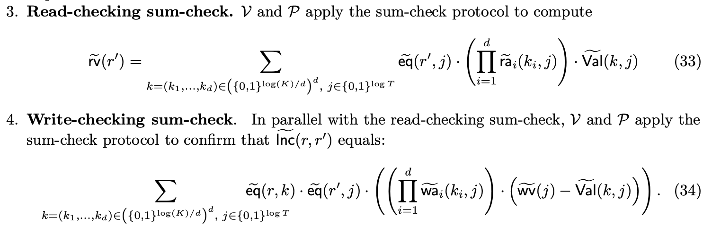
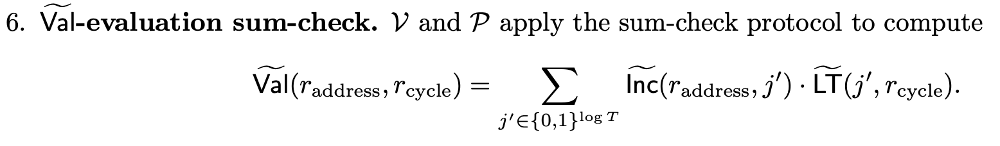

# Twist and Shout

🚧 These docs are under construction 🚧

👷If you are urgently interested in this specific page, open a Github issue and we'll try to expedite it.👷
## One-hot polynomials

## Shout

### Prefix-suffix Shout

## Twist

### "Local" vs "alternative" algorithm

### wv virtualization

In the Twist and Shout paper (Figure 9), the read and write checking sumchecks of Twist are presented as follows:

Observe that the write checking sumcheck is presented as a way to confirm that an evaluation of $\widetilde{\textsf{Inc}}: \mathbb{F}^{\log K} \times \mathbb{F}^{\log T} \rightarrow \mathbb{F}$ is correct.

Under this formulation, both $\widetilde{\textsf{Inc}}$ and the $\widetilde{\textsf{wv}}: \mathbb{F}^{\log T} \rightarrow \mathbb{F}$ polynomial are committed.

With a slight tweak, we can avoid committing to $\textsf{wv}$.
First, we will modify $\widetilde{\textsf{Inc}}$ to be a polynomial over just the cycle variables, i.e. $\widetilde{\textsf{Inc}}: \mathbb{F}^{\log T} \rightarrow \mathbb{F}$.
Intuitively, the $j$th coefficient of $\widetilde{\textsf{Inc}}$ is the delta for the memory cell accessed at cycle $j$ (agnostic to which cell was accessed).

Second, we will reformulate the write checking sumcheck to more closely match the read checking sumcheck:

$$
\widetilde{\textsf{wv}}(r') = \sum_{k = (k_1, \dots, k_d) \in \left(\{0, 1\}^{\log(K) / d}\right)^d, j \in \{0, 1\}^{\log(T)}} \widetilde{\textsf{eq}}(r, k) \cdot \widetilde{\textsf{eq}}(r', j) \cdot
\left( \left( \prod_{i=1}^d \widetilde{\textsf{wa}}_i(k_i, j) \right) \cdot \left(\widetilde{\textsf{Val}}(k, j) + \widetilde{\textsf{Inc}}(j) \right) \right)
$$

Intuitively, the write value at cycle $j$ is equal to whatever was already in that register ($\widetilde{\textsf{Val}}(k, j)$), plus the increment ($\widetilde{\textsf{Inc}}$).

We also need to tweak the $\widetilde{\textsf{Val}}$-evaluation sumcheck to accommodate the modification $\widetilde{\textsf{Inc}}$.
As presented in the paper:

After modifying $\widetilde{\textsf{Inc}}$ to be a polynomial over just the cycle variables:

$$
\widetilde{\textsf{Val}}(r_\text{address}, r_\text{cycle}) = \sum_{j' \in \{0, 1\}^{\log T}} \widetilde{\textsf{Inc}}(j') \cdot \widetilde{\textsf{wa}}(r_\text{address}, j') \cdot \widetilde{\textsf{LT}}(j', r_\text{cycle})
$$
