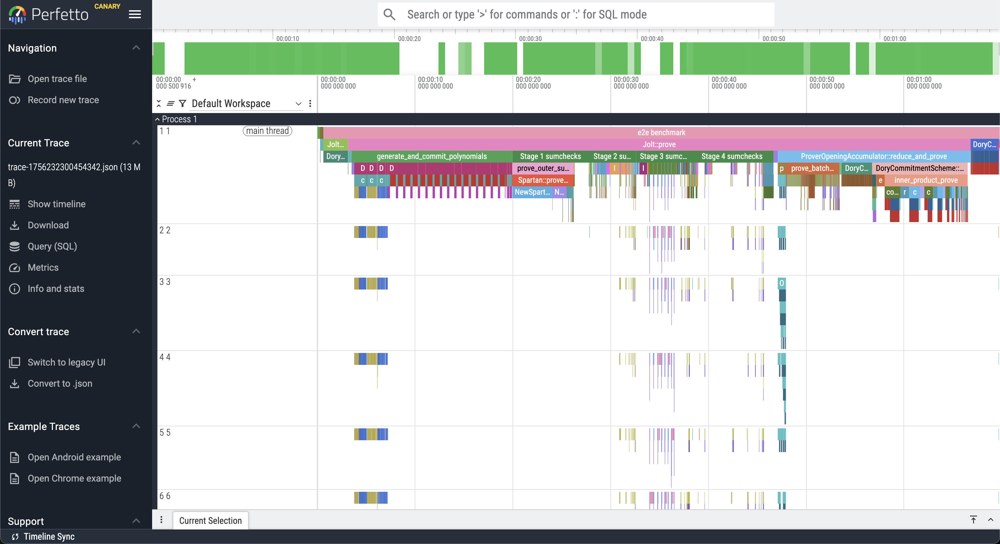
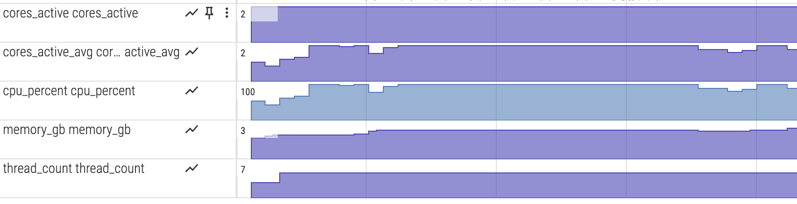
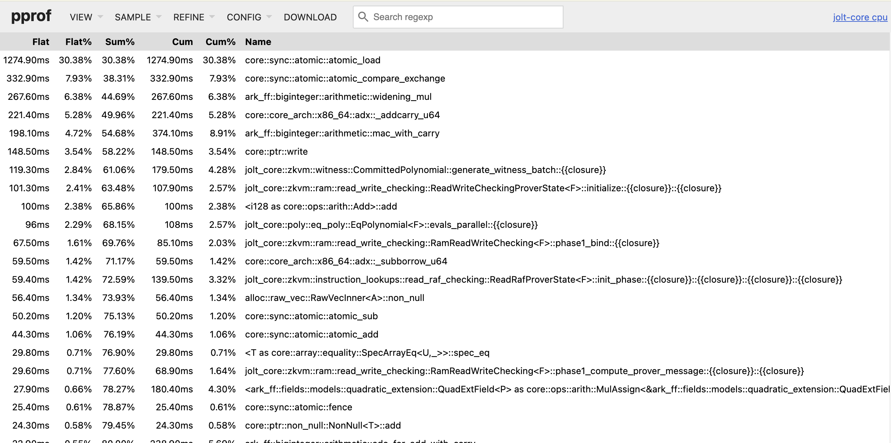
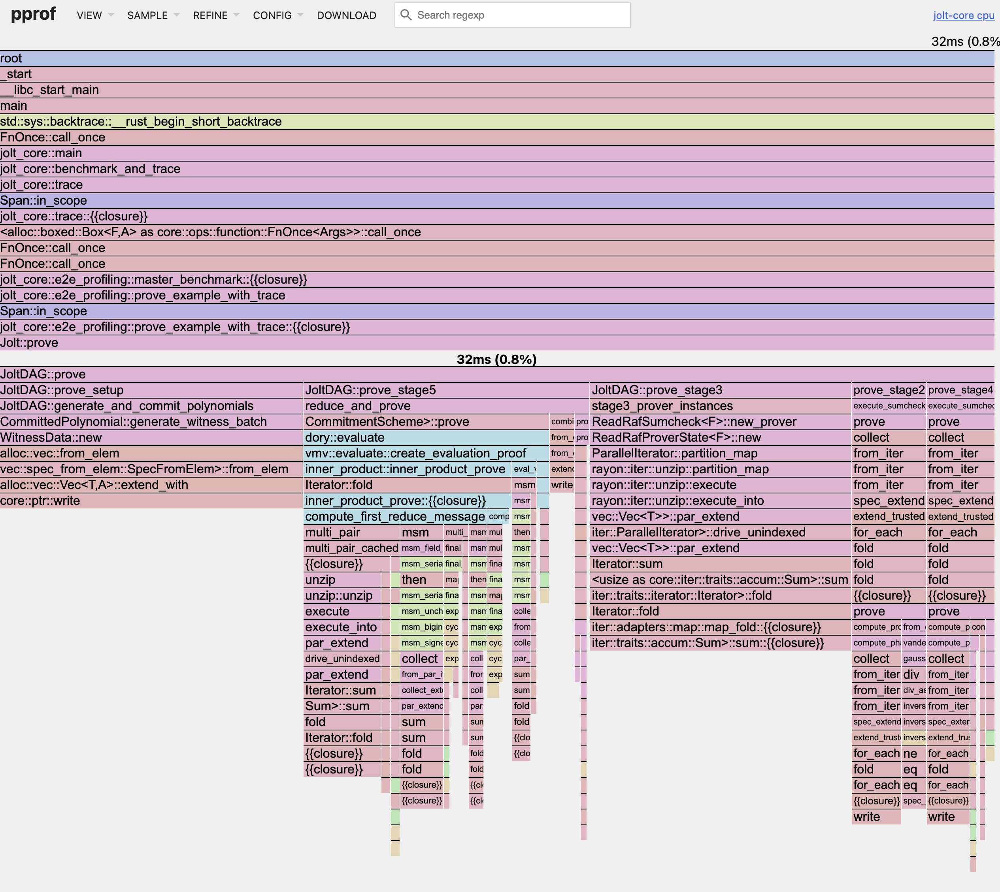
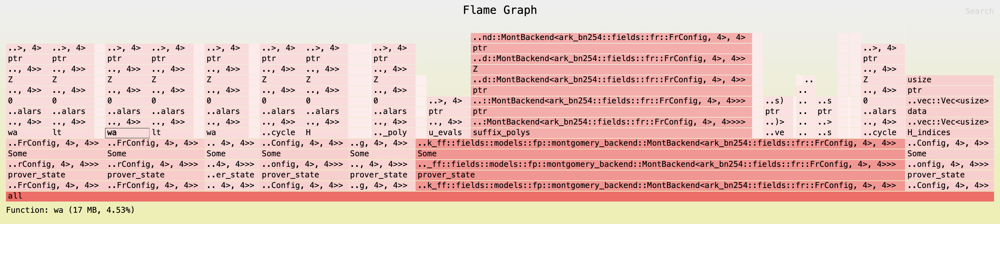

# Profiling Jolt

## Execution profiling

Jolt is instrumented using [`tokio-rs/tracing`](https://github.com/tokio-rs/tracing) for execution profiling.
We use the [`tracing_chrome`](https://github.com/thoren-d/tracing-chrome) crate to output traces in the format expected by [Perfetto](https://ui.perfetto.dev/).

To generate a trace, run e.g.

```cargo run --release -p jolt-core profile --name sha3 --format chrome```

Where `--name` can be `sha2`, `sha3`, `sha2-chain`, `fibonacci`, or `btreemap`. The corresponding guest programs can be found in the `examples` directory. The benchmark inputs are provided in `bench.rs`.

The above command will output a JSON file in the workspace rootwith a name `trace-<timestamp>.json`, which can be viewed in [Perfetto](https://ui.perfetto.dev/):



### System resource monitoring

To visualize CPU and memory usage alongside the execution trace, enable the `monitor` feature:

```bash
cargo run --release --features monitor -p jolt-core profile --name sha3 --format chrome
python3 scripts/postprocess_trace.py trace-*.json
```

The postprocessing step converts the metrics into counter tracks for Perfetto.



### Fine-grained CPU profiling with pprof

When tracing is insufficiently detailed, you can enable [pprof](https://github.com/google/pprof) for fine-grained CPU profiling. While execution tracing shows you the high-level stages and their durations (based on manually instrumented code), pprof automatically samples your entire program at the function level to capture each function call including in dependencies. This can help reveal performance bottlenecks that tracing might miss, such as unexpected hotspots in serialization, memory allocation, or cryptographic operations.

To enable pprof profiling, add the `--features pprof` flag:

```cargo run --release --features pprof -p jolt-core profile --name sha3 --format chrome```

This will generate multiple `.pb` profile files in `benchmark-runs/pprof/`, one for each major stage.

To view the proving profile in your browser using [pprof](https://github.com/google/pprof), run:

```go tool pprof -http=:8080 target/release/jolt-core benchmark-runs/pprof/sha3_prove.pb```

This will start a web server at `http://localhost:8080` where you can explore:

- **Flame graphs** - Visual representation of call stacks and time spent
- **Top functions** - List of functions consuming the most CPU time
- **Source view** - Line-by-line breakdown of CPU usage
- **Call graph** - Function call relationships




You may need to increase the sampling frequency to get a more detailed profile for shorter traces or decrease it for longer tracesto reduce overhead.You may customize the sampling frequency using the `PPROF_FREQ` environment variable (default: 100 Hz):

```PPROF_FREQ=1000 cargo run --release --features pprof -p jolt-core profile --name sha3 --format chrome```

## Memory profiling

Jolt uses [allocative](https://github.com/facebookexperimental/allocative) for memory profiling.
Allocative allows you to (recursively) measure the total heap space occupied by any data structure implementing the `Allocative` trait, and optionally generate a flamegraph.
In Jolt, most sumcheck data structures implement the `Allocative` trait, and we generate a flamegraph at the start and end of stages 2-7 of the Jolt [DAG](../../how/architecture/architecture.md#jolt-as-a-dag) (see [`jolt_dag.rs`](https://github.com/a16z/jolt/blob/main/jolt-core/src/zkvm/dag/jolt_dag.rs)).

To generate allocative output, run:

```RUST_LOG=debug cargo run --release --features allocative -p jolt-core profile --name sha3 --format chrome```

Where, as above, `--name` can be `sha2`, `sha3`, `sha2-chain`, `fibonacci`, or `btreemap`.

The above command will log memory usage info to the command line and output multiple SVG files, e.g. `stage3_start_flamechart.svg`, which can be viewed in a web browser of your choosing:


