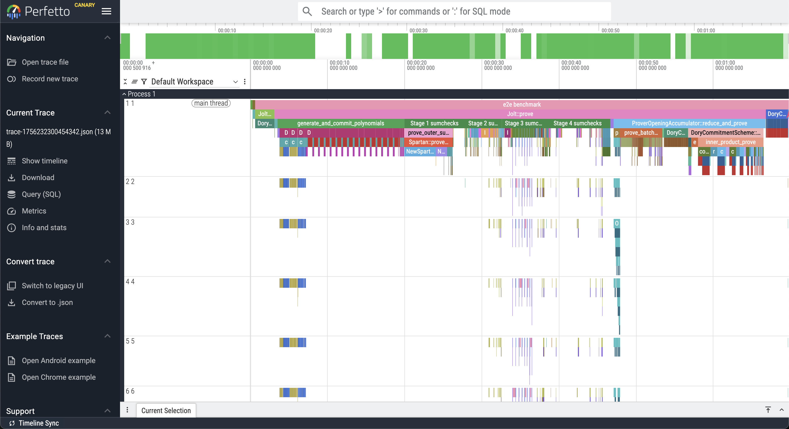
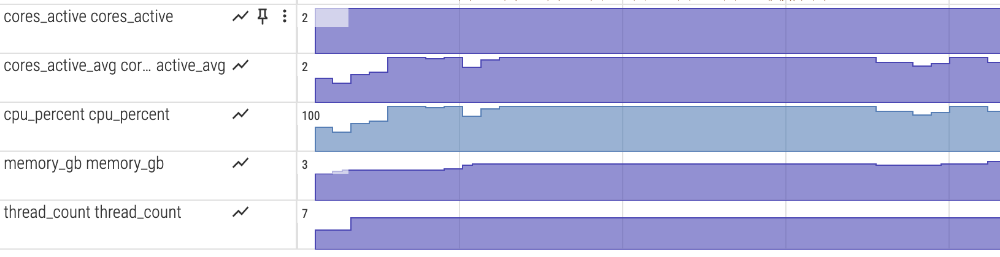
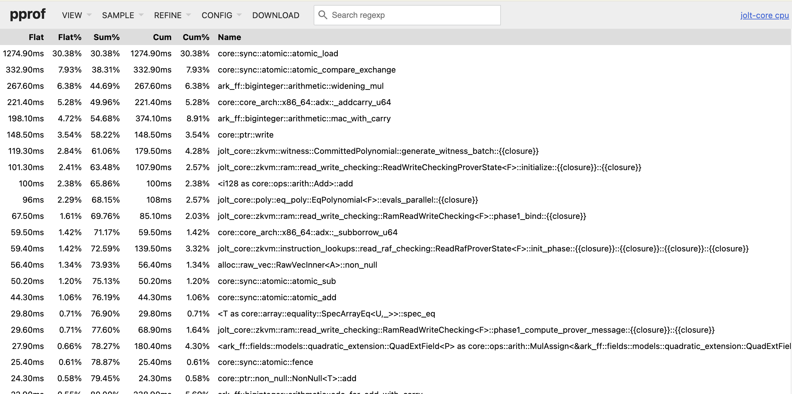
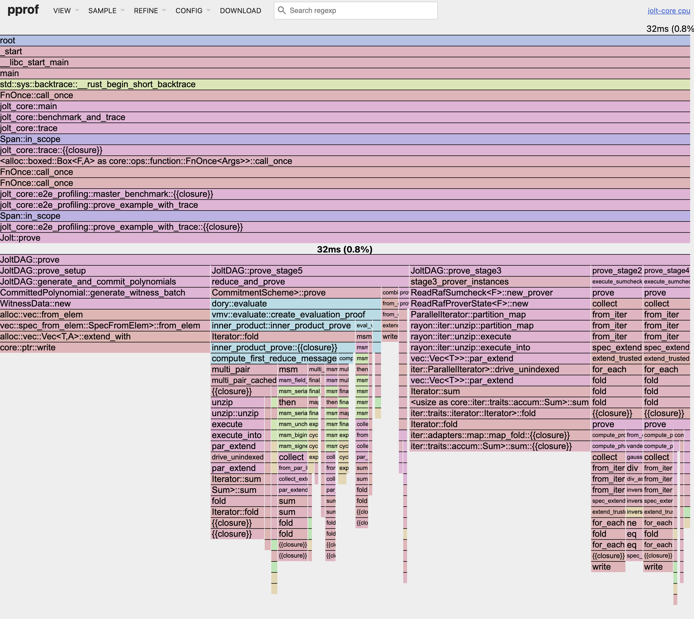
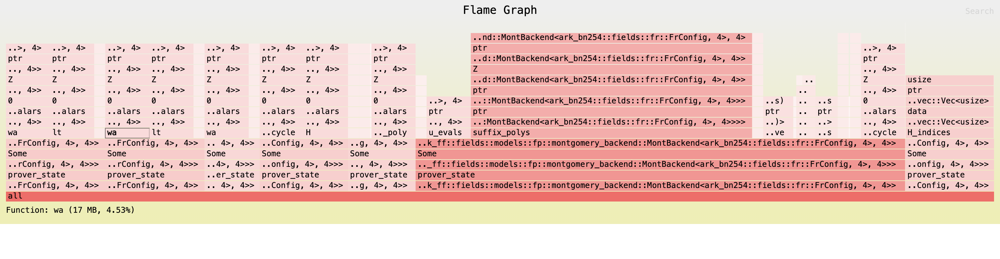

# Profiling Jolt

The modular prover (`crates/jolt-prover`) is the primary profiling target.
One command proves a named workload and emits two artifacts from the same
span stream: a Perfetto-viewable chrome trace for humans, and a
machine-queryable `summary.json` for scripts, agents, and `jolt-eval`
telemetry objectives.

```bash
cargo run --release -p jolt-prover --features profiling -- \
    profile --name sha2-chain --format chrome
```

Workloads and default scales (`--scale <log2 trace length>` overrides):

| `--name` | default scale |
|---|---|
| `fibonacci` | 2^16 |
| `sha2-chain` | 2^22 |
| `sha3-chain` | 2^22 |
| `btreemap` | 2^20 |

`--backend` selects the prover backend (both subcommands): `reference`
(default) is the naive test oracle — absolute numbers are provisional,
attribution is meaningful relatively — while `optimized` is the performance
tier (legacy-parity prover performance), slotting into the same
instrumented seams.

Artifacts are grouped by run: each invocation writes into
`benchmark-runs/{timestamp}_{trace_name}/` (with `{trace_name}` =
`modular_{workload}_{scale}`, hyphens in the workload mapped to
underscores; optimized runs append `_optimized`, keeping their artifact set
next to the reference one), and `benchmark-runs/latest_{trace_name}` is symlinked to the
newest successful run — the stable path every example below reads. All
paths are under the current working directory. The directory name carries
the run identity, so the files inside use fixed names:

- `trace.json` — chrome trace. Open in
  [Perfetto](https://ui.perfetto.dev/) or query with `trace_processor` SQL.
- `summary.json` — schema-versioned aggregates (see below).

The run also compiles and traces the guest, proves it, and **verifies the
proof** as a correctness gate; only `prove()` is measured. The `profiling`
feature enables the system monitor, so CPU/memory counters render as native
Perfetto counter tracks directly from the emitted trace — no offline
post-processing step.

## Benchmark sweeps

The `benchmark` subcommand sweeps workloads across scales — one `profile`
subprocess per (workload, scale), continuing past failures, with `--resume`
skipping pairs whose `latest_` link already exists:

```bash
cargo run --release -p jolt-prover --features profiling -- \
    benchmark --min-scale 18 --max-scale 21 --resume
# --benchmarks fibonacci,sha2-chain limits the workload set
```

Results accumulate in `benchmark-runs/modular_timings.csv` (per-run CSVs live
in the run directories); render
them with:

```bash
python3 scripts/benchmark_summary.py     # per-scale table
python3 scripts/plot_benchmarks.py       # speed + proof-size plots
python3 scripts/plot_memory_usage.py     # peak memory per run (from summary.json)
```

Mind the machine: the reference backend retains ~18 GiB regardless of scale
and grows steeply with it — large-scale sweeps on the reference backend are
for big-memory hosts; use `--backend optimized` above small scales.

The span labels are a versioned public schema — taxonomy v1 lives in the
`jolt-profiling` crate docs (`crates/jolt-profiling/src/taxonomy.rs`), the
normative source for label names, level policy, and the hot-loop rule.

## Querying without the Perfetto UI

`summary.json` answers the canonical questions with `jq` alone:

```bash
S=benchmark-runs/latest_modular_sha2_chain_22/summary.json

# Total prover wallclock (seconds) and dark time (root time not covered by
# any stage span)
jq '.root | {s: (.wall_time_ns/1e9), dark: .dark_time_fraction}' $S

# Total time across all instances of one span label
jq '.spans."EqPolynomial::evals".total_ns / 1e9' $S

# Top 10 spans by inclusive time
jq '.spans | to_entries | sort_by(-.value.total_ns) | .[:10]
    | map({label: .key, s: (.value.total_ns/1e9)})' $S

# Top 10 spans by self time (inclusive minus same-thread children)
jq '.spans | to_entries | sort_by(-.value.self_ns) | .[:10]
    | map({label: .key, s: (.value.self_ns/1e9)})' $S

# Per-stage wallclock breakdown
jq '.stages | map({label, s: (.wall_time_ns/1e9)})' $S

# Per-stage memory: boundary-RSS delta (retained growth) and windowed
# sample-max (null when the stage closed between monitor samples)
jq '.stages | map({label, rss_delta_gib, peak_memory_gib})' $S
```

Arbitrary ad-hoc queries go through Perfetto's `trace_processor` SQL against
the trace (the same SQL the Perfetto UI runs, now scriptable). Provision the
pinned pip package once:

```bash
uv pip install perfetto==0.57.2
```

```python
from perfetto.trace_processor import TraceProcessor

tp = TraceProcessor(trace="benchmark-runs/latest_modular_sha2_chain_22/trace.json")
q = tp.query("""
    SELECT name, COUNT(*) AS n, SUM(dur)/1e9 AS total_s
    FROM slice GROUP BY name ORDER BY total_s DESC LIMIT 15
""")
for row in q:
    print(row.name, row.n, row.total_s)
```

## Measurement semantics

- **Time metrics** cover the `jolt_prover::prove` root span only — guest
  compilation, tracer execution, and preprocessing are excluded.
- **Per-label totals** sum inclusive durations across all threads and may
  exceed wallclock under rayon parallelism.
- **Self time** subtracts same-thread children only; work on rayon workers
  attributes to its own labels.
- **Two peak-memory numbers, complementary**: `peak_rss_gib` is the
  process-lifetime `getrusage` high-water mark (cannot miss short spikes,
  but includes guest compile/trace); `root.peak_memory_gib` is the max over
  monitor samples inside the root span (prove-only, but sampled at ≥ 50 ms).

## Overhead and dark-time budgets

The full subscriber stack must stay within 5% of an uninstrumented run, and
dark time (root wallclock not covered by any stage span) within 5%.
Verified by a manual procedure, not CI (wallclock thresholds on shared
runners are flaky gates) — on sha2-chain at scale 2^22, median of 3 runs on
the same machine:

```bash
# Baseline: no subscriber at all; prove() timed with std::time::Instant
cargo run --release -p jolt-prover --features profiling -- \
    profile --name sha2-chain --format none

# Instrumented: full stack (chrome + summary + monitor)
cargo run --release -p jolt-prover --features profiling -- \
    profile --name sha2-chain --format chrome
jq '.root | {s: (.wall_time_ns/1e9), dark: .dark_time_fraction}' \
    benchmark-runs/latest_modular_sha2_chain_22/summary.json
```

Budgets: `root.wall_time_ns` (chrome) ≤ 105% of the `--format none` Instant
measurement, and `dark_time_fraction` ≤ 0.05.

## Memory profiling (allocative)

With the `allocative` feature, the same profile command additionally
captures per-batch heap snapshots and renders the whole memory story as a
self-contained page:

```bash
cargo run --release -p jolt-prover --features profiling,allocative -- \
    profile --name fibonacci --format chrome
open benchmark-runs/latest_modular_fibonacci_13/memory.html
```

**`memory.html`** is the human view — one time axis carrying
the continuous RSS envelope (the monitor's `memory_gib` counter), the stage
spans as labeled bands, and at each snapshot instant a stacked composition
column of the live batch kernels, colored by relation family on one shared
byte scale, topped with the gray "unattributed" residual up to the envelope
(allocator retention + unvisited allocations). Click a column for the
snapshot's full-depth icicle; a table view carries every exact byte count.

The machine views: each snapshot persists as exact-bytes folded-stacks text
(`{run_dir}/{StageLabel}_prepared.folded`,
`root;child BYTES` per line), and the per-snapshot totals land in
`summary.json`'s `heap` section (per-root bytes, keyed by snapshot label),
so heap attribution is one `jq` away:

```bash
jq '.heap | map_values({gib: (.total_bytes / 1073741824),
                        top: (.roots | to_entries | max_by(.value) | .key)})' \
    benchmark-runs/latest_modular_fibonacci_13/summary.json
```

One snapshot per driver batch, taken right after every member kernel's
`prepare`, with all tables materialized and nothing bound yet — **the
stage's retained-memory peak**.
This is where the multi-GiB naive kernel tables show up. Every
`SumcheckKernel` is `MaybeAllocative`, so the live members are visited
directly, keyed by their concrete kernel type (which names the relation);
the proof session rides along, its carries attributed by concrete type name
through the per-entry visitors captured at park time. (End-of-stage
snapshots were dropped: stage working sets free on exit, so they were
near-empty by construction — anything genuinely carried across a boundary,
like the 6b→7 precommitted reduction, appears inside the consuming kernel
in the *next* stage's `_prepared` snapshot. A lingering RSS plateau after a
large `_prepared` graph is allocator retention, not live data. Stages 0 and
8 have no sumcheck batch and therefore no flamegraph — their memory lives
inside the commit and joint-opening slot calls; use the counter tracks and
the per-stage RSS table there.)

## jolt-eval telemetry objectives

Every summary metric is reachable as a string-keyed `jolt-eval` objective
(`telemetry:<workload>:<metric>`), so optimization agents can target any
span without editing `jolt-eval`; deterministic instruction counts are
available through the opt-in iai-callgrind lane
(`callgrind:<bench-name>:instructions`). See `jolt-eval/README.md`.

```bash
cargo run -p jolt-eval --bin measure-objectives -- \
    --objective telemetry:fibonacci:prover_time_s
# Heap attribution as an objective (builds the profile run with allocative;
# exact bytes; the root frame after the snapshot label is verbatim):
cargo run -p jolt-eval --bin measure-objectives -- \
    --objective telemetry:fibonacci:heap:Stage2Batch_prepared
```

---

# Legacy prover (jolt-prover-legacy)

The instructions below apply to the legacy monolith until it is deleted.

## Execution profiling

```bash
cargo run --release -p jolt-prover-legacy profile --name sha3 --format chrome
```

Where `--name` can be `sha2`, `sha3`, `sha2-chain`, `sha3-chain`,
`fibonacci`, or `btreemap`. Traces are written to
`benchmark-runs/perfetto_traces/{name}_{timestamp}.json` and viewable in
[Perfetto](https://ui.perfetto.dev/):



### System resource monitoring

```bash
cargo run --release --features monitor -p jolt-prover-legacy profile --name sha3 --format chrome
python3 scripts/postprocess_trace.py benchmark-runs/perfetto_traces/*.json
```

The postprocessing step converts the metrics into counter tracks for
Perfetto (the legacy pipeline only; the modular pipeline does this at
flush time).



### Fine-grained CPU profiling with pprof

When tracing is insufficiently detailed, you can enable
[pprof](https://github.com/google/pprof) for fine-grained CPU profiling.
While execution tracing shows you the high-level stages and their durations
(based on manually instrumented code), pprof automatically samples your
entire program at the function level to capture each function call including
in dependencies.

```bash
cargo run --release --features pprof -p jolt-prover-legacy profile --name sha3 --format chrome
```

This will generate multiple `.pb` profile files in `benchmark-runs/pprof/`,
one for each major stage. To view in your browser:

```bash
go tool pprof -http=:8080 target/release/jolt-prover-legacy benchmark-runs/pprof/sha3_prove.pb
```




Customize the sampling frequency with `PPROF_FREQ` (default: 100 Hz):

```bash
PPROF_FREQ=1000 cargo run --release --features pprof -p jolt-prover-legacy profile --name sha3 --format chrome
```

## Memory profiling

The legacy prover generates [allocative](https://github.com/facebookexperimental/allocative)
flamegraphs at the start and end of stages 2–7 (see
`crates/jolt-prover-legacy/src/zkvm/prover.rs`):

```bash
RUST_LOG=debug cargo run --release --features allocative -p jolt-prover-legacy profile --name sha3 --format chrome
```

This logs memory usage to the command line and outputs SVG files, e.g.
`stage3_start_flamechart.svg`:


