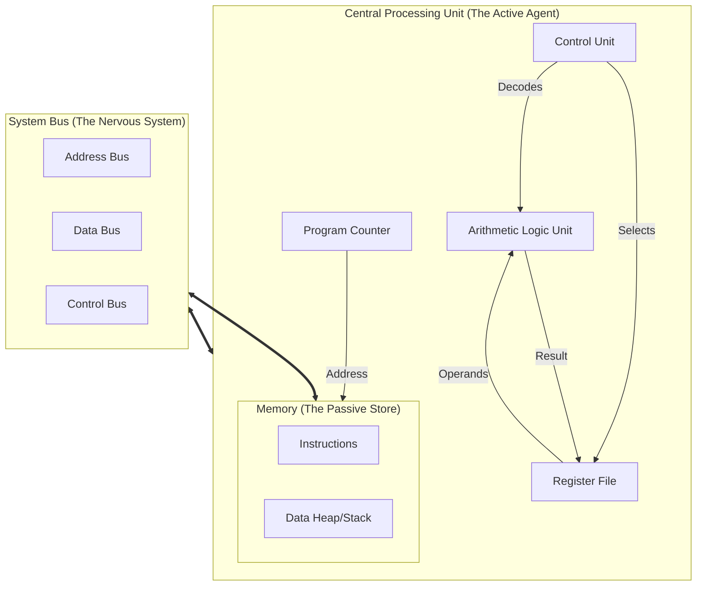
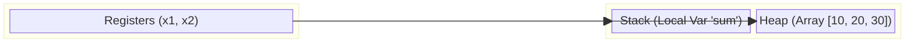
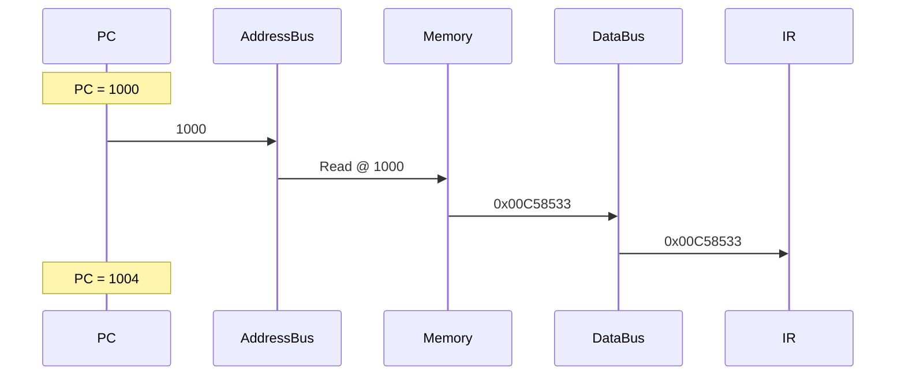
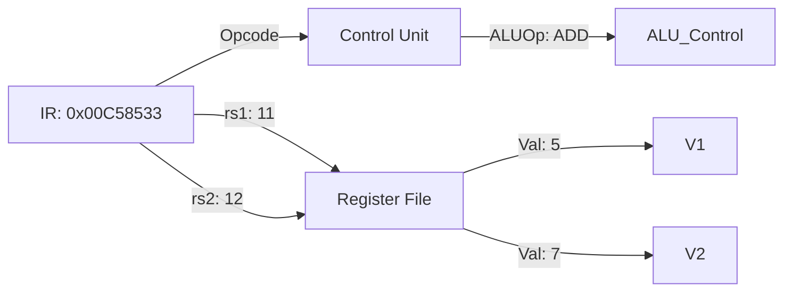
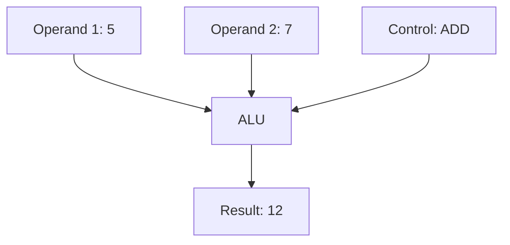

# The Abstract Machine: A Rigorous Formalization

## 1. The Computer as a Dynamical System

To the physicist, the universe is a state vector evolving under a Hamiltonian. To the computer scientist, a computer is a **discrete-time, deterministic, finite dynamical system**. While the physical substrate (silicon, electrons) is continuous and quantum mechanical, the *logical abstraction* is perfectly discrete.

We define a computer formally as a tuple $\mathcal{M} = (\mathcal{S}, \Sigma, \delta, s_0)$, where:
1.  $\mathcal{S}$ is the **State Space**: The set of all possible configurations of the machine.
2.  $\Sigma$ is the **Input Alphabet**: The set of valid external stimuli (e.g., interrupts, I/O).
3.  $\delta: \mathcal{S} \times \Sigma \to \mathcal{S}$ is the **Transition Function**: The law of evolution.
4.  $s_0 \in \mathcal{S}$ is the **Initial State**.

### 1.1 The Cardinality of the State Space
It is instructive to quantify the size of $\mathcal{S}$. Consider a standard 32-bit RISC-V microcontroller with 4 GiB of RAM.
*   **Registers**: $32 \text{ regs} \times 32 \text{ bits} = 1,024 \text{ bits}$.
*   **PC (Program Counter)**: $32 \text{ bits}$.
*   **Memory**: $2^{32} \text{ bytes} \times 8 \text{ bits/byte} \approx 3.4 \times 10^{10} \text{ bits}$.

### 1.1.1 Why $2^{32}$ Bytes? The Address Space Explained
In a "32-bit architecture" (like RISC-V 32-bit), the registers that hold memory addresses are 32 bits wide.
This means there are $2^{32}$ possible unique addresses (combinations of zeros and ones) that the CPU can generate.
$$ \text{Address Range} = [0, 2^{32} - 1] = [0, 4,294,967,295] $$
Since each address points to a unique **Byte** (8 bits) in memory, the maximum addressable memory is $2^{32}$ bytes, which equals 4 Gigabytes (GiB).
*   This is not about "slots of 0 or 1". It is about **Addressability**.
*   Imagine a street with house numbers. If the house number plate can only hold 2 digits (00-99), you can only build 100 houses on that street.
*   Here, the "number plate" (address) has 32 binary digits.

### 1.1.2 Pointers vs. Values (The "Solidity Mapping" Analogy)
You can think of the entire memory $\mathcal{M}$ as a giant Key-Value mapping, similar to a `mapping(uint32 => uint8)` in Solidity.

*   **Key (The Pointer)**: The Address (32-bit integer). When we say "pointer", we just mean a variable whose *value* is an address.
*   **Value**: The Data stored there (8-bit byte).

**Example Mapping**:
Imagine we store the 4-byte integer `0xDEADBEEF` starting at address `0x1000`.
In Little Endian (LSB first), the mapping looks like this:

| Address (Key/Pointer) | Value (Byte) | Notes |
| :--- | :--- | :--- |
| `0x00001000` | `0xEF` | Least Significant Byte |
| `0x00001001` | `0xBE` | |
| `0x00001002` | `0xAD` | |
| `0x00001003` | `0xDE` | Most Significant Byte |

> **Note on Hexadecimal**: A common point of confusion is the size of hex numbers.
> *   **1 Hex Digit** (e.g., `F`) represents **4 bits** (values 0-15).
> *   **2 Hex Digits** (e.g., `EF`) represent **8 bits**, which is exactly **1 Byte**.
> *   So, `0xEF` is 1 byte, not 4. A 32-bit address (4 bytes) requires 8 hex digits (e.g., `0x00001000`).

$$ \text{Value} = \mathcal{M}[\text{Pointer}] $$

In C or Rust, a pointer `*ptr` or `&T` is simply a register holding an index $i$. Dereferencing it (`*ptr`) means asking the memory: "Give me the value at index $i$."

The total number of bits $N \approx 3.4 \times 10^{10}$.
The number of states is $|\mathcal{S}| = 2^N$.
To put this in perspective, the number of atoms in the observable universe is estimated at $10^{80} \approx 2^{266}$. The state space of a simple computer is hyper-astronomically larger than the physical universe. This combinatorial explosion is why **verification** is hard: we cannot exhaustively test states; we must prove properties using the structure of $\delta$.

### 1.2 The Trace
An execution of the machine over time $T$ is a sequence (trajectory) of states:
$$ \tau = (s_0, s_1, \dots, s_T) $$
Such that $\forall t \in [0, T-1], s_{t+1} = \delta(s_t, \sigma_t)$.

In the context of verifiable computing, the **Prover's** task is to construct this trace $\tau$, and the **Verifier's** task is to check the validity of the transition $s_{t} \to s_{t+1}$ without re-running the computation.

## 2. The Von Neumann Architecture

The **Von Neumann model** (1945) is the structural paradigm for almost all general-purpose computers. Its defining characteristic is the **Stored-Program Concept**: instructions are data. They reside in the same addressable memory as the numbers they manipulate.

### 2.1 Structural Components



### 2.2 The Bottleneck
Because instructions and data travel over the same bus, the CPU cannot fetch an instruction and read data simultaneously (in the simplest model). This bandwidth limitation is known as the **Von Neumann Bottleneck**.
*   *Relevance to Cryptography*: In Zero-Knowledge Virtual Machines (zkVMs), "memory access" is often a dominant cost. Every read/write must be proven. The "bottleneck" here manifests as the cost of the memory-checking argument.

### 2.3 The Bus System: Definitions
The "Bus" is the communication highway connecting the components. It is split into three specialized channels:

1.  **Address Bus**:
    *   *Role*: "Where do I want to go?"
    *   *Direction*: CPU $\to$ Memory (Unidirectional).
    *   *Width*: 32 wires (in a 32-bit system). Carries the binary address (e.g., `0x80001000`).
2.  **Data Bus**:
    *   *Role*: "What is the content?"
    *   *Direction*: CPU $\leftrightarrow$ Memory (Bidirectional).
    *   *Width*: Typically 32 bits (1 Word) or 64 bits. Carries the actual instruction code or data values.
    *   *Distinction*: This is **NOT** the Registry. The Bus is the **Wire** (the road). The Registry is the **Destination** (the garage). The data travels *on* the Bus *to* the Registry.
3.  **Control Bus**:
    *   *Role*: "What are we doing?"
    *   *Direction*: CPU $\to$ Memory (mostly).
    *   *Signals*:
        *   `WE` (Write Enable): "I am writing to you."
        *   `OE` (Output Enable): "I want you to send me data."
        *   `CLK` (Clock): The synchronization heartbeat.

**Toy Interaction: "The Library Request"**
Imagine the CPU is a Scholar and Memory is a Librarian.
1.  **Scholar (CPU)** writes `1000` on a slip of paper (**Address Bus**).
2.  **Scholar** raises a green flag (**Control Bus**: `Read Enable`).
3.  **Librarian (Memory)** sees `1000`, goes to shelf `1000`, finds a book labeled `42`.
4.  **Librarian** puts the book `42` on the counter (**Data Bus**).
5.  **Scholar** takes `42`.

### 2.4 Memory Regions: Stack, Heap, and the "Registry"
It is crucial to distinguish **physical storage types** (ROM/RAM) from **logical memory regions** (Stack/Heap).

#### Physical vs. Logical
1.  **Registers (The "Registry")**:
    *   *Location*: Inside the CPU.
    *   *Analogy*: Your hands. You can only work on what you are holding.
    *   *Speed*: Immediate.
    *   *Storage*: Very small (32 words).
2.  **RAM (Random Access Memory)**:
    *   *Location*: A separate chip (or area).
    *   *Analogy*: A massive library of bookshelves.
    *   *Speed*: Slow (requires walking to the shelf).
    *   *Storage*: Huge (4 GiB).
    *   *Logical Division*: The RAM is subdivided by software into the **Stack** and the **Heap**.

#### Stack vs. Heap (Both live in RAM)

| Feature | **Stack** | **Heap** |
| :--- | :--- | :--- |
| **Analogy** | A stack of dinner plates. | A chaotic warehouse. |
| **Allocation** | **Automatic**. You put a plate on top (call function), you take it off (return). | **Manual**. You ask the warehouse manager ("Malloc") for space. |
| **Growth** | Linear, contiguous. | Fragmented, scattered. |
| **Lifetime** | Exists only while the function is running. | Exists until you explicitly delete it. |

**Visual Example**:
Imagine a program that calculates `sum_array([10, 20, 30])`.

1.  **Heap Usage**:
    The array `[10, 20, 30]` is too big/dynamic for registers. It sits in the Heap at address `0x5000`.
2.  **Stack Usage**:
    The function `sum_array` needs a place to keep the running total `sum`. It reserves space on the Stack.
3.  **Registers Usage**:
    The CPU loads `10` from Heap `0x5000` into Register `x1`. It adds it to Register `x2` (the sum).



## 3. The Cycle: A Deep Dive into $\delta$

### 3.0 Preliminaries: The Program Counter (PC)
Before understanding the cycle, we must understand the **Program Counter (PC)**.
*   **Definition**: The PC is a special register that holds the **Memory Address** of the *current* (or next) instruction.
*   **Analogy**: It is your finger pointing to the current line of text you are reading in a book.
*   **Initialization**: When you power on the computer, the PC is set to a fixed hardware value (e.g., `0x80000000`). This is the **Entry Point**.
*   **Loading**: The program (binary code) is loaded into RAM at this exact address.
    *   *Example*: If your program starts with "Add 5 + 5", the binary for that instruction sits at `0x80000000`.

### 3.0.2 The Instruction Register (IR)
The **IR** is a special-purpose internal register that is *not* visible to the programmer (unlike x0-x31 or PC).
*   **Role**: It is the "holding pen" for the current instruction.
*   **Why needed?**: When data comes off the Data Bus, it is fleeting. The IR latches onto it so the Control Unit can analyze the bits (Opcode, Rd, etc.) for the rest of the cycle.

### 3.0.3 Detailed Example: Loading and Executing a Program
Let's trace a program from "Disk" to "Execution".

**1. The Source Code (Programmer View)**:
```c
int main() {
    int a = 5;
    int b = 7;
    return a + b;
}
```

**2. The Binary (Disk View)**:
The compiler translates this into 3 instructions (12 bytes):
*   `0x00500513` (Set x10 = 5)
    *   **Breakdown**: This is `ADDI x10, x0, 5`.
    *   **Meaning of Parts**:
        *   **Opcode** (`0010011`): This specific 7-bit pattern is hardwired in the CPU to mean "I-Type Arithmetic". It tells the Control Unit: "Activate the ALU, but use an Immediate value instead of a second register."
        *   **Rd** (`01010`): This is the binary index `10`. It tells the Write-Back stage: "When you are done, save the result into Register x10."
        *   **Funct3** (`000`): This is a sub-instruction selector. Combined with the Opcode, it specifies "ADD". (Other values like `100` might mean `XOR`).
        *   **Rs1** (`00000`): This is the binary index `0`. It tells the Register Fetch stage: "Read the value from Register x0." (In RISC-V, x0 is a special register that always contains the number 0).
        *   **Imm** (`000000000101`): This is the number `5` encoded directly in the instruction bits. Unlike registers, which are *addresses* of data, this IS the data.
    *   **Concatenation**: `000000000101` `00000` `000` `01010` `0010011`
    *   **Hex Grouping**: `0000` `0000` `0101` `0000` `0000` `0101` `0001` `0011` $\to$ `0x00500513`
    *   *Result*: `Reg[10] = Reg[0] + 5`.
*   `0x00700593` (Set x11 = 7)
*   `0x00B50533` (Add x10 + x11 -> x10)

**3. The Loader (OS/Bootloader Action)**:
When you run the program, the OS copies these 12 bytes from Disk into RAM, starting at address `0x1000`.

**4. Memory State (RAM View)**:
| Address | Content (Instruction) | Meaning |
| :--- | :--- | :--- |
| `0x1000` | `0x00500513` | `ADDI x10, x0, 5` |
| `0x1004` | `0x00700593` | `ADDI x11, x0, 7` |
| `0x1008` | `0x00B50533` | `ADD x10, x10, x11` |

**5. Execution Trace (CPU View with Buses)**:
*   **Cycle 0 (Fetch)**:
    *   **Address Bus**: CPU writes `0x1000` (PC).
    *   **Control Bus**: CPU asserts `READ`.
    *   **Data Bus**: RAM returns `0x00500513`.
    *   **CPU Internal**: `0x00500513` goes into IR.
*   **Cycle 0 (Execute)**:
    *   **Decode**: `0x00500513` decoded to "Add 5 to x0".
    *   **ALU**: Computes `0 + 5 = 5`.
    *   **Write Back**: Result `5` written to internal Register `x10` (no Bus traffic for this, it's internal).
    *   **Update**: PC becomes `0x1004`.
*   **Cycle 1 (Fetch)**:
    *   **Address Bus**: CPU writes `0x1004`.
    *   **Control Bus**: CPU asserts `READ`.
    *   **Data Bus**: RAM returns `0x00700593`.
    *   **Execute**: Sets Register x11 to 7.
    *   **Update**: PC becomes `0x1008`.
*   **Cycle 2**:
    *   CPU sees PC = `0x1008`.
    *   **Fetch**: Asks RAM for `Mem[0x1008]`. Gets `0x00B50533`.
    *   **Execute**: Adds x10(5) + x11(7) -> x10 becomes 12.
    *   **Update**: PC becomes `0x100C` (End of program).

**The Feedback Loop**:
1.  CPU looks at PC (e.g., `1000`).
2.  CPU fetches instruction from RAM at address `1000`.
3.  CPU executes it.
4.  CPU updates PC to `1004` (next line).
5.  Repeat.

The transition function $\delta$ is not monolithic. It is a composition of micro-operations triggered by the **Clock**.
Let $\Phi$ be the clock signal. The period $t_{\text{cycle}} = 1/f_{\text{clk}}$ is the discrete time step.

The execution of *one* instruction (the transition $s_t \to s_{t+1}$) is classically decomposed into phases. Even though modern CPUs pipeline these (doing them in parallel for different instructions), the *logical* model is sequential.

### Phase 1: Instruction Fetch (IF)
The CPU must answer: "What do I do next?"
Let $PC = 1000$ (Address in memory).
1.  **Address Generation**: CPU places `1000` onto the **Address Bus**.
2.  **Read Request**: CPU asserts `READ` on the **Control Bus**.
    *   *What else can it do?*: The Control Bus has many lines. `READ` is just one wire. Other wires include `WRITE` (for Stores), `INTERRUPT_ACK` (for I/O), or `BUS_REQUEST`.
    *   *How does it know?*: In the **Fetch Phase**, the CPU logic is hardwired to *always* Read. It *must* fetch an instruction to begin. It doesn't know what the instruction *is* yet, so it can't do anything else but Read from the PC address.
3.  **Memory Access**: RAM looks up address `1000`. Suppose it finds `0x00C58533`.
4.  **Latch**: RAM places `0x00C58533` on the **Data Bus**. CPU copies it to **IR (Instruction Register)**.
    $$ IR \leftarrow \mathcal{M}[1000] $$
5.  **Increment**: $PC \leftarrow 1000 + 4 = 1004$.



### Phase 2: Instruction Decode (ID) & Register Fetch
The **Control Unit** dissects the bits in `IR` (`0x00C58533`).
*   **Bits [0-6]**: `0110011` (Opcode for R-Type Arithmetic).
*   **Bits [15-19]**: `01011` (Decimal 11) $\to$ **rs1** (Source Register 1).
*   **Bits [20-24]**: `01100` (Decimal 12) $\to$ **rs2** (Source Register 2).
*   **Bits [7-11]**: `01010` (Decimal 10) $\to$ **rd** (Destination Register).

**Register Fetch**:
The CPU sends indices `11` and `12` to the Register File.
Suppose $Reg[11] = 5$ and $Reg[12] = 7$.
The Register File outputs $V_1 = 5$ and $V_2 = 7$.



### Phase 3: Execute (EX)
The **ALU** receives the operands and the command.
*   **Input**: $V_1 = 5$, $V_2 = 7$.
*   **Control**: `ADD`.
*   **Computation**: $Result = 5 + 7 = 12$.



### Phase 4: Memory Access (MEM)
*   **Context**: Registers are fast but small. RAM is huge but slow. We need instructions to move data between them.
*   **LOAD** (e.g., `LW`): Moves data **FROM RAM TO Registry**.
    *   *Action*: Reads data at address `ALU_Result` from RAM, saves it into a Register.
*   **STORE** (e.g., `SW`): Moves data **FROM Registry TO RAM**.
    *   *Action*: Takes value from a Register, writes it to address `ALU_Result` in RAM.
*   **Arithmetic Ops** (ADD, SUB): Do **NOT** touch RAM. They only work on Registers.

### Phase 5: Write Back (WB)
*   **The Problem**: The ALU is a calculator, not a storage box. As soon as the electrical signals change (next cycle), the result "12" vanishes.
*   **The Solution**: We must save the result into a permanent container: The Register File.
*   **Why "Back"?**: Data flowed *from* Registers $\to$ ALU. Now it flows *back* from ALU $\to$ Registers.

**Example**: `ADD x1, x2, x3`
1.  **Fetch/Decode**: CPU sees `ADD`.
2.  **Execute**: ALU computes $5 + 7 = 12$.
3.  **Write Back**: The value $12$ is written into Register `x1`.
    *   *If we skipped this phase*: The number 12 would exist on the wire for a nanosecond and then disappear forever. `x1` would remain unchanged. By writing it back, `x1` now holds 12 for all future instructions to use.

## 4. The Datapath and Control Logic

To truly understand the machine, one must separate the **Datapath** from the **Control**.

### 4.1 The Arithmetic Logic Unit (ALU)
The ALU is the mathematical heart of the CPU. It is a purely **Combinational Circuit**—a complex arrangement of logic gates (AND, OR, XOR) that has no memory.

*   **Input**: Two 32-bit numbers ($A$ and $B$) and a Control Signal (`Op`).
*   **Output**: One 32-bit result ($Y$) and Status Flags (Zero, Overflow).
*   **Function**: $Y = f(A, B, Op)$.

If you send $A=5, B=7, Op=ADD$ into the ALU, $Y=12$ comes out the other side almost instantly.

### 4.2 The Datapath
The Datapath is the plumbing: the registers, the ALU, the multiplexers (MUX), and the buses that carry *data*.
*   **Example**: There is a wire connecting the output of the Register File to the input of the ALU.
*   **Multiplexers**: Crucial components. A MUX selects one of several inputs based on a control bit.
    *   *Example*: The input to the PC register comes from a MUX.
        *   Input 0: $PC + 4$ (Next sequential instruction).
        *   Input 1: $PC + \text{offset}$ (Branch target).
        *   *Control Signal*: `PCSrc` (determined by Branch Logic).

### 4.3 The Control Unit
The Control Unit is the puppet master. It doesn't touch data; it pulls the strings (control signals) that configure the Datapath.
*   For an `ADD` instruction, it sets `ALUSrc=0` (use register), `RegWrite=1` (save result), `MemRead=0`.
*   For a `LW` instruction, it sets `ALUSrc=1` (use immediate), `RegWrite=1`, `MemRead=1`.

**Logical Equivalence**: In some verification contexts, the "Control Unit" is effectively modeled by the selection of which constraints to apply. If the opcode says `ADD`, we check the `ADD` constraints. The constraints of the system enforce that the "wires" (variables) match the logic of the control signals.

## 5. The Clock: Synchronous Logic

Why do we need a clock? Why not just let signals flow?
Digital circuits are composed of **Combinational Logic** and **Sequential Logic**.

1.  **Combinational Logic** (ALU, Decoder): Output depends *only* on current input. $Y = f(X)$. Changes propagate effectively instantly (modulo speed of light/transistor switching).
2.  **Sequential Logic** (Registers, RAM): Output depends on *history*. These elements have a "Clock" input. They only update their internal state on the **Rising Edge** of the clock.

$$ S_{t+1} = \text{Logic}(S_t) $$

The clock period $T_{clk}$ must be long enough for the signal to propagate through the deepest chain of logic gates (the **Critical Path**) and stabilize at the input of the next register before the next tick.
$$ T_{clk} > T_{\text{prop\_delay}} + T_{\text{setup\_time}} $$

*   **Hz to Cycle**: A 3 GHz processor has a cycle time of $0.33$ ns.
*   **Verifiable Computing Implication**: Abstract models often don't care about nanoseconds. They care about **Cycle Count**. A "cycle" is one logical step of the state machine. Optimization in this context means reducing the number of rows in the execution trace, not reducing nanoseconds.

## 6. Determinism and the Initial State

For the machine to be useful as a function $f(x)$, it must be deterministic.
$$ \text{Output} = \text{Machine}(s_0) $$
The initial state $s_0$ typically involves:
*   Memory loaded with the program binary (the **Image**).
*   PC set to the **Entry Point** (usually `_start`).
*   Registers initialized to 0 (or specific ABI values).

If we run the machine twice from $s_0$, the sequence $s_0, s_1, \dots$ must be identical. This **Reproducibility** is the foundation of verifiable computing. If execution were stochastic (random), a Verifier could not check the Prover's work without knowing the specific random outcomes.


# The Jolt Execution Model: From Code to Trace

This document bridges the gap between abstract Computer Science theory and the concrete implementation of the **Jolt zkVM**. We will trace the lifecycle of a simple program from high-level Rust code down to the `RISCVCycle` structs generated by the Jolt Emulator.

## 1. The Program: Calculating Factorial

We start with a simple recursive function to calculate the factorial of 3 ($3! = 6$). This is perfect for illustrating:
1.  **Arithmetic** (Multiplication/Subtraction).
2.  **Control Flow** (Branching).
3.  **Stack Usage** (Recursion).

### 1.1 High-Level Source (Rust)
```rust
// main.rs
fn factorial(n: u64) -> u64 {
    if n <= 1 {
        return 1;
    }
    return n * factorial(n - 1);
}

pub fn main() {
    let result = factorial(3);
}
```

### 1.2 Compilation (to RISC-V Assembly)
The compiler (rustc/LLVM) translates this into RISC-V assembly.
*   **Architecture**: `RV64IMAC` (64-bit, Integer, Multiply, Atomic, Compressed).
*   **Note**: Jolt uses 64-bit registers (`u64`).

```asm
# Simplified Assembly
factorial:
    # Prologue
    addi    sp, sp, -16      # Allocate stack space
    sd      ra, 8(sp)        # Save Return Address (ra) to stack
    sd      s0, 0(sp)        # Save old Frame Pointer (s0)

    # Base Case Check
    li      t0, 1            # Load immediate 1 into temp reg
    bgt     a0, t0, .recurse # If n (a0) > 1, jump to recurse

    # Base Case Return
    li      a0, 1            # Return value = 1
    j       .cleanup         # Jump to cleanup

.recurse:
    # Recursive Step
    mv      s0, a0           # Save n (a0) into s0 (preserved across call)
    addi    a0, a0, -1       # Setup arg: n - 1
    call    factorial        # Recursive call
    mul     a0, a0, s0       # Result = factorial(n-1) * n

.cleanup:
    # Epilogue
    ld      ra, 8(sp)        # Restore Return Address
    ld      s0, 0(sp)        # Restore Frame Pointer
    addi    sp, sp, 16       # Deallocate stack
    ret                      # Return to caller
```

## 2. The Jolt Emulator: Structure & State

Before executing, let's look at the machine that will run this code. Jolt's emulator is written in Rust (`tracer/src/emulator/cpu.rs`).

### 2.1 The CPU State
Unlike a physical CPU with wires, the Jolt CPU is a `struct`:

```rust
pub struct Cpu {
    pub xregs: [u64; 32],     // The 32 General Purpose Registers (x0-x31)
    pub pc: u64,              // Program Counter (64-bit)
    pub mmu: Mmu,             // Memory Management Unit
}
```

*   **xregs**: Notice `u64`. Jolt is a 64-bit VM.
*   **mmu**: Handles all memory access.

**The emulator's dual role**:
1.  **Execution**: Runs RISC-V bytecode, generates `Vec<RISCVCycle>` trace
2.  **Witness generation**: Constructs polynomial evaluations for proving
    *   Example: Register reads/writes become entries in register MLE
    *   Memory operations become entries in RAM MLE
    *   These MLEs are inputs to the proof generation system (covered in Section 6)

### 2.2 The Memory (MMU)
Jolt uses a **Flat Memory Model**.
*   **No Paging**: Virtual addresses = Physical addresses.
*   **Addressable Unit**: The MMU optimizes for proving by treating memory as 8-byte (64-bit) chunks ("Doublewords"), though it supports byte-level access for the CPU logic.

```rust
// tracer/src/emulator/mmu.rs
// Conceptually:
pub struct Mmu {
    memory: HashMap<u64, u8>, // Sparse map of address -> byte
}
```

## 3. Execution Trace: Cycle by Cycle

We load the program into RAM starting at `0x80000000` (The Entry Point).
**Initial State**:
*   `PC`: `0x80000000`
*   `sp` (x2): `0x8000` (Top of Stack)
*   `a0` (x10): `3` (Argument passed to factorial)

### Cycle 0: The Prologue (Stack Alloc)
**Instruction**: `addi sp, sp, -16` (`0xFF010113`)
*   **Location**: `0x80000000`

1.  **Fetch**:
    *   Emulator calls `mmu.load(cpu.pc, 32)`.
    *   Returns `0xFF010113`.
2.  **Decode**:
    *   `Instruction::decode(0xFF010113)` matches `ADDI`.
    *   Extracts: `rd=2 (sp)`, `rs1=2 (sp)`, `imm=-16`.
3.  **Trace Capture (Pre-Exec)**:
    *   `regs_pre[2]` (sp) = `0x8000`.
4.  **Execute**:
    *   `cpu.xregs[2] = cpu.xregs[2].wrapping_add(-16)`.
    *   New `sp` = `0x7FF0`.
5.  **Trace Capture (Post-Exec)**:
    *   `regs_post[2]` = `0x7FF0`.
6.  **Record**:
    ```rust
    RISCVCycle {
        pc: 0x80000000,
        instruction: ADDI,
        register_reads: [(2, 0x8000)],
        register_write: (2, 0x7FF0),
        memory_ops: []
    }
    ```
7.  **Update PC**: `pc += 4` $\to$ `0x80000004`.

---

### Cycle 1: Saving State (Store)
**Instruction**: `sd ra, 8(sp)` (Store Doubleword)
*   **Location**: `0x80000004`
*   **Purpose**: Save the return address so we know where to go back to.

1.  **Fetch**: Gets instruction bytes.
2.  **Decode**: Matches `SD` (Store Doubleword).
    *   `rs2=1 (ra)`, `rs1=2 (sp)`, `imm=8`.
3.  **Execute**:
    *   Calculate Address: `sp + 8` = `0x7FF0 + 8` = `0x7FF8`.
    *   Value to Store: `ra` (let's say `0x0` for now).
    *   `mmu.store_u64(0x7FF8, 0x0)`.
4.  **Record**:
    ```rust
    RISCVCycle {
        pc: 0x80000004,
        instruction: SD,
        register_reads: [(2, 0x7FF0), (1, 0x0)],
        memory_ops: [(WRITE, 0x7FF8, 0x0)] // Crucial for Memory Consistency Proof
    }
    ```

---

### Cycle 2: The Branch (Control Flow)
**Instruction**: `bgt a0, t0, .recurse`
*   **Location**: `0x8000000C`
*   **State**: `a0=3`, `t0=1`.

1.  **Fetch/Decode**: Matches `BGT` (Branch Greater Than).
2.  **Execute**:
    *   Condition: `3 > 1` is **True**.
    *   Target: `PC + offset` (Address of `.recurse`).
3.  **Trace**:
    *   Captures inputs `a0` and `t0`.
4.  **Update PC**:
    *   Instead of `pc += 4`, `pc` is set to `0x80000014` (Jump target).

---

### Cycle 3: Multiplication (The Core Math)
Skipping ahead to the multiplication step: `mul a0, a0, s0`.
*   **State**: `a0=1` (result of `factorial(2)`), `s0=3` (saved `n`).

1.  **Fetch/Decode**: Matches `MUL`.
2.  **Execute**:
    *   `result = 1 * 3 = 3`.
    *   `cpu.xregs[10] = 3`.
3.  **Record**:
    ```rust
    RISCVCycle {
        instruction: MUL,
        register_reads: [(10, 1), (8, 3)], // a0, s0
        register_write: (10, 3)            // a0
    }
    ```
4.  **Relevance to Jolt**:
    *   Jolt does **not** prove this using a multiplier circuit.
    *   It **decomposes** the 64-bit MUL into **16 lookups** into 4-bit MUL subtables:
        - Split inputs into 16 4-bit chunks: `1 = [1, 0, 0, ..., 0]` and `3 = [3, 0, 0, ..., 0]`
        - Lookup each chunk pair in 256-entry `MUL_4` table: `MUL_4[1][3] = 3`, `MUL_4[0][0] = 0`, ...
        - Prove correct recombination: `result = 3·2⁰ + 0·2⁴ + ... + 0·2⁶⁰ = 3`
    *   This reduces impossible 2¹²⁸-entry table to feasible 2⁸-entry subtable.

## 4. Virtual Instructions & The "Witness"

Jolt has a feature not found in standard CPUs: **Virtual Instructions**.
Some operations (like Division) are too complex to prove with a single table lookup.

### Example: Division (`DIV a0, a1`)
Suppose `a0 = 20`, `a1 = 4`.

1.  **Emulator Action**:
    The emulator sees `DIV`. It doesn't just execute `20 / 4`. It expands this into a **Virtual Sequence**:
    *   It computes quotient `Q=5` and remainder `R=0`.
    *   It places these "hints" into the **Advice** region of memory.
    *   It executes a sequence of simpler instructions to *verify* the hints:
        1.  `MUL t0, Q, a1` (Compute $5 \times 4 = 20$)
        2.  `ADD t0, t0, R` (Compute $20 + 0 = 20$)
        3.  `ASSERT_EQ t0, a0` (Check matches input)

2.  **Why?**
    This allows Jolt to prove a complex operation (Division) using only simple tables (Multiplication and Addition).

## 5. The Output: `Vec<RISCVCycle>`

After the loop finishes (typically via a special `TERMINATE` instruction or hitting max cycles), the emulator returns a vector of these `RISCVCycle` structs.

This vector is the **Witness**.
*   **The Prover** takes this vector and generates cryptographic proofs for each cycle.
*   **Memory Checking**: Uses the **Twist protocol** (v0.2.0+, replacing Spice from v0.1.0):
    - Proves time-ordered trace is permutation of address-ordered trace
    - Uses **virtualized increments** (not explicit sorting)
    - Grand product argument: prove two polynomial products are equal
    - If equal → memory consistent: reads return most recent writes
*   **Lookup Checking**: It groups all `ADD` ops, all `MUL` ops, etc., and proves they are in their respective tables via Shout batch evaluation.

This architecture separates the **Trace Generation** (Rust code simply running the logic) from the **Proof Generation** (Math proving the trace is valid).

---

## 6. From Trace to Proof: The Transformation Pipeline

The `Vec<RISCVCycle>` witness is **not** the proof. Here's the complete pipeline:

### 6.1 Trace to Multilinear Extensions (MLEs)

Each component of the trace becomes a polynomial over the Boolean hypercube $\{0,1\}^n$ where $n = \log_2(T)$ for $T$ cycles.

**Example - Program Counter trace**:
```
Execution trace:
  Cycle 0: PC = 0x80000000
  Cycle 1: PC = 0x80000004
  Cycle 2: PC = 0x80000008
  ...

Polynomial representation:
  PC: {0,1}^n → F
  PC(000...0) = 0x80000000  [cycle 0 in binary]
  PC(000...1) = 0x80000004  [cycle 1 in binary]
  PC(000..10) = 0x80000008  [cycle 2 in binary]
  ...

MLE: P̃C(x₁, ..., xₙ) is unique multilinear polynomial agreeing on {0,1}^n
```

**All traces become MLEs**:
*   PC trace → $\widetilde{\text{PC}}(\text{cycle\_index})$
*   Register reads → $\widetilde{\text{RegRead}}(\text{cycle\_index}, \text{register\_index})$
*   Memory operations → $\widetilde{\text{MemOp}}(\text{cycle\_index}, \text{address\_index})$
*   Instruction bytes → $\widetilde{\text{Instr}}(\text{bytecode\_index})$

### 6.2 Commit Polynomials (using Dory PCS)

Prover computes cryptographic commitments:
*   $\text{Commit}(\widetilde{\text{PC}})$: Commitment to PC polynomial
*   $\text{Commit}(\widetilde{\text{RegRead}})$: Commitment to register read polynomial
*   $\text{Commit}(\widetilde{\text{MemAddr}})$: Commitment to memory address polynomial
*   etc.

**Why commitments?**
*   Verifier can't store full trace (too large: millions of field elements)
*   Commitments are short (~48 bytes per polynomial using Dory)
*   Later, prover can prove evaluations: "$\widetilde{\text{PC}}(r) = v$ for random $r$"
*   Verifier checks without seeing full polynomial

### 6.3 Generate Sumcheck Proofs

Instead of sending all $2^n$ evaluations, prover uses **sum-check protocol** to prove properties:

**Example - R1CS check**:
```
Property: For all cycles, (Az) ∘ (Bz) = Cz

Direct check (infeasible):
  For t = 0 to T-1:
    Check constraint_t holds

Sumcheck approach:
  Prove: Σ_{t ∈ {0,1}^n} eq(τ, t) · [constraint_t] = 0
  where τ is verifier's random challenge

Result: Reduces T checks to 1 check at random point
```

**Five categories of sumchecks** (mapped to VM properties):
1.  **Bytecode**: Fetched instructions match committed program (Shout read-checking)
2.  **Instruction semantics**: Lookups into instruction tables correct (Shout batch evaluation)
3.  **Register consistency**: Reads return recent writes (Twist memory checking)
4.  **RAM consistency**: Same as registers but for memory (Twist with chunking)
5.  **R1CS wiring**: PC updates and data flow correct (Spartan)

### 6.4 Batched Opening Proof (Dory - Stage 5)

All sumchecks reduce to evaluation claims:
*   "$\widetilde{\text{PC}}(r_1) = v_1$"
*   "$\widetilde{\text{RegRead}}(r_2) = v_2$"
*   ...
*   "$\text{MLE}_{50}(r_{50}) = v_{50}$"

**Batching trick**:
Instead of 50 separate opening proofs, create random linear combination:
$$Q(X) = \rho_1 \cdot \widetilde{\text{PC}}(X) + \rho_2 \cdot \widetilde{\text{RegRead}}(X) + \ldots + \rho_{50} \cdot \text{MLE}_{50}(X)$$

Prove: $Q(r) = \rho_1 \cdot v_1 + \rho_2 \cdot v_2 + \ldots + \rho_{50} \cdot v_{50}$

Single Dory opening proof verifies all 50 claims together.

### 6.5 The Complete Pipeline Visualized

```
[RISC-V Execution]
        ↓
Vec<RISCVCycle> (witness)
        ↓
Transform to MLEs:
  - P̃C(cycle)
  - RegRead̃(cycle, reg)
  - MemOp̃(cycle, addr)
  - Instr̃(pc_index)
        ↓
Commit polynomials (Dory):
  - Com(P̃C)
  - Com(RegRead̃)
  - Com(MemOp̃)
  - Com(Instr̃)
        ↓
Generate sumcheck proofs (5 stages):
  Stage 1: Initial checks
    - R1CS outer sumcheck
    - Instruction lookups
    - Bytecode read-check
    - Register read-check
    - RAM read-check

  Stage 2: Product expansions
    - R1CS product sumcheck
    - Lookup prefix/suffix
    - Bytecode write-check
    - Register write-check
    - RAM write-check

  Stage 3: Evaluation sumchecks
    - Matrix evaluations
    - Table evaluations
    - Memory state evaluations

  Stage 4: Final checks

  Stage 5: Batched opening (Dory)
        ↓
[Proof] (~13 KB)
        ↓
[Verifier checks] (~40 Gₜ exponentiations + sumcheck validation)
        ↓
Accept ✓ / Reject ✗
```

### 6.6 Key Insight: Polynomial Indirection

**Not checked**: "Did cycle 3 execute MUL(2,3)=6 correctly?"

**Checked instead**: "Does MLE of trace satisfy polynomial identity at random point?"

**Why this works:**
*   Polynomial commitments enable succinct proofs
*   Verifier checks without re-execution
*   Sum-check reduces $2^n$ checks to single random point evaluation
*   Schwartz-Zippel lemma ensures soundness: cheating caught with probability $\geq 1 - n/|\mathbb{F}|$

**For detailed verification mapping**: See how each execution cycle maps to specific sumchecks in practice.

