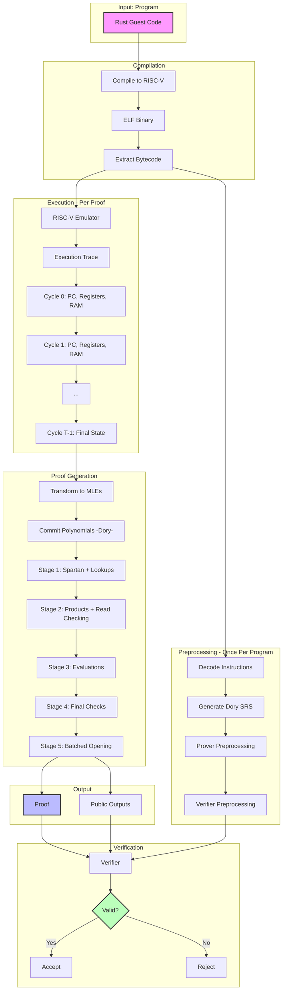

# Jolt zkVM: Mathematical Foundations and Design

> **For Implementation Details**: This document provides complete mathematical foundations with full derivations and security proofs. For implementation guidance with code paths, see [02_Jolt_Complete_Guide.md](../02_Jolt_Complete_Guide.md).
>
> **Purpose**: This is the theoretical reference for:
> - Researchers understanding Jolt's design
> - Auditors verifying security properties
> - Cryptographers studying the protocol composition
> - Anyone seeking complete mathematical rigor

**What this document contains**:
- Full mathematical derivations
- Security proofs (completeness, soundness)
- Design rationale and trade-offs
- Complete 5-stage DAG mathematical structure
- Every sumcheck equation for all 22 sumchecks
- NO implementation details (no code, no file paths)
- NO Rust-specific content

---

## Table of Contents

### Part 0: Computer Architecture Fundamentals
1. [What is a CPU?](#01-what-is-a-cpu)
2. [Registers: The CPU's Working Memory](#02-registers-the-cpus-working-memory)
3. [RAM: Main Memory](#03-ram-main-memory)
4. [The Instruction Execution Cycle](#04-the-instruction-execution-cycle)
5. [The RISC-V Architecture](#05-the-risc-v-architecture)

### Part I: The Jolt Philosophy and Architecture
1. [The Lookup Singularity](#11-the-lookup-singularity)
2. [Hybrid Architecture: Lookups for Semantics, R1CS for Wiring](#12-hybrid-architecture)
3. [Design Trade-offs](#13-design-trade-offs)

### Part II: The Five Components - Mathematical Deep Dive
1. [R1CS Constraints (Spartan)](#21-r1cs-constraints-spartan)
2. [Instruction Lookups (Lasso/Shout)](#22-instruction-lookups-lassoshout)
3. [Memory Consistency (Twist)](#23-memory-consistency-twist)
4. [Bytecode Verification (Shout)](#24-bytecode-verification-shout)
5. [Polynomial Commitments (Dory)](#25-polynomial-commitments-dory)

### Part III: The Five-Stage Verification DAG
1. [Why a DAG Structure?](#31-why-a-dag-structure)
2. [Stage-by-Stage Mathematical Specification](#32-stage-by-stage-mathematical-specification)
3. [The Opening Accumulator](#33-the-opening-accumulator)
4. [Virtual vs Committed Polynomials](#34-virtual-vs-committed-polynomials)
5. [Dependency Graph Analysis](#35-dependency-graph-analysis)

### Part IV: Security Analysis
1. [Security Definitions](#41-security-definitions)
2. [Component-by-Component Security](#42-component-by-component-security)
3. [Composition Security](#43-composition-security)
4. [Concrete Security Parameters](#44-concrete-security-parameters)

### Part V: Optimizations and Trade-offs
1. [Prover Optimizations](#51-prover-optimizations)
2. [Verifier Optimizations](#52-verifier-optimizations)
3. [Preprocessing Trade-offs](#53-preprocessing-trade-offs)

### Appendices
- [A: Notation Reference](#appendix-a-notation-reference)
- [B: Key Theorems](#appendix-b-key-theorems)
- [C: Comparison with Other zkVMs](#appendix-c-comparison-with-other-zkvms)

---

# Part 0: Computer Architecture Fundamentals

> **Purpose**: This section provides essential computer science background for understanding how Jolt proves program execution. If you're familiar with CPU architecture, you may skip to Part I.

## 0.1 What is a CPU?

A **Central Processing Unit (CPU)** is the "brain" of a computer that executes instructions. At its core, a CPU performs a simple loop:

1. **Fetch** an instruction from memory
2. **Decode** the instruction to understand what operation to perform
3. **Execute** the operation
4. **Write back** the result
5. Repeat

**Key insight for Jolt**: Each execution of this loop (called a **cycle**) transforms the machine's state in a predictable way. Jolt proves that this state transformation was computed correctly.

### The CPU State

At any moment, a CPU's complete state consists of:

- **Program Counter (PC)**: Address of the next instruction to execute
- **Registers**: Fast, small storage locations (typically 32 or 64 registers)
- **Memory (RAM)**: Larger storage for data and instructions
- **Flags**: Status indicators (overflow, zero, negative, etc.)

**Example state**:
```
Cycle 0:
  PC = 0x1000
  Registers: r0=0, r1=10, r2=20, r3=0, ..., r31=0
  RAM[0x2000] = 100
  RAM[0x2008] = 200
  ...
```

After executing instruction at PC=0x1000:
```
Cycle 1:
  PC = 0x1004  (incremented by 4 for 32-bit instruction)
  Registers: r0=0, r1=10, r2=20, r3=30, ..., r31=0  (r3 changed!)
  RAM[0x2000] = 100
  RAM[0x2008] = 200
  ...
```

### Why This Matters for Zero-Knowledge

**Traditional execution**: CPU executes program, produces output. No proof of correctness.

**Zero-knowledge execution**:
1. Prover executes program (generates **execution trace** = sequence of states)
2. Prover generates cryptographic proof that each state transition was valid
3. Verifier checks proof without re-executing program

**Jolt's approach**: Transform "prove state transitions" into "prove lookups into CPU instruction table"

---

## 0.2 Registers: The CPU's Working Memory

Registers are the fastest storage locations in a CPU. Think of them as variables that the CPU can manipulate directly.

### Properties of Registers

- **Fixed number**: RISC-V has 32 general-purpose registers (r0 through r31)
- **Fixed size**: In 64-bit RISC-V, each register holds 64 bits (8 bytes)
- **Named access**: Instructions specify which registers to read/write
- **r0 is special**: In RISC-V, register r0 always contains zero (hardwired)

### Register Operations

Every computational instruction reads from source registers and writes to a destination register:

**Example**: `ADD r3, r1, r2`
- **Reads**: Values from r1 and r2 (source registers, called rs1 and rs2)
- **Computes**: r1 + r2
- **Writes**: Result to r3 (destination register, called rd)

**Notation in Jolt**:
- $\text{rs1}$: Source register 1 (first input)
- $\text{rs2}$: Source register 2 (second input)
- $\text{rd}$: Destination register (output)

### Concrete Example: Register State Evolution

**Initial state**:
```
r1 = 10
r2 = 20
r3 = 0 (uninitialized)
```

**Execute**: `ADD r3, r1, r2`

**Final state**:
```
r1 = 10  (unchanged)
r2 = 20  (unchanged)
r3 = 30  (computed: 10 + 20)
```

### What Jolt Must Prove About Registers

1. **Read consistency**: When instruction claims to read value $v$ from register $r_i$, prove that $r_i$ actually contained $v$
2. **Write consistency**: When instruction writes value $v$ to register $r_i$, prove that $r_i$ gets updated to $v$
3. **Temporal consistency**: When instruction at cycle $t$ reads from $r_i$, the value read is the most recent value written to $r_i$ (in cycles 0 through $t-1$)

**How Jolt does it**: Twist memory checking protocol (Section 2.3)

---

## 0.3 RAM: Main Memory

**Random Access Memory (RAM)** is where programs store data that doesn't fit in registers.

### RAM Properties

- **Large**: Typically gigabytes (in contrast to registers: ~256 bytes for 32 registers × 8 bytes)
- **Addressed**: Each memory location has a unique address
- **Byte-addressable**: Can access individual bytes, but Jolt treats it as doubleword-addressable (8-byte cells)
- **Slower**: Accessing RAM is slower than registers (but Jolt doesn't model timing, only correctness)

### Memory Operations

**LOAD**: Copy value from RAM to register
```
LOAD r1, 0x2000    # Load value from RAM address 0x2000 into register r1
```

**STORE**: Copy value from register to RAM
```
STORE r1, 0x2000   # Store value from register r1 to RAM address 0x2000
```

### Concrete Example: Memory State Evolution

**Initial state**:
```
Registers:
  r1 = 0
  r2 = 100
RAM:
  [0x2000] = 0
  [0x2008] = 200
```

**Execute**: `LOAD r1, 0x2008`

**State after LOAD**:
```
Registers:
  r1 = 200  (loaded from RAM)
  r2 = 100
RAM:
  [0x2000] = 0
  [0x2008] = 200  (unchanged by LOAD)
```

**Execute**: `STORE r2, 0x2000`

**Final state**:
```
Registers:
  r1 = 200
  r2 = 100
RAM:
  [0x2000] = 100  (written by STORE)
  [0x2008] = 200
```

### What Jolt Must Prove About RAM

**The fundamental property**: Every LOAD returns the value of the most recent STORE to that address (or initial value if never stored).

**Example**:
```
Cycle 1: STORE 77 to address 0xA1
Cycle 2: STORE 50 to address 0xB2
Cycle 3: LOAD from address 0xA1  → must return 77
Cycle 4: STORE 99 to address 0xA1
Cycle 5: LOAD from address 0xA1  → must return 99 (not 77)
```

**Why this is hard**: In a trace with $T$ cycles and $K$ memory addresses, checking all $T$ operations against all $K$ locations naively requires $O(T \cdot K)$ work. For $T = 10^6$ and $K = 2^{30}$: impossible!

**How Jolt does it**: Twist memory checking with chunking (Section 2.3)

### Memory Addressing in Jolt

RISC-V uses byte addresses, but Jolt optimizes by treating memory as **doubleword-addressable** (8-byte cells):

**Address remapping formula**:
$$\text{Jolt\_index} = \frac{\text{RISC-V\_address} - \text{RAM\_START}}{8} + 1$$

where RAM\_START = 0x80000000 in RISC-V.

**Example**: RISC-V address 0x80001008
$$\text{Jolt\_index} = \frac{0x80001008 - 0x80000000}{8} + 1 = \frac{0x1008}{8} + 1 = 513$$

**Why division by 8?** Reduces memory table size by 8× (since most data access is word-aligned)

### Jolt's Memory Layout

When a program is loaded and executed, memory is divided into distinct regions for different purposes:

```
Memory Address Space (Guest View):

0x0000_0000 ┌──────────────────────────────────────────┐
            │   Input Region (4KB)                     │
            │   - Serialized function arguments        │
            │   - Read-only during execution           │
0x0000_1000 ├──────────────────────────────────────────┤
            │   Output Region (4KB)                    │
            │   - Return values written here           │
            │   - Write-only during execution          │
0x0000_2000 ├──────────────────────────────────────────┤
            │   Trusted Advice (4KB)                   │
            │   - Prover hints (verified in proof)     │
            │   - Used for optimization (e.g., div)    │
0x0000_3000 ├──────────────────────────────────────────┤
            │   Untrusted Advice (4KB)                 │
            │   - Prover hints (NOT verified)          │
            │   - For witness generation only          │
0x0000_4000 ├──────────────────────────────────────────┤
            │                                          │
            │   Stack (~2GB)                           │
            │   ↓ grows downward ↓                     │
            │   - Local variables                      │
            │   - Function call frames                 │
            │   - Return addresses                     │
            │                                          │
0x7FFF_FFFF ├──────────────────────────────────────────┤
0x8000_0000 ├──────────────────────────────────────────┤  ← RAM_START_ADDRESS
            │   Program Bytecode (up to 64KB typical)  │
            │                                          │
            │   PC=0x8000_0000: [instr_0] (4 bytes)   │  ← Entry point
            │   PC=0x8000_0004: [instr_1] (4 bytes)   │  ← PC += 4
            │   PC=0x8000_0008: [instr_2] (4 bytes)   │  ← PC += 4
            │   PC=0x8000_000C: [instr_3] (4 bytes)   │  ← PC += 4
            │   ...                                    │
            │   (Committed during preprocessing)       │
            │                                          │
0x8001_0000 ├──────────────────────────────────────────┤
            │                                          │
            │   Heap (~256MB)                          │
            │   ↑ grows upward ↑                       │
            │   - malloc() / Vec::new() / etc.         │
            │   - Dynamic allocations                  │
            │                                          │
0x9000_0000 └──────────────────────────────────────────┘
```

---

### Detailed Region Descriptions

#### 1. Input Region (0x0000_0000 - 0x0000_1000)
- **Size**: 4KB (configurable via `max_input_size`)
- **Contents**: Serialized function arguments using `postcard` format
- **Example**: For `fn add(a: u32, b: u32)` with `a=5, b=7`:
  ```
  0x0000_0000: [0x05, 0x00, 0x00, 0x00]  ← a=5 (little-endian)
  0x0000_0004: [0x07, 0x00, 0x00, 0x00]  ← b=7 (little-endian)
  ```
- **Access**: Read-only; guest program reads inputs from this region

#### 2. Output Region (0x0000_1000 - 0x0000_2000)
- **Size**: 4KB (configurable via `max_output_size`)
- **Contents**: Serialized return value
- **Example**: For return value `12`:
  ```
  0x0000_1000: [0x0C, 0x00, 0x00, 0x00]  ← output=12
  ```
- **Access**: Write-only; guest program writes result here before termination
- **Verification**: Jolt proves claimed output matches what was written to this region

#### 3. Stack (0x0000_4000 - 0x7FFF_FFFF)
- **Size**: ~2GB (configurable via `stack_size`)
- **Direction**: Grows **downward** from high addresses
- **Contents**:
  - Local variables
  - Function call frames
  - Return addresses (for function calls)
  - Saved registers (function prologue/epilogue)
- **Stack pointer**: RISC-V register `x2` (SP) tracks current stack top
- **Example stack frame**:
  ```
  0x7FFF_FFF8: [return_address]     ← Where to jump after function returns
  0x7FFF_FFF0: [saved_register_x8]  ← Callee-saved registers
  0x7FFF_FFE8: [saved_register_x9]
  0x7FFF_FFE0: [local_var_1]        ← Function local variables
  0x7FFF_FFD8: [local_var_2]        ← SP points here (current frame)
  ```

#### 4. Program Bytecode (0x8000_0000 - 0x8001_0000)
- **Size**: Typically 16KB - 256KB (varies by program complexity)
- **Contents**: RISC-V machine code (32-bit instructions)
- **Committed during preprocessing**: Cannot change during execution
- **PC (Program Counter)**: Tracks which instruction to execute next

**Detailed bytecode layout with PC progression**:

```
Address         Bytecode (hex)    Assembly              PC Behavior
─────────────────────────────────────────────────────────────────────
0x8000_0000:    0x00000013        ADDI x0, x0, 0       PC starts here (entry point)
                                  (NOP)
                                                        PC += 4 (sequential)
                                                        ↓
0x8000_0004:    0x00500593        ADDI x11, x0, 5      PC = 0x8000_0004
                                  (Load immediate 5)
                                                        PC += 4 (sequential)
                                                        ↓
0x8000_0008:    0x00700613        ADDI x12, x0, 7      PC = 0x8000_0008
                                  (Load immediate 7)
                                                        PC += 4 (sequential)
                                                        ↓
0x8000_000C:    0x00C586B3        ADD x13, x11, x12    PC = 0x8000_000C
                                  (13 = 11 + 12)
                                                        PC += 4 (sequential)
                                                        ↓
0x8000_0010:    0x02D00893        ADDI x17, x0, 45     PC = 0x8000_0010
                                  (Load immediate 45)
                                                        PC += 4 (sequential)
                                                        ↓
0x8000_0014:    0x0116C663        BLT x13, x17, 12     PC = 0x8000_0014
                                  (Branch if 13 < 17)
                                                        If true: PC = 0x8000_0014 + 12 = 0x8000_0020
                                                        If false: PC += 4 = 0x8000_0018
                                                        ↓
0x8000_0018:    0x00100513        ADDI x10, x0, 1      PC = 0x8000_0018
                                  (Set return value 1)
                                                        PC += 4 (sequential)
                                                        ↓
0x8000_001C:    0x00008067        JALR x0, x1, 0       PC = 0x8000_001C
                                  (Return - jump to x1)
                                                        PC = value in x1 (return address)
                                                        ↓
0x8000_0020:    0x00000513        ADDI x10, x0, 0      PC = 0x8000_0020 (branch target)
                                  (Set return value 0)
                                                        PC += 4 (sequential)
                                                        ↓
0x8000_0024:    0x00008067        JALR x0, x1, 0       PC = 0x8000_0024
                                  (Return - jump to x1)
                                                        PC = value in x1
```

**PC increment rules**:
- **Normal instructions**: PC += 4 (each instruction is 4 bytes)
- **Branch instructions** (BEQ, BLT, etc.):
  - If condition true: PC += immediate offset
  - If condition false: PC += 4
- **Jump instructions** (JAL, JALR): PC = target address
- **Compressed instructions** (C extension): PC += 2 (not shown above)

**Bytecode index calculation**:
$$\text{Bytecode\_index} = \frac{\text{PC} - 0x80000000}{4}$$

**Examples**:
- PC = 0x8000\_0000 → index = 0 (first instruction)
- PC = 0x8000\_0004 → index = 1 (second instruction)
- PC = 0x8000\_0020 → index = 8 (ninth instruction, branch target)

#### 5. Heap (0x8001_0000 - 0x9000_0000)
- **Size**: ~256MB (configurable via `memory_size`)
- **Direction**: Grows **upward** from low addresses
- **Contents**: Dynamic allocations
  - Rust: `Vec::new()`, `Box::new()`, `String::from()`
  - C: `malloc()`, `calloc()`
- **Heap pointer**: Tracks next free address
- **Example heap allocation**:
  ```
  Vec::new() allocates at 0x8001_0000:

  0x8001_0000: [capacity]       ← Vec metadata
  0x8001_0008: [length]         ← Current length
  0x8001_0010: [element_0]      ← First element
  0x8001_0018: [element_1]      ← Second element
  0x8001_0020: [element_2]      ← etc.
  ```

---

### Why This Matters for Jolt

**Preprocessing phase**:
- **Bytecode region committed**: Prover creates polynomial commitment to all instructions
- **Memory layout fixed**: Verifier knows exactly where each region is
- **Address mapping defined**: Guest addresses → witness polynomial indices

**Proving phase**:
- **PC trace**: Execution generates sequence PC₀, PC₁, PC₂, ... (which instructions executed)
- **Bytecode verification**: Proves each PCᵢ fetched correct instruction from committed bytecode
- **Memory operations**: Proves all LOAD/STORE operations accessed correct regions
- **Output extraction**: Proves claimed output matches what was written to output region

**Verification phase**:
- Verifier checks bytecode commitment matches preprocessed commitment
- Verifier checks all memory operations stayed within bounds
- Verifier extracts claimed output from proof and checks it matches execution

**Address remapping for witness**:

For **data RAM** (8-byte cells):
$$\text{RAM\_index} = \frac{\text{Guest\_address} - 0x80000000}{8} + 1$$

For **bytecode** (4-byte instructions):
$$\text{Bytecode\_index} = \frac{\text{PC} - 0x80000000}{4}$$

**Example**: Program reads from address 0x8000\_1008:
$$\text{RAM\_index} = \frac{0x80001008 - 0x80000000}{8} + 1 = \frac{0x1008}{8} + 1 = 513$$

This index (513) is used in the RAM witness polynomial $\widetilde{\text{RAM}}(t, k)$ where $k = 513$.

---

## 0.4 The Instruction Execution Cycle

Every CPU follows a **fetch-decode-execute** cycle. Understanding this is crucial for understanding what Jolt proves.

### The Classical CPU Cycle


**1. Fetch**: Read instruction from memory at address PC
- CPU reads 32-bit instruction word from RAM[PC]
- Example: Read instruction `0x003100B3` from RAM[0x1000]

**2. Decode**: Parse instruction to determine:
- Opcode (what operation?)
- Source registers (which inputs?)
- Destination register (where does output go?)
- Immediate values (constant values embedded in instruction)

**3. Execute**: Perform the operation
- For ADD: Compute rs1 + rs2
- For XOR: Compute rs1 ⊕ rs2
- For LOAD: Read from RAM[rs1 + offset]

**4. Write Back**: Store result
- Write result to destination register rd
- Update PC for next instruction

### Concrete Example: Executing ADD

**Program**:
```assembly
0x1000: ADD r3, r1, r2    # Encoded as 0x002081B3
```

**Initial state** (cycle 0):
```
PC = 0x1000
r1 = 10
r2 = 20
r3 = 0
```

**Cycle execution**:

**Fetch** (from PC=0x1000):
- Read instruction word: `0x002081B3`

**Decode**:
- Opcode: `ADD` (from bits 0-6)
- rs1 = r1 (from bits 15-19)
- rs2 = r2 (from bits 20-24)
- rd = r3 (from bits 7-11)

**Execute**:
- Compute: r1 + r2 = 10 + 20 = 30

**Write Back**:
- Write 30 to r3
- Update PC: PC = PC + 4 = 0x1004

**Final state** (cycle 1):
```
PC = 0x1004
r1 = 10
r2 = 20
r3 = 30  ← Changed!
```

### What Jolt Proves About Execution

For every cycle $t$ in the execution trace:

1. **Correct instruction fetch**: Instruction at PC$_t$ matches committed program bytecode
   - **Protocol**: Shout (Section 2.4)

2. **Correct instruction semantics**: If instruction is ADD, output equals input1 + input2
   - **Protocol**: Lasso/Shout lookups (Section 2.2)

3. **Correct state transition**: PC updates correctly, registers updated correctly, memory consistent
   - **Protocol**: Spartan R1CS (Section 2.1) + Twist (Section 2.3)

---

## 0.5 The RISC-V Architecture

Jolt implements the **RV64IMAC** instruction set architecture.

### What is RISC-V?

**RISC-V** is an open-source instruction set architecture (ISA) based on **Reduced Instruction Set Computer (RISC)** principles:

- **Simple instructions**: Most instructions do one simple operation
- **Regular encoding**: Instructions have consistent format
- **Load-store architecture**: Only LOAD/STORE access memory; arithmetic uses registers
- **Large register file**: 32 general-purpose registers

### RV64IMAC Breakdown

- **RV64**: 64-bit address space and register width
- **I**: Base integer instruction set (ADD, SUB, XOR, shifts, branches, LOAD, STORE)
- **M**: Multiplication/division extension (MUL, DIV, REM)
- **A**: Atomic operations extension (for concurrent programming)
- **C**: Compressed instruction extension (16-bit instruction encoding)

### Common Instructions

| Instruction | Operation | Example | Meaning |
|-------------|-----------|---------|---------|
| **Arithmetic** ||||
| ADD | Addition | `ADD r3, r1, r2` | r3 = r1 + r2 |
| SUB | Subtraction | `SUB r3, r1, r2` | r3 = r1 - r2 |
| MUL | Multiply | `MUL r3, r1, r2` | r3 = (r1 × r2)[low 64 bits] |
| **Bitwise** ||||
| XOR | Bitwise XOR | `XOR r3, r1, r2` | r3 = r1 ⊕ r2 |
| OR | Bitwise OR | `OR r3, r1, r2` | r3 = r1 \| r2 |
| AND | Bitwise AND | `AND r3, r1, r2` | r3 = r1 & r2 |
| **Shifts** ||||
| SLL | Shift left logical | `SLL r3, r1, r2` | r3 = r1 << r2 |
| SRL | Shift right logical | `SRL r3, r1, r2` | r3 = r1 >> r2 (zero-fill) |
| **Comparison** ||||
| SLT | Set less than | `SLT r3, r1, r2` | r3 = (r1 < r2) ? 1 : 0 |
| **Memory** ||||
| LOAD | Load from memory | `LD r1, 0(r2)` | r1 = RAM[r2 + 0] |
| STORE | Store to memory | `SD r1, 0(r2)` | RAM[r2 + 0] = r1 |
| **Control** ||||
| BEQ | Branch if equal | `BEQ r1, r2, offset` | if (r1 == r2) PC += offset |
| JAL | Jump and link | `JAL r1, offset` | r1 = PC+4; PC += offset |

### Instruction Format

RISC-V instructions are encoded in 32-bit words with specific fields:

**R-type** (register-register operations like ADD):
```
[31:25] [24:20] [19:15] [14:12] [11:7] [6:0]
 funct7   rs2     rs1    funct3   rd    opcode
```

**I-type** (immediate operations and LOAD):
```
[31:20]  [19:15] [14:12] [11:7] [6:0]
  imm      rs1    funct3   rd    opcode
```

**Example**: `ADD r3, r1, r2` encoded as 32-bit word:
```
0000000 00010 00001 000 00011 0110011
 funct7  rs2   rs1  f3   rd    opcode
   (0)   (r2)  (r1) (0)  (r3)  (ADD)
```

### Why RISC-V for Jolt?

1. **Open standard**: No licensing restrictions
2. **Simple design**: Easier to implement and prove
3. **Growing ecosystem**: Many compilers, tools, and programs
4. **Decomposable operations**: Most instructions fit Jolt's lookup paradigm

### Assembly Notation

Throughout this document, assembly instructions follow this format:
$$\text{OPCODE} \quad \text{rd}, \quad \text{rs1}, \quad \text{rs2}$$

**Example**: `ADD r3, r1, r2`
- **OPCODE**: ADD (the operation)
- **rd**: r3 (destination register - where result goes)
- **rs1**: r1 (first source register)
- **rs2**: r2 (second source register)

**Reading it**: "Add the values in registers r1 and r2, and store the result in register r3"

---

# Part I: The Jolt Philosophy and Architecture

> **Overview**: This part explains Jolt's core innovation—proving CPU execution via lookup arguments instead of arithmetization.

## The Jolt Pipeline: High-Level View

Before diving into the mathematics, let's visualize the complete Jolt workflow:



**Key stages**:

1. **Compilation**: Rust → RISC-V bytecode (standard compiler)
2. **Preprocessing**: Decode program, generate cryptographic parameters (once per program)
3. **Execution**: Run program in RISC-V emulator, record complete trace
4. **Proving**: Transform trace to polynomials, prove via 5-stage protocol
5. **Verification**: Check proof without re-executing program

**The innovation**: Step 4 uses lookup arguments (not circuits) for instruction semantics.

---

## 1.1 The Lookup Singularity

### The Traditional zkVM Approach: Arithmetization

Traditional zkVM designs (RISC Zero, SP1, zkEVMs) follow a **circuit-based paradigm**:

1. **Compile**: Translate each CPU instruction into arithmetic constraints
2. **Prove**: Generate proof that the constraints hold

**Example: 64-bit XOR instruction**

To prove `c = a ⊕ b` where `a, b, c` are 64-bit values:

**Step 1: Bit decomposition**
- Decompose `a` into bits: $a = \sum_{i=0}^{63} a_i \cdot 2^i$ where $a_i \in \{0,1\}$
- Similarly for `b` and `c`
- **Cost**: ~64 constraints to prove each $a_i \in \{0,1\}$ (via $a_i \cdot (1 - a_i) = 0$)

**Step 2: Bitwise XOR constraints**
- For each bit position $i$: $c_i = a_i + b_i - 2 \cdot a_i \cdot b_i$
- **Cost**: 64 R1CS constraints (one per bit)

**Total**: **~192 R1CS constraints for one XOR instruction**

For a program executing millions of instructions, this "constraint explosion" creates enormous proof systems.

### Jolt's Insight: Pre-compute and Lookup

**Key observation**: The logic of CPU instructions is **fixed and finite**. A 64-bit XOR instruction has $2^{128}$ possible input combinations (two 64-bit operands), but its behavior is completely determined.

**Jolt's approach**:
1. **Pre-compute**: Define XOR as a lookup table: `XOR_TABLE[a][b] = a ⊕ b`
2. **Prove execution**: Show that for each XOR in the trace, the prover looked up the correct result

**The problem**: A table with $2^{128}$ entries is astronomically large (>$10^{38}$ entries). Committing to it or storing it is impossible.

**Jolt's solution**: Prove the table is **decomposable**

### Decomposition: The Core Innovation

**Theorem** (Decomposability of Bitwise Operations):

For any bitwise operation $\odot$ (AND, OR, XOR, etc.) on $n$-bit operands, the operation decomposes as:

$$(a \odot b) = \sum_{i=0}^{n/c - 1} 2^{c \cdot i} \cdot \text{OP}_c(a_i, b_i)$$

where $a_i, b_i$ are the $i$-th $c$-bit chunks of $a$ and $b$.

**For XOR with 64-bit operands and 4-bit chunks** ($c=4$, so 16 chunks):

$$a \oplus b = \sum_{i=0}^{15} 2^{4i} \cdot \text{XOR}_4(a_i, b_i)$$

where $\text{XOR}_4$ is a **4-bit XOR table** with only $2^8 = 256$ entries!

**The trade-off**:
- **Before**: One lookup into $2^{128}$-entry table (impossible)
- **After**: 16 lookups into $2^8$-entry table (feasible!) + proof that chunks are correct

### The Lookup Singularity Hypothesis

**Definition**: The "lookup singularity" occurs when:

$$\text{Cost}(\text{prove } n \text{ lookups}) < \text{Cost}(\text{arithmetize operation})$$

**Jolt's architecture is designed around this hypothesis**:
- Modern lookup arguments (Lasso, Shout) have cost $O(m \log m)$ for $m$ lookups
- Arithmetization cost for complex operations: $O(n \cdot k)$ where $k$ is constraint count per operation
- For large programs with many complex instructions, lookups win

**The result**: Jolt achieves a fast prover by **avoiding constraint explosion entirely**.

---

## 1.2 Hybrid Architecture: Lookups for Semantics, R1CS for Wiring

While lookups handle instruction **semantics** (what an ADD or XOR does), a complete zkVM must also prove correct **state transitions** of the machine.

### What R1CS Handles: The "Glue Logic"

Jolt uses a **small, fixed R1CS system** (~30 constraints per cycle) to prove:

**1. Program Counter (PC) Logic**

For standard instructions:
$$\text{PC}_{\text{next}} = \text{PC}_{\text{current}} + 4$$

For jump instruction to address $\text{addr}$:
$$\text{PC}_{\text{next}} = \text{addr}$$

These are simple algebraic constraints, ideal for R1CS.

**2. Data Flow Consistency**

Values must flow correctly between components:
- Value read from RAM → value used by instruction
- Value computed by instruction → value written to register

**Example R1CS constraint** (copy constraint):

Let $z$ be the execution trace (witness vector). If:
- $z_i$ = value read from memory address $a$ at cycle $t$
- $z_j$ = value loaded into destination register at cycle $t$

The constraint $z_i = z_j$ is proven via R1CS row:
$$(z_i - z_j) \cdot 1 = 0$$

Implemented as:
- $A_k = [0, \ldots, 1, \ldots, -1, \ldots, 0]$ (1 at position $i$, -1 at position $j$)
- $B_k = [1, 0, \ldots, 0]$ (picks out constant 1 from $z[0] = 1$)
- $C_k = [0, 0, \ldots, 0]$ (zero vector)

Check: $(A_k \cdot z) \cdot (B_k \cdot z) = (z_i - z_j) \cdot 1 = 0 = C_k \cdot z$ ✓

**3. Circuit Flags**

Enable/disable constraints based on instruction type:
- `jump_flag`: 1 if instruction is jump, 0 otherwise
- `branch_flag`: 1 if branch instruction, 0 otherwise
- These flags are read from bytecode and enforce conditional logic

### Why Not Just Use R1CS for Everything?

**Cost analysis for 64-bit XOR**:

| Approach | Constraint Count | Lookup Count |
|----------|------------------|--------------|
| Pure R1CS | ~192 constraints | 0 |
| Jolt (decomposed lookups) | ~5 constraints (wiring) | 16 lookups |

For a real program with millions of instructions:
- **R1CS-only**: Billions of constraints
- **Jolt**: Millions of lookups + fixed ~30M constraints (for 1M cycles)

The lookup argument (Lasso/Shout) scales as $O(m \log m)$ for $m$ lookups, making it more efficient.

### The Hybrid Philosophy

**Lookups are for**:
- Complex, non-algebraic operations (bitwise ops, shifts, table lookups)
- Operations with many constraints if arithmetized
- CPU instruction semantics

**R1CS is for**:
- Simple algebraic relationships
- Wiring between components
- PC updates, copy constraints
- The fixed "glue" holding the VM together

**Result**: ~30 R1CS constraints per cycle + variable lookups per instruction = efficient proof system.

---

## 1.3 Design Trade-offs

### Prover Complexity vs Verifier Complexity

**Jolt's choice**: Optimize prover performance

**Why?**
- Proof generation happens once (by prover)
- Verification happens many times (by many verifiers)
- But: many use cases only need one verification (e.g., proving computation to single party)

**Trade-off made**:
- **Prover**: O(N) work, large memory (~400 MB for N=1M cycles)
- **Verifier**: O(log N) + ~40 $\mathbb{G}_T$ exponentiations (~1.5B RISC-V cycles)

Verifier is slower than some SNARKs (Groth16: 2 pairings, <1M cycles), but:
- Transparent (no trusted setup)
- Prover is much faster
- Can compose with Groth16 for on-chain use

### Memory vs Computation

**Jolt's choice**: Use more memory to save computation

**Examples**:
- Precompute equality polynomials (eq tables)
- Store generator pairings (χ values in Dory)
- Cache polynomial evaluations

**Result**: Faster prover, but higher memory usage

### Transparency vs Efficiency

**Jolt's choice**: Transparency (Dory PCS)

**Comparison**:

| PCS | Setup | Verifier | Proof Size |
|-----|-------|----------|------------|
| Groth16 | Trusted (per-circuit) | 2 pairings | 192 bytes |
| KZG | Trusted (universal) | 2 pairings | ~48 bytes |
| Dory | Transparent | ~40 Gₜ exp | ~13 KB |

Jolt accepts larger proofs and slower verifier for transparency.

---

# Part II: The Five Components - Mathematical Deep Dive

> **Note**: This section provides complete mathematical derivations for each component. For protocol foundations, see individual Theory docs (Spartan.md, Lasso.md, etc.).

---

## 2.0 Foundation: The Sum-check Protocol

Before diving into Jolt's five components, we must understand the **sum-check protocol**—the fundamental cryptographic primitive used throughout Jolt's proof system.

### What is Sum-check?

**Sum-check** is an interactive protocol where a prover convinces a verifier that a claimed sum over a Boolean hypercube is correct.

**Prover's claim**:
$$H = \sum_{x \in \{0,1\}^{\nu}} g(x_1, \ldots, x_{\nu})$$

where:
- $g: \mathbb{F}^{\nu} \to \mathbb{F}$ is a $\nu$-variate polynomial
- $\{0,1\}^{\nu}$ is the Boolean hypercube (all $2^{\nu}$ binary strings of length $\nu$)
- $H \in \mathbb{F}$ is the claimed sum

**Key challenge**: Naively, verifier must evaluate $g$ at $2^{\nu}$ points—infeasible for large $\nu$ (e.g., $\nu = 20$ means $2^{20} = 1{,}048{,}576$ evaluations).

**Sum-check solution**: Reduce verification to checking $g$ at a **single random point**.

---

### The Protocol (Interactive Version)

**Round 1** (binding variable $x_1$):

1. **Prover sends**: Univariate polynomial $g_1(X_1)$ of degree $\leq d_1$ where:
   $$g_1(X_1) = \sum_{x_2, \ldots, x_{\nu} \in \{0,1\}} g(X_1, x_2, \ldots, x_{\nu})$$

2. **Verifier checks**: $g_1(0) + g_1(1) \stackrel{?}{=} H$
   - If false: reject immediately
   - If true: continue

3. **Verifier samples**: Random challenge $r_1 \leftarrow \mathbb{F}$

4. **Both parties compute**: New claim $H_1 = g_1(r_1)$

**Intuition**: We've "collapsed" the first variable by fixing $x_1 = r_1$. Now we need to verify:
$$H_1 = \sum_{x_2, \ldots, x_{\nu} \in \{0,1\}} g(r_1, x_2, \ldots, x_{\nu})$$

---

**Round $j$ (for $j = 2, \ldots, \nu$)**:

Same structure, binding variable $x_j$:

1. **Prover sends**: $g_j(X_j) = \sum_{x_{j+1}, \ldots, x_{\nu} \in \{0,1\}} g(r_1, \ldots, r_{j-1}, X_j, x_{j+1}, \ldots, x_{\nu})$

2. **Verifier checks**: $g_j(0) + g_j(1) \stackrel{?}{=} H_{j-1}$

3. **Verifier samples**: $r_j \leftarrow \mathbb{F}$

4. **Update claim**: $H_j = g_j(r_j)$

---

**Final Round** (after $\nu$ rounds):

All variables bound to random values $\vec{r} = (r_1, \ldots, r_{\nu})$.

**Verifier checks**: $H_{\nu} \stackrel{?}{=} g(r_1, \ldots, r_{\nu})$

- Verifier can compute $g(\vec{r})$ directly (single evaluation!)
- If check passes: accept
- If check fails: reject

---

### Why Sum-check Works

**Completeness** (honest prover accepted):
- If $H = \sum_{x \in \{0,1\}^{\nu}} g(x)$, then by definition:
  $$g_1(0) + g_1(1) = H$$
- Similarly for all subsequent rounds
- Final check: $g(\vec{r})$ computed correctly by both parties

**Soundness** (cheating prover caught):

Suppose prover lies: $H \neq \sum_{x \in \{0,1\}^{\nu}} g(x)$

**Round 1**: Prover must send some $\tilde{g}_1(X_1)$. Two cases:

1. **Prover sends wrong polynomial**: $\tilde{g}_1(0) + \tilde{g}_1(1) \neq H$
   - Verifier rejects immediately ✗

2. **Prover sends "corrected" polynomial**: $\tilde{g}_1(0) + \tilde{g}_1(1) = H$ but $\tilde{g}_1 \neq g_1$
   - Round 1 check passes ✓
   - But now prover must continue with $\tilde{g}_1(r_1)$ as new claim
   - Since $\tilde{g}_1 \neq g_1$ (different polynomials), by **Schwartz-Zippel**:
     $$\Pr[\tilde{g}_1(r_1) = g_1(r_1)] \leq \frac{d_1}{|\mathbb{F}|}$$
   - With high probability, $\tilde{g}_1(r_1) \neq g_1(r_1)$
   - This "error" propagates through subsequent rounds

**After $\nu$ rounds**: With high probability, prover's final claim $H_{\nu}$ won't match verifier's computation $g(\vec{r})$ → reject ✗

**Soundness error**: $\leq \frac{\nu \cdot d_{\max}}{|\mathbb{F}|}$ where $d_{\max}$ is max degree across all rounds

For $\mathbb{F} = \mathbb{F}_p$ with $p \approx 2^{256}$ and $\nu = 20$, $d_{\max} = 3$:
$$\text{Error} \leq \frac{20 \cdot 3}{2^{256}} \approx 2^{-250}$$

---

### Concrete Toy Example: Sum-check for 2-Variable Polynomial

**Setup**:
- Polynomial: $g(x_1, x_2) = 3x_1x_2 + 2x_1 + x_2 + 1$
- Degree: 2 (from $x_1x_2$ term)
- Claim: $H = 15$ (prover claims sum over $\{0,1\}^2$ equals 15)

**Verification**:
$$H = g(0,0) + g(0,1) + g(1,0) + g(1,1)$$
$$= 1 + 2 + 3 + 6 = 12$$

So the honest answer is $H = 12$, but prover **lies** and claims $H = 15$.

---

**Round 1** (binding $x_1$):

**Prover computes** (honestly):
$$g_1(X_1) = \sum_{x_2 \in \{0,1\}} g(X_1, x_2) = g(X_1, 0) + g(X_1, 1)$$
$$= (2X_1 + 1) + (3X_1 + X_1 + 1 + 1) = 6X_1 + 3$$

**Check**: $g_1(0) + g_1(1) = 3 + 9 = 12 \neq 15$ ✗

Verifier would **reject immediately** because prover can't make this check pass without lying about $g_1$.

**Alternative**: Prover tries to cheat by sending $\tilde{g}_1(X_1) = 6X_1 + 4.5$

**Check**: $\tilde{g}_1(0) + \tilde{g}_1(1) = 4.5 + 10.5 = 15$ ✓ (passes!)

**Verifier samples**: $r_1 = 0.7$ (random challenge)

**New claim**: $H_1 = \tilde{g}_1(0.7) = 6(0.7) + 4.5 = 8.7$

---

**Round 2** (binding $x_2$):

**Honest computation**: $g_2(X_2) = g(0.7, X_2) = 3(0.7)X_2 + 2(0.7) + X_2 + 1 = 3.1X_2 + 2.4$

**Check**: $g_2(0) + g_2(1) = 2.4 + 5.5 = 7.9$

But prover claimed $H_1 = 8.7$ ✗

With high probability, prover's lie is caught! If prover tries to "correct" $g_2$ to make the check pass, the error propagates to the final check.

---

**Final round**:

**Verifier samples**: $r_2 = 0.3$

**Verifier computes**: $g(0.7, 0.3) = 3(0.7)(0.3) + 2(0.7) + 0.3 + 1 = 0.63 + 1.4 + 0.3 + 1 = 3.33$

**Prover's claim** (if they continued): Would likely not match $3.33$

**Result**: Cheating prover caught with high probability ✓

---

### Sum-check in Jolt: The Workhorse Protocol

**Jolt uses sum-check everywhere**:

1. **Spartan (R1CS)**: 3 sumchecks to verify constraint satisfaction
2. **Instruction lookups (Shout)**: Multiple sumchecks for read-checking and write-checking
3. **Memory consistency (Twist)**: Sumchecks over fingerprint products
4. **Bytecode verification (Shout)**: Sumchecks proving correct instruction fetches
5. **Polynomial opening reduction**: Final sumcheck before Dory opening

**Total in Jolt**: ~22 sumcheck instances across 5 stages

**Why sum-check is crucial**:
- Reduces $2^{\nu}$ evaluations to 1 evaluation ($O(2^{\nu}) \to O(1)$ for verifier)
- Interactive protocol made non-interactive via Fiat-Shamir
- Prover cost: $O(2^{\nu})$ (must evaluate at all Boolean points)
- Verifier cost: $O(\nu)$ (check one polynomial per round + final evaluation)
- Proof size: $O(\nu \cdot d)$ (one degree-$d$ polynomial per round)

**Key insight**: Sum-check transforms verification of large sums into verification of a single random-point evaluation. This random-point evaluation then becomes an **opening claim** for the polynomial commitment scheme (Dory).

### Prover Algorithms: Lagrange vs. FFT-Based

The sumcheck protocol requires the prover to send univariate polynomial $P_j(X_j)$ in each round $j$. However, the prover doesn't know the coefficients directly—the polynomial is defined by a summation:

$$P_j(X_j) = \sum_{b_{j+1}, \ldots, b_k \in \{0,1\}} g(r_1, \ldots, r_{j-1}, X_j, b_{j+1}, \ldots, b_k)$$

**The prover must**:
1. **Evaluate**: Compute $P_j$ at $d_j+1$ distinct points (where $d_j$ is degree in $X_j$)
2. **Interpolate**: Find coefficients from point-value pairs
3. **Send**: Transmit coefficients to verifier

#### Standard Approach: Lagrange-Based Prover

**Algorithm**:
- For each point $i \in \{0, 1, \ldots, d_j\}$, compute $P_j(i)$ by summing over $2^{k-j}$ Boolean points
- Use Lagrange interpolation (or Inverse FFT if evaluation points are roots of unity) to recover coefficients

**Cost per round**:
$$(d_j + 1) \cdot 2^{k-j} \cdot \text{cost}(g)$$

**Problem**: When degree $d_j$ is high, this becomes prohibitively expensive. For example, if $d_j = 100$ and $k-j = 20$, the prover must compute $(101) \cdot 2^{20} \approx 106$ million evaluations.

#### Jolt's Optimization: Twist and Shout (FFT-Based Prover)

**Key observation**: When $g$ has high degree in one variable but simple structure, we can use FFT to dramatically reduce the number of summations.

**Where high-degree polynomials come from in Jolt**:

> 🎯 **Critical Insight**: High-degree polynomials do **NOT** come from complex CPU instructions!
>
> Jolt's entire premise is that operations like ADD, XOR, SLT are "easy" because they decompose into lookups into small, simple sub-tables with low-degree MLEs.
>
> The high degree arises from **permutation arguments** used to prove that decomposition wiring is correct. For example, 64-bit addition decomposes into 16 separate 4-bit additions. The prover must prove the carry bit from chunk $i$ was correctly passed to chunk $i+1$. This wiring proof uses a generic permutation argument involving verifier challenge $\gamma$, creating a polynomial with very high degree in $\gamma$ (but still multilinear in computation variables).

**Twist and Shout algorithm**:
1. **Change basis**: Instead of evaluating on integer points $\{0, 1, \ldots, d_j\}$, evaluate on FFT-friendly points (roots of unity)
2. **FFT magic**: Exploit FFT structure to compute all $d_j+1$ evaluations with a **single pass** over the Boolean hypercube plus one FFT
3. **Result**: Cost reduces from $(d_j+1) \cdot 2^{k-j}$ to approximately $2^{k-j} + d_j \log d_j$

**Asymptotic improvement**:
- **Before**: $O(d \cdot 2^n)$ for degree-$d$ polynomial over $n$ variables
- **After**: $O(2^n + d \log d)$
- **When $d \gg 2^n$**: Massive speedup (e.g., $100 \times$ faster for $d=100$, $n=20$)

**Why this matters for Jolt**:
- Memory checking (Twist) uses grand products with high-degree challenge terms
- Permutation arguments for instruction decomposition create high-degree polynomials
- Without FFT-based prover, these would be bottlenecks
- **With Twist and Shout**: Jolt achieves state-of-the-art CPU prover performance

**Implementation note**: The technique is named "Twist and Shout" because it applies a "twist" (variable substitution) to the polynomial and then "shouts" (broadcasts) evaluations over the FFT basis.

---

## 2.1 R1CS Constraints (Spartan)

### Spartan in Context: Comparison with Other SNARKs

Spartan is Jolt's R1CS backend—a transparent SNARK optimized for proving constraint systems. Understanding its tradeoffs helps clarify why Jolt chose it.

| Feature | Groth16 | PLONK (KZG) | Spartan (DLOG) | Spartan in Jolt |
| :--- | :--- | :--- | :--- | :--- |
| **Trusted Setup** | Circuit-specific | Universal & Updateable | **None (Transparent)** | **None** |
| **Proof Size** | Constant (~128 B) | Constant (~400-600 B) | Logarithmic or $O(\sqrt{N})$ | ~10 KB (with Dory) |
| **Verifier Time** | Constant (fastest) | Constant (fast) | Sub-linear $O(\log N)$ or $O(\sqrt{N})$ | $O(\log N)$ per stage |
| **Prover Time** | $O(N \log N)$ | $O(N \log N)$ | **Linear $O(N)$ (time-optimal)** | **$O(N)$ for R1CS** |
| **Crypto Assumptions** | Pairings + KEA | Pairings + KEA | Discrete Log (DLOG) | SXDH (pairings via Dory) |
| **Quantum Resistance** | No | No | No (Yes with hash PCS) | No |

**Why Spartan for Jolt?**

1. **Transparency**: No trusted setup simplifies deployment and enhances trust
2. **Time-optimal prover**: $O(N)$ prover is critical for Jolt's ~30 constraints per cycle
3. **Sparse matrix optimization**: Jolt's R1CS matrices are 97%+ sparse; Spartan's SPARK protocol exploits this
4. **Uniform constraints**: Same 30 constraints every cycle—Spartan optimized for this pattern

**Trade-off accepted**: Larger proof size (~10 KB vs. 128 B) and sub-linear verification (~$O(\log N)$ vs. $O(1)$). But for Jolt's use case (primarily R1CS for wiring, not main computation), this is acceptable. The real bottleneck—instruction semantics—is handled by lookups, not R1CS.

### Problem Statement

**Given**:
- Execution trace with $T$ cycles
- ~30 constraints per cycle enforcing VM semantics
- Total: $m = 30T$ constraints

**Prove**: All constraints hold without revealing the execution trace

### R1CS Formulation

An R1CS (Rank-1 Constraint System) consists of three matrices $A, B, C \in \mathbb{F}^{m \times n}$ and witness vector $z \in \mathbb{F}^n$.

**Constraint equation**:
$$Az \circ Bz = Cz$$

where $\circ$ is element-wise (Hadamard) product.

**In Jolt**:
- $n \approx 100T$ (witness includes registers, memory, intermediate values per cycle)
- $m = 30T$ (30 constraints per cycle)
- Each constraint enforces one aspect of VM semantics

### The Witness Vector Structure

$$z = [1, \text{PC}_0, \text{reg}_{0,0}, \ldots, \text{reg}_{0,31}, \text{mem}_0, \ldots, \text{PC}_1, \ldots]$$

**Components** (for T cycles):
- $z[0] = 1$ (constant)
- PC values: $T$ elements
- Register values: $32T$ elements (32 registers per cycle)
- Memory access values: variable
- Intermediate values: decomposition chunks, carry bits, etc.

### R1CS Design Philosophy: Lookups for Semantics, R1CS for Wiring

Jolt's core innovation is avoiding arithmetization of complex **instruction semantics** (the logic of ADD, XOR, etc.) by using lookup arguments instead. However, a complete zkVM must also prove the **entire machine state transitions correctly**, including the "glue" logic that wires different components together.

**Two roles of R1CS in Jolt**:

1. **Program Counter Logic**: Proving that $\text{PC}_{\text{next}} = \text{PC}_{\text{current}} + 4$ for standard instructions (or correct branching/jumping for control flow)

2. **Data Consistency (Wiring)**: Proving that values are correctly passed between components. For example:
   - Value read from RAM component must equal value used in register file
   - Carry bit output from one instruction chunk must equal carry bit input to next chunk
   - These are simple copy constraints: $z_i = z_j$ or equivalently $z_i - z_j = 0$

> **Why R1CS for wiring but lookups for semantics?**
>
> R1CS is built on field addition and multiplication, perfect for simple algebraic relationships. But for non-algebraic bitwise operations, it's prohibitively expensive.
>
> **Example: 64-bit XOR**
> - **R1CS approach**: Decompose into 64 bits, enforce XOR logic bit-by-bit via $c_i = a_i + b_i - 2 \cdot a_i \cdot b_i$
>   - Cost: 64+ R1CS constraints (plus bit decomposition constraints)
>   - For a program with 1000 XORs: 64,000+ constraints just for XOR!
>
> - **Jolt's approach**: 16 lookups into a pre-computed 4-bit XOR table (256 entries)
>   - Cost: 16 table lookups (proven via Shout)
>   - The XOR logic itself is **never arithmetized**—it's baked into the table
>
> **Insight**: The logic of XOR is fixed. Why re-prove it 64 times with constraints every time when you can pre-compute a lookup table once?

### Example Constraint 1: PC Update

**Standard instruction** (non-jump, non-branch):
$$\text{PC}_{t+1} = \text{PC}_t + 4$$

**R1CS encoding**: For cycle $t$, constraint row $k$:

$$(\text{PC}_{t+1} - \text{PC}_t - 4) \cdot 1 = 0$$

**Matrices**:
- $A_k$: Vector with 1 at $\text{PC}_{t+1}$ position, -1 at $\text{PC}_t$ position, -4 at constant position
- $B_k$: Unit vector at constant position (selects $z[0] = 1$)
- $C_k$: Zero vector

### Example Constraint 2: Component Wiring (Copy Constraint)

**Scenario**: Load instruction (`LW`) at cycle $t$:
1. Read value from RAM at address `addr`
2. Write that same value to destination register `rd`

**The wiring requirement**: Value read from RAM must equal value written to register.

**Witness vector positions**:
- Let $z_i$ = value read from RAM component at cycle $t$
- Let $z_j$ = value written to register component at cycle $t$

**Constraint**: $z_i - z_j = 0$ (these must be identical)

**R1CS encoding**: For constraint row $k$:

$$(z_i - z_j) \cdot 1 = 0$$

**Matrices**:
- $A_k$: Vector with $1$ at position $i$, $-1$ at position $j$, zeros elsewhere
  - Dot product: $A_k \cdot z = z_i - z_j$
- $B_k$: Unit vector at position $0$ (constant)
  - Dot product: $B_k \cdot z = z[0] = 1$
- $C_k$: Zero vector
  - Dot product: $C_k \cdot z = 0$

**Verification**: $(z_i - z_j) \cdot 1 = 0$ proves the value correctly "flowed" from RAM to register.

**Why this matters**: Jolt's components (RAM, Registers, Instructions, Bytecode) are proven **independently** using Twist and Shout. R1CS is the "glue" proving they're consistent with each other. Without these wiring constraints, a malicious prover could use different values in different components!

### Spartan's Sumcheck Reduction

**Goal**: Reduce R1CS claim to polynomial evaluation claims

**Step 1: Multilinear Extensions**

Transform matrices to multilinear polynomials:
- $\widetilde{A}(x, y): \{0,1\}^{\log m} \times \{0,1\}^{\log n} \to \mathbb{F}$
- Similarly for $\widetilde{B}$, $\widetilde{C}$, $\widetilde{z}$

where:
- $x \in \{0,1\}^{\log m}$: constraint index
- $y \in \{0,1\}^{\log n}$: witness element index

**Step 2: Express Constraint Satisfaction**

The R1CS equation $(Az \circ Bz = Cz)$ becomes:

$$\sum_{x \in \{0,1\}^{\log m}} \left[(\widetilde{Az})(x) \cdot (\widetilde{Bz})(x) - (\widetilde{Cz})(x)\right] = 0$$

where:
$$(\widetilde{Az})(x) = \sum_{y \in \{0,1\}^{\log n}} \widetilde{A}(x, y) \cdot \widetilde{z}(y)$$

**Step 3: Random Linear Combination**

Sample random $\tau \in \mathbb{F}^{\log m}$ (Fiat-Shamir).

Prove instead:
$$\sum_{x \in \{0,1\}^{\log m}} \widetilde{\text{eq}}(\tau, x) \cdot \left[(\widetilde{Az})(x) \cdot (\widetilde{Bz})(x) - (\widetilde{Cz})(x)\right] = 0$$

**Why this suffices** (Schwartz-Zippel):

If any constraint fails (say constraint $i$), then:
- The sum over all $x$ is non-zero
- For random $\tau$, the weighted sum is non-zero with probability $\geq 1 - d/|\mathbb{F}|$

where $d$ is the degree of the polynomial (here $d \leq 3$).

**Step 4: Sumcheck Protocol**

Run sumcheck on the claim above:
- Prover sends $\log m$ univariate polynomials
- Verifier samples $\log m$ random challenges
- Reduces to evaluation claims:
  - $(\widetilde{Az})(\vec{r}) = v_1$
  - $(\widetilde{Bz})(\vec{r}) = v_2$
  - $(\widetilde{Cz})(\vec{r}) = v_3$

**Step 5: Second Sumcheck (Product Arguments)**

Each claim $(\widetilde{Az})(\vec{r})$ is itself a sum:
$$(\widetilde{Az})(\vec{r}) = \sum_{y \in \{0,1\}^{\log n}} \widetilde{A}(\vec{r}, y) \cdot \widetilde{z}(y)$$

Run sumcheck again to reduce to:
- $\widetilde{A}(\vec{r}, \vec{s})$ (verifier can compute - $A$ is public)
- $\widetilde{z}(\vec{s}) = v$ (needs opening proof via Dory)

### Spartan in Jolt: Three-Stage Sumcheck

**Stage 1** (Outer sumcheck):
- Claim: $\sum_x \widetilde{\text{eq}}(\tau, x) \cdot [(\widetilde{Az})(x) \cdot (\widetilde{Bz})(x) - (\widetilde{Cz})(x)] = 0$
- Rounds: $\log m = \log(30T)$
- Output: Evaluation point $\vec{r}$ and claims $(\widetilde{Az})(\vec{r}), (\widetilde{Bz})(\vec{r}), (\widetilde{Cz})(\vec{r})$

**Stage 2** (Product sumchecks):
- Three parallel sumchecks (for Az, Bz, Cz)
- Each proves: $(\widetilde{Az})(\vec{r}) = \sum_y \widetilde{A}(\vec{r}, y) \cdot \widetilde{z}(y)$
- Rounds: $\log n$ each
- Output: Evaluation points and claims for $\widetilde{z}$ at three points

**Stage 3** (Matrix evaluation):
- If matrices are sparse (Jolt's case: ~97% sparse), use SPARK
- SPARK proves sparse polynomial evaluations efficiently
- Output: Dense evaluation claims

### Security Analysis

**Completeness**: If $Az \circ Bz = Cz$, prover can always make verifier accept (by honest execution).

**Soundness**: If $(Az \circ Bz)_i \neq (Cz)_i$ for some $i$, then:

1. The sum $\sum_x [(\widetilde{Az})(x) \cdot (\widetilde{Bz})(x) - (\widetilde{Cz})(x)] \neq 0$

2. With random $\tau$, the weighted sum is non-zero with probability $\geq 1 - 3/|\mathbb{F}|$

3. Sumcheck soundness: malicious prover caught with probability $\geq 1 - d \cdot \log m/|\mathbb{F}|$

4. Product sumcheck: caught with probability $\geq 1 - d \cdot \log n/|\mathbb{F}|$

**Total soundness error**: $\leq 3/|\mathbb{F}| + O((\log m + \log n)/|\mathbb{F}|) \approx 2^{-250}$ for 256-bit field.

---

## 2.2 Instruction Lookups (Lasso/Shout)

### Problem Statement

**Given**:
- Execution trace with $T$ cycles
- Each cycle executes one RISC-V instruction (ADD, XOR, MUL, etc.)
- Each instruction takes two 64-bit operands: $\text{rs1}$, $\text{rs2}$

**Prove**: Every instruction's output is correct for its inputs

**Naive approach**: Lookup table
- Table size: $2^{128}$ entries (two 64-bit inputs)
- **Impossible**: Cannot commit to, store, or evaluate this table

**Jolt's solution**: Decomposition + Shout lookup argument

### Decomposition Theory

**Theorem** (Instruction Decomposition):

Any CPU instruction $f: \{0,1\}^{64} \times \{0,1\}^{64} \to \{0,1\}^{64}$ that operates bitwise or with local carry can be decomposed as:

$$f(a, b) = g\left(f_0(a_0, b_0), f_1(a_1, b_1), \ldots, f_{c-1}(a_{c-1}, b_{c-1})\right)$$

where:
- $a = (a_0, \ldots, a_{c-1})$: decomposition of $a$ into $c$ chunks (4-bit chunks $\Rightarrow c = 16$)
- $f_i: \{0,1\}^4 \times \{0,1\}^4 \to \{0,1\}^w$: sub-table lookup (tiny table: $2^8$ entries)
- $g$: **wiring function** combining sub-table outputs

**Example: 64-bit ADD**

For 4-bit chunks ($c = 16$ chunks):

$$\text{ADD}(a, b) = \sum_{i=0}^{15} 2^{4i} \cdot s_i + 2^{64} \cdot c_{16}$$

where:
- $s_i$: sum bits from $i$-th chunk
- $c_i$: carry bit into $i$-th chunk
- $c_0 = 0$ (no initial carry)

**Sub-table definition**: $\text{ADD}_4: \{0,1\}^4 \times \{0,1\}^4 \times \{0,1\} \to \{0,1\}^4 \times \{0,1\}$

$$\text{ADD}_4(a_i, b_i, c_i) = (s_i, c_{i+1})$$

where:
- $s_i = (a_i + b_i + c_i) \mod 16$
- $c_{i+1} = \lfloor (a_i + b_i + c_i)/16 \rfloor$

**Decomposition formula**:

$$\text{ADD}(a, b) = \sum_{i=0}^{15} 2^{4i} \cdot s_i$$

where $(s_0, c_1) = \text{ADD}_4(a_0, b_0, 0)$, $(s_1, c_2) = \text{ADD}_4(a_1, b_1, c_1)$, etc.

**Key insight**:
- Instead of one lookup into $2^{128}$-entry table
- Perform 16 lookups into $2^9$-entry table (4 bits + 4 bits + 1 carry bit)
- Prove carry chain is correct via wiring constraints

**Cost**:
- 16 lookups per ADD instruction
- Small table: $2^9 = 512$ entries
- Wiring proof: included in Shout sumcheck

---

### Toy Example: 2-Bit Addition with Full Derivation

To make decomposition concrete, let's work through a complete example with tiny numbers.

**Goal**: Prove $1 + 2 = 3$ using decomposed lookups

#### Setup

We'll decompose a 2-bit addition using 1-bit full adders.

**Inputs**:
- $a = 1 = (01)_2$ (bits: $a_1 = 0$, $a_0 = 1$)
- $b = 2 = (10)_2$ (bits: $b_1 = 1$, $b_0 = 0$)
- Initial carry: $c_0 = 0$

**Expected output**: $c = 3 = (11)_2$

#### The ADD_1 Sub-Table

A 1-bit full adder takes three inputs (two bits plus carry-in) and produces two outputs (sum bit plus carry-out).

**Complete ADD_1 table**:

| Index | $a_i$ | $b_i$ | $c_i$ (carry-in) | $s_i$ (sum bit) | $c_{i+1}$ (carry-out) |
|-------|-------|-------|------------------|------------------|-----------------------|
| 0 | 0 | 0 | 0 | 0 | 0 |
| 1 | 0 | 0 | 1 | 1 | 0 |
| 2 | 0 | 1 | 0 | 1 | 0 |
| 3 | 0 | 1 | 1 | 0 | 1 |
| 4 | 1 | 0 | 0 | 1 | 0 |
| 5 | 1 | 0 | 1 | 0 | 1 |
| 6 | 1 | 1 | 0 | 0 | 1 |
| 7 | 1 | 1 | 1 | 1 | 1 |

**Table formula**: For each row,
- $s_i = (a_i + b_i + c_i) \mod 2$ (sum bit)
- $c_{i+1} = \lfloor (a_i + b_i + c_i) / 2 \rfloor$ (carry bit)

#### Decomposed Execution

**Bit 0 (Least Significant Bit)**:

Inputs: $a_0 = 1$, $b_0 = 0$, $c_0 = 0$

Lookup: $\text{ADD}_1(1, 0, 0)$ → Check table at index 4

Result: $(s_0, c_1) = (1, 0)$

**Bit 1 (Most Significant Bit)**:

Inputs: $a_1 = 0$, $b_1 = 1$, $c_1 = 0$ (carry from previous bit)

Lookup: $\text{ADD}_1(0, 1, 0)$ → Check table at index 2

Result: $(s_1, c_2) = (1, 0)$

#### Verification: Composition and Consistency

**1. Composition Check**: Assemble final result from sum bits

$$c = s_1 \cdot 2^1 + s_0 \cdot 2^0 = 1 \cdot 2 + 1 \cdot 1 = 3$$

**Polynomial constraint**:
$$C_{\text{compose}} = c - (s_1 \cdot 2 + s_0) = 3 - (1 \cdot 2 + 1) = 0 \quad \checkmark$$

**2. Consistency Check**: Verify carry chain wiring

**Initial carry**:
$$C_{\text{init}} = c_0 - 0 = 0 - 0 = 0 \quad \checkmark$$

**Carry chain**:
$$C_{\text{carry}} = c_1^{\text{(out from bit 0)}} - c_1^{\text{(in to bit 1)}} = 0 - 0 = 0 \quad \checkmark$$

**Final carry** (no overflow):
$$C_{\text{final}} = c_2 = 0 \quad \checkmark$$

**3. Combined Constraint**: Random linear combination

Verifier samples random $\gamma \in \mathbb{F}$. Prover proves:
$$g = C_{\text{compose}} + \gamma \cdot C_{\text{init}} + \gamma^2 \cdot C_{\text{carry}} = 0 + \gamma \cdot 0 + \gamma^2 \cdot 0 = 0$$

By Schwartz-Zippel, if any constraint failed, $g = 0$ occurs with probability $\leq 3/|\mathbb{F}| \approx 2^{-253}$.

#### What Did We Prove?

1. **Lookup correctness**: Both lookups $(1,0,0) \to (1,0)$ and $(0,1,0) \to (1,0)$ are in ADD_1 table
2. **Wiring correctness**: Carry-out from bit 0 correctly became carry-in to bit 1
3. **Composition correctness**: Final result $c = 3$ correctly assembled from sum bits

**Key insight**: We never built a $2^6 = 64$-entry ADD_2 table! We used a tiny 8-entry ADD_1 table twice.

**Scaling**: For 64-bit addition, use 16-bit chunks (not 1-bit), but same principle:
- 16 lookups into 512-entry ADD_4 table
- 15 carry chain consistency checks
- Final composition check

---

### The Shout Lookup Argument

Shout (v0.2.0) is the lookup protocol proving that every value in witness vector $\mathbf{w}$ appears in table $T$.

**Setup**:
- Table $T: \{0,1\}^{\log N} \to \mathbb{F}$
- Witness $\mathbf{w} \in \mathbb{F}^m$ (claimed lookups)
- MLE of table: $\widetilde{T}(x): \{0,1\}^{\log N} \to \mathbb{F}$
- MLE of witness: $\widetilde{w}(y): \{0,1\}^{\log m} \to \mathbb{F}$

**Prover's claim**: For all $i \in [m]$, $w_i \in T$

**Verification approach**: Offline memory checking via multiset equality

#### The Conceptual Transformation: From Subset to Permutation

Before diving into the cryptographic mechanism, it's crucial to understand the conceptual leap that makes modern lookup arguments efficient.

**The formal problem**: Prove that multiset $f = \{f_1, \ldots, f_m\}$ (witness values) is a subset of multiset $t = \{t_1, \ldots, t_d\}$ (table values), i.e., $f \subseteq t$.

> **Why not just check products directly?**
>
> A naive approach would construct two grand products: $P_f = \prod_{i=1}^m (\gamma + f_i)$ and $P_t = \prod_{j=1}^d (\gamma + t_j)$, then check if $P_f$ "divides" $P_t$.
>
> This fails for two reasons:
> 1. **False positives**: $f = \{6\}$ and $t = \{2,3,4\}$ satisfy $(\gamma+6) | (\gamma+2)(\gamma+3)(\gamma+4)$ for the right cofactor
> 2. **Multiplicities**: If $t = \{2,2,4\}$, how do we distinguish $f = \{2,2\}$ (valid) from $f = \{2,4,4\}$ (invalid)?
>
> The simple product check doesn't capture the necessary subset relationship.

**The elegant solution** (from Plookup): Transform the subset claim into a permutation claim, which **can** be checked robustly via grand products.

**Step 1: Construct sorted vector** $s$

Define $s = \text{sort}(f \cup t)$ - concatenate witness and table, then sort.

**Example**:
- Witness: $f = \{3, 7, 3\}$ (3 lookups)
- Table: $t = \{1, 3, 5, 7, 9\}$
- Combined & sorted: $s = [1, 3, 3, 3, 5, 7, 7, 9]$

**Step 2: The key property**

$f \subseteq t$ if and only if **every adjacent pair** $(s_i, s_{i+1})$ in $s$ satisfies one of:
1. **Repeat from witness**: $s_i = s_{i+1}$ (witness value "inserted" next to matching table value)
2. **Table transition**: $(s_i, s_{i+1})$ is also an adjacent pair in sorted table $t$

**Checking the example**:
- $(1,3)$: Transition in $t$ ✓
- $(3,3)$: Repeat (first lookup) ✓
- $(3,3)$: Repeat (second lookup) ✓
- $(3,5)$: Transition in $t$ ✓
- $(5,7)$: Transition in $t$ ✓
- $(7,7)$: Repeat (third lookup) ✓
- $(7,9)$: Transition in $t$ ✓

All pairs valid → $f \subseteq t$ confirmed!

**Step 3: Turn property into permutation**

The "adjacent pair property" can be verified by showing that:

$$\text{Multiset of pairs from } s = \text{Multiset of (table transitions + witness repeats)}$$

This is a **permutation check**, which we know how to do efficiently with a grand product argument (like PLONK's copy constraints).

**Why this works**:
1. **Sorting eliminates order ambiguity**: Two multisets are equal iff their sorted versions are identical
2. **Adjacent pairs capture structure**: The sorted structure exposes exactly where witness values "fit" into the table
3. **Permutation is verifiable**: Grand product checks over randomized fingerprints detect permutation violations with overwhelming probability (Schwartz-Zippel)

**Conceptual benefit**: We've reduced the messy problem of comparing two unordered multisets to a clean structural property on a single sorted vector, verifiable with standard cryptographic tools.

**In Jolt's Shout implementation**: The sorted vector $s$ is never materialized explicitly. Instead, the protocol uses polynomial techniques to verify the adjacent-pair property via sumchecks over fingerprinted values.

#### The Fingerprinting Technique

**Fingerprint function**: For value $v$ at index $\text{addr}$:
$$\phi(v, \text{addr}) = \gamma - v - \alpha \cdot \text{addr}$$

where $\gamma, \alpha \in \mathbb{F}$ are random challenges.

**Multiset equality**: Prove that multiset of witness values equals multiset of table values (with correct indices).

**Grand product argument**:

$$\prod_{i=0}^{m-1} \phi(w_i, \text{read\_addr}_i) = \prod_{j=0}^{N-1} \phi(T_j, j)^{\text{count}_j}$$

where $\text{count}_j$ = number of times table entry $j$ is accessed.

**Problem**: Computing full product requires $O(N)$ work (table can be huge: $N = 2^{128}$).

#### Prefix-Suffix Sumcheck: The Key to Scalability

**Observation**: Computing products is equivalent to computing sums (in log space):

$$\log\left(\prod_{i} \phi_i\right) = \sum_{i} \log(\phi_i)$$

But this requires working in log space, which is not algebraic.

**Better idea**: Express product as a sum over Boolean hypercube via multilinear extension.

**Grand product claim** (taking logs and rearranging):

$$\sum_{i \in \{0,1\}^{\log m}} \widetilde{\log \phi_{\text{read}}}(i) = \sum_{j \in \{0,1\}^{\log N}} \widetilde{\log \phi_{\text{table}}}(j) \cdot \widetilde{\text{count}}(j)$$

**Problem**: Still requires $O(N)$ verifier work to compute RHS.

**Prefix-Suffix Solution**: Split the table index into prefix and suffix.

Let $\log N = 128 = 64 + 64$ (for 64-bit × 64-bit instruction table).

**Index decomposition**: $j = (\text{prefix}, \text{suffix})$ where:
- $\text{prefix} \in \{0,1\}^{64}$: first operand
- $\text{suffix} \in \{0,1\}^{64}$: second operand

**Key theorem** (Efficient Table Evaluation):

For instructions with efficiently evaluable semantics, the table MLE decomposes:

$$\widetilde{T}(\text{prefix}, \text{suffix}) = h(\widetilde{T}_{\text{prefix}}(\text{prefix}), \widetilde{T}_{\text{suffix}}(\text{suffix}))$$

where:
- $\widetilde{T}_{\text{prefix}}$: MLE depending only on prefix
- $\widetilde{T}_{\text{suffix}}$: MLE depending only on suffix
- $h$: simple combining function (e.g., addition, multiplication)

**Example: XOR instruction**

$$\text{XOR}(a, b) = a \oplus b = \sum_{i=0}^{63} 2^i \cdot (a_i \oplus b_i)$$

The MLE of XOR table:
$$\widetilde{\text{XOR}}(x, y) = \sum_{i=0}^{63} 2^i \cdot \widetilde{\text{XOR}}_{\text{bit}}(x_i, y_i)$$

where $\widetilde{\text{XOR}}_{\text{bit}}(x_i, y_i) = x_i + y_i - 2 \cdot x_i \cdot y_i$.

This can be evaluated in $O(64)$ time for any $(x, y) \in \mathbb{F}^{64} \times \mathbb{F}^{64}$.

**Prefix-suffix decomposition**:
$$\widetilde{\text{XOR}}(x, y) = \widetilde{g}_{\text{prefix}}(x) + \widetilde{g}_{\text{suffix}}(y) + \widetilde{g}_{\text{cross}}(x, y)$$

where cross-term is efficiently computable.

#### The Prefix-Suffix Sumcheck Protocol

**Goal**: Prove the sum
$$\sum_{j \in \{0,1\}^{128}} \widetilde{F}(j) = C$$

where $j = (\text{pref}, \text{suff})$ and $\widetilde{F}$ is prefix-suffix decomposable.

**Protocol structure**: 8 phases

**Phase 1** (bind prefix, first 16 bits):
- Prover sends univariate polynomial $g_1(X)$ of degree $\leq 3$
- $g_1(X) = \sum_{\substack{p \in \{0,1\}^{64} \\ p_0 = X}} \sum_{s \in \{0,1\}^{64}} \widetilde{F}(p, s)$
- Verifier samples random $r_1 \in \mathbb{F}$
- Claim becomes: $g_1(r_1) = C_1$

**Phases 2-4** (bind next 48 bits of prefix):
- Similar structure, binding prefix bits $r_2, \ldots, r_{16}$
- After phase 4: prefix fully bound to $\vec{r}_{\text{pref}} \in \mathbb{F}^{64}$

**Phases 5-8** (bind suffix, 64 bits):
- Similar structure for suffix bits
- After phase 8: suffix fully bound to $\vec{r}_{\text{suff}} \in \mathbb{F}^{64}$

**Final check**: Verifier evaluates $\widetilde{F}(\vec{r}_{\text{pref}}, \vec{r}_{\text{suff}})$ directly (efficiently computable by construction).

**Total rounds**: $64 + 64 = 128$ rounds (one per bit of table index)

**Key advantage**:
- Verifier work: $O(\log N)$ rounds + $O(1)$ final evaluation
- No dependence on table size $N$ in verifier work!
- Prover work: $O(N)$ but highly parallelizable

### Combining Chunks: Wiring Polynomials

After proving each chunk lookup correct, must prove they're combined correctly.

**For ADD instruction**:

Let $(s_i, c_{i+1}) = \text{ADD}_4(a_i, b_i, c_i)$ for $i = 0, \ldots, 15$.

**Wiring constraints** (enforced via R1CS):
1. $c_0 = 0$ (no initial carry)
2. For $i = 0, \ldots, 14$: carry output of chunk $i$ equals carry input of chunk $i+1$
3. Final result: $\text{result} = \sum_{i=0}^{15} 2^{4i} \cdot s_i$

These constraints are linear and efficiently proven via R1CS.

**The full picture**:
- **Shout**: Proves each lookup $(a_i, b_i, c_i) \mapsto (s_i, c_{i+1})$ is correct
- **R1CS**: Proves the 16 lookups are wired together correctly
- **Result**: Correct 64-bit ADD proven efficiently

### Multiple Instructions: Batching Lookups

In a real execution trace:
- Cycle 0: ADD instruction $\Rightarrow$ 16 lookups
- Cycle 1: XOR instruction $\Rightarrow$ 16 lookups
- Cycle 2: MUL instruction $\Rightarrow$ 16 lookups
- ...

**Total lookups**: $\approx 16T$ for $T$ cycles (varies by instruction type)

**Shout batching**: All lookups proven together in single Shout instance
- Witness vector $\mathbf{w}$: concatenation of all lookup values
- Table: union of all instruction sub-tables
- One prefix-suffix sumcheck proves all lookups

**Optimization**: Most instructions use same 4-bit sub-tables (ADD, SUB, XOR, OR, AND)
- Single commitment to universal 4-bit table
- Massive reuse across instructions

### Security Analysis

**Completeness**: If all lookups are correct, honest prover makes verifier accept (by executing Shout protocol).

**Soundness**: If any lookup is incorrect (say $w_i \notin T$), then:

1. **Fingerprint collision**: For $w_i \notin T$, we need $\phi(w_i, \text{addr}_i) = \phi(T_j, j)$ for some $j$
   $$\gamma - w_i - \alpha \cdot \text{addr}_i = \gamma - T_j - \alpha \cdot j$$
   $$w_i + \alpha \cdot \text{addr}_i = T_j + \alpha \cdot j$$

2. **Collision probability**: For random $\gamma, \alpha$, this is a degree-2 polynomial equation in $(\gamma, \alpha)$
   - Schwartz-Zippel: collision probability $\leq 2/|\mathbb{F}|$

3. **Sumcheck soundness**: Malicious prover caught with probability $\geq 1 - d \cdot R/|\mathbb{F}|$
   - $d = 3$ (polynomial degree)
   - $R = 128$ (rounds)
   - Error: $\leq 384/|\mathbb{F}|$

**Total soundness error**: $\leq (2 + 384)/|\mathbb{F}| \approx 2^{-248}$ for 256-bit field.

### Per-Instruction Lookup Tables

Different instructions require different sub-tables:

**Bitwise operations** (XOR, OR, AND):
- Sub-table: $\{0,1\}^4 \times \{0,1\}^4 \to \{0,1\}^4$
- Table size: $2^8 = 256$ entries
- Chunks: 16 per instruction

**Arithmetic operations** (ADD, SUB):
- Sub-table: $\{0,1\}^4 \times \{0,1\}^4 \times \{0,1\} \to \{0,1\}^4 \times \{0,1\}$ (includes carry)
- Table size: $2^9 = 512$ entries
- Chunks: 16 per instruction

**Shifts and rotates**:
- More complex decomposition
- May require virtual sequences (see Implementation Guide)

**Load/Store** (memory operations):
- Address calculation: proven via R1CS
- Memory consistency: proven via Twist (next section)
- No instruction lookup needed

---

## 2.3 Memory Consistency (Twist)

### Problem Statement

**Given**:
- Execution trace with $T$ cycles
- Each cycle may read/write to RAM or registers
- Initial memory state $M_0$ (all zeros except input region)
- Claimed final memory state $M_T$

**Prove**: All memory operations are consistent
- Every READ returns the most recently WRITTEN value (or initial value)
- Reads and writes happen in claimed order

**Naive approach**: Store entire memory state at each cycle
- Space: $O(T \cdot K)$ where $K$ is memory size
- For $K = 2^{30}$ (1GB RAM), $T = 10^6$ cycles: $10^{15}$ field elements
- **Infeasible**

**Jolt's solution**: Twist memory checking (v0.2.0)

### Memory Checking via Grand Product Argument

**Key insight** (Blum et al., 2024): Memory consistency is equivalent to a permutation check.

**Two orderings of memory operations**:

1. **Time-ordered trace** $\tau$: Operations as they occur during execution
   - $(t_0, \text{addr}_0, v_0, \text{op}_0)$: At time $t_0$, operation $\text{op}_0$ on address $\text{addr}_0$ with value $v_0$
   - $(t_1, \text{addr}_1, v_1, \text{op}_1)$
   - ...
   - $(t_{M-1}, \text{addr}_{M-1}, v_{M-1}, \text{op}_{M-1})$

2. **Address-ordered trace** $\tau'$: Same operations sorted by address, then by time
   - All operations on address 0 (in time order)
   - All operations on address 1 (in time order)
   - ...

**Claim**: $\tau'$ is a permutation of $\tau$

**Why this suffices**: If we verify $\tau'$ (address-ordered), we can check:
- For each address, reads return most recent write
- This is easy to check in address-order!

**Permutation check via grand product**:

$$\prod_{i=0}^{M-1} \phi(\tau_i) = \prod_{i=0}^{M-1} \phi(\tau'_i)$$

where $\phi$ is a fingerprint function.

---

### Concrete Example: Why Two Orderings?

Let's trace a simple program that accesses register 5 three times:

**Program execution** (in time order):
```
Cycle 0: WRITE register_5 ← 100
Cycle 1: READ  register_5 → must return 100
Cycle 2: WRITE register_5 ← 200
```

**Time-ordered trace** $\tau$ (as executed):
```
[(addr=5, time=0, value=100, op=WRITE),
 (addr=5, time=1, value=100, op=READ),
 (addr=5, time=2, value=200, op=WRITE)]
```

**Address-ordered trace** $\tau'$ (sorted by address, then time):
```
[(addr=5, time=0, value=100, op=WRITE),
 (addr=5, time=1, value=100, op=READ),   ← Check: value matches previous WRITE ✓
 (addr=5, time=2, value=200, op=WRITE)]
```

**Why address-ordered checking is easy**:

In address-ordered view, all operations on register 5 are grouped together. We can verify locally:
- At time=1, READ returns 100
- Most recent WRITE before time=1 was at time=0 with value=100
- **Check passes**: READ value matches most recent WRITE ✓

**Why permutation proof is necessary**:

How do we know the prover didn't cheat by creating different time-ordered and address-ordered traces?

**Honest prover**: Both traces contain same operations (permutation)
**Dishonest prover**: Could fake an address-ordered trace where reads always match writes, even if time-ordered trace is inconsistent

**Solution**: Prove $\tau$ and $\tau'$ are permutations via fingerprint products. If they're permutations and $\tau'$ checks out locally, then $\tau$ must also be correct!

---

### More Complex Example: Multiple Addresses

**Execution**:
```
Cycle 0: WRITE address_0xA1 ← 77
Cycle 1: WRITE address_0xB2 ← 50
Cycle 2: READ  address_0xA1 → must return 77
Cycle 3: WRITE address_0xA1 ← 99
Cycle 4: READ  address_0xA1 → must return 99 (NOT 77!)
```

**Time-ordered trace** (as executed):
```
[(0xA1, 0, 77, W), (0xB2, 1, 50, W), (0xA1, 2, 77, R), (0xA1, 3, 99, W), (0xA1, 4, 99, R)]
```

**Address-ordered trace** (sorted by address, then time):
```
[(0xA1, 0, 77, W),
 (0xA1, 2, 77, R),   ← Check: value=77 matches time=0 write ✓
 (0xA1, 3, 99, W),
 (0xA1, 4, 99, R),   ← Check: value=99 matches time=3 write ✓
 (0xB2, 1, 50, W)]
```

**Local checks in address-ordered view**:
- Address 0xA1:
  - time=0: WRITE 77 (initial)
  - time=2: READ 77 → matches most recent write at time=0 ✓
  - time=3: WRITE 99 (update)
  - time=4: READ 99 → matches most recent write at time=3 ✓
- Address 0xB2:
  - time=1: WRITE 50 (no reads, so nothing to check)

**Key insight**: Grouping operations by address makes consistency checking trivial—just verify each READ matches the preceding WRITE to the same address.

---

### The Fingerprinting Function

**Fingerprint for memory operation** $(t, a, v, \text{op})$:

$$\phi(t, a, v, \text{op}) = \gamma - t - \alpha \cdot a - \beta \cdot v - \delta \cdot \text{op}$$

where $\gamma, \alpha, \beta, \delta \in \mathbb{F}$ are random challenges (Fiat-Shamir).

**Why this works** (Schwartz-Zippel):
- If $\tau$ and $\tau'$ differ (not a permutation), their fingerprint products differ
- Probability of collision: $\leq d/|\mathbb{F}|$ where $d$ is polynomial degree
- For random challenges, collision is negligible

### The Local Prover Algorithm

**Problem**: Computing the full product $\prod_{i=0}^{M-1} \phi(\tau_i)$ requires $O(M)$ multiplications.

**Twist innovation**: "Local" prover using incremental products

**Chunking parameter** $d$: Split memory into chunks

Let:
- $K$ = memory size (number of addresses)
- Choose $d$ such that $K^{1/d} \approx 2^8$ (manageable chunk size)
- For $K = 2^{30}$: $d = 4$ gives $K^{1/4} = 2^{7.5} \approx 181$

**Memory addresses**: Decompose as $d$-digit base-$B$ number where $B = K^{1/d}$

$$a = a_0 + a_1 \cdot B + a_2 \cdot B^2 + \cdots + a_{d-1} \cdot B^{d-1}$$

**Local products**: For each chunk level $j \in [d]$, compute incremental products over addresses sharing first $j$ digits.

**Example with $d=2$**, $B=256$ (addresses 0-65535):

- **Level 0** (most coarse): One product for entire memory
- **Level 1**: 256 products, one per first digit $a_0 \in [0, 255]$
  - Product for $a_0 = 5$: product over all addresses $5 + 256 \cdot a_1$ for any $a_1$
- **Level 2** (most fine): 65536 products, one per full address

**Incremental relation**: Product at level $j+1$ equals product at level $j$ times "difference" term.

This allows prover to compute all products in $O(M)$ time with $O(K^{1/d} \cdot d)$ space.

### The Twist Protocol for RAM

**Setup**:
- Memory size: $K$ addresses (e.g., $K = 2^{30}$ for 1GB RAM)
- Chunking: $d$ levels, base $B = K^{1/d}$
- Execution: $T$ cycles, $M \leq T$ memory operations (some cycles don't touch memory)

**Committed polynomials** (prover computes and commits):

1. **Time-ordered polynomials** (execution order):
   - $\widetilde{t}(x)$: timestamp of operation $x$
   - $\widetilde{a}(x)$: address accessed at operation $x$
   - $\widetilde{v}(x)$: value read/written at operation $x$
   - where $x \in \{0,1\}^{\log M}$ indexes operations

2. **Address-ordered polynomials** (sorted by address, then time):
   - $\widetilde{t'}(x)$: timestamp (same operations, different order)
   - $\widetilde{a'}(x)$: address (sorted)
   - $\widetilde{v'}(x)$: value (reordered to match)

3. **Incremental product polynomials**: For each chunk level $j \in [d]$
   - $\widetilde{L}_j(x)$: local product at level $j$ for address prefix $x$

**Verification via three sumchecks**:

#### Sumcheck 1: Read-Checking (Time Order)

**Claim**: Time-ordered trace is well-formed

$$\sum_{x \in \{0,1\}^{\log M}} \widetilde{\phi}(\widetilde{t}(x), \widetilde{a}(x), \widetilde{v}(x)) = C_{\text{read}}$$

**Why**: Verifies prover committed to correctly formatted operations.

**Verifier action**:
- Run sumcheck protocol
- Obtain evaluation point $\vec{r} \in \mathbb{F}^{\log M}$
- Receive claimed evaluations: $\widetilde{t}(\vec{r}), \widetilde{a}(\vec{r}), \widetilde{v}(\vec{r})$
- Add to opening accumulator

#### Sumcheck 2: Write-Checking (Address Order)

**Claim**: Address-ordered trace is well-formed

$$\sum_{x \in \{0,1\}^{\log M}} \widetilde{\phi}(\widetilde{t'}(x), \widetilde{a'}(x), \widetilde{v'}(x)) = C_{\text{write}}$$

**Why**: Verifies address-ordered trace is correctly formatted.

**Additional check**: In address order, reads return most recent writes
- For each read at position $i$ in $\tau'$: $v'_i$ equals most recent write to $a'_i$ before time $t'_i$
- This is checked via constraints in address-ordered sumcheck

**Verifier action**:
- Run sumcheck protocol
- Obtain evaluation point $\vec{s} \in \mathbb{F}^{\log M}$
- Receive claimed evaluations: $\widetilde{t'}(\vec{s}), \widetilde{a'}(\vec{s}), \widetilde{v'}(\vec{s})$
- Add to opening accumulator

#### Sumcheck 3: Permutation Check (Incremental Products)

**Claim**: Time-ordered and address-ordered traces are permutations (via product equality)

$$C_{\text{read}} \cdot \prod_{j=0}^{d-1} \widetilde{L}_j(\text{root}) = C_{\text{write}}$$

where $\widetilde{L}_j(\text{root})$ is the product polynomial at level $j$ evaluated at the root.

**Why**: Product equality over fingerprints proves permutation.

**Verifier action**:
- Run sumcheck for each level $j$
- Verify incremental product relations
- Check final product equality

**Total**: Three sumchecks prove memory consistency.

### Registers: Simplified Twist

Registers are simpler than RAM:
- Fixed size: $K = 64$ (32 RISC-V + 32 virtual registers)
- No chunking needed: $d = 1$
- Every cycle: 2 reads (rs1, rs2) + 1 write (rd)

**Three polynomials per register set**:
- $\widetilde{\text{ra}}_{\text{rs1}}(r, c)$: 1 if instruction at cycle $c$ reads from register $r$, else 0
- $\widetilde{\text{ra}}_{\text{rs2}}(r, c)$: 1 if instruction at cycle $c$ reads from register $r$ (second operand), else 0
- $\widetilde{\text{wa}}_{\text{rd}}(r, c)$: 1 if instruction at cycle $c$ writes to register $r$, else 0

**Optimization**: No one-hot checks needed
- Register addresses hardcoded in bytecode (rs1, rs2, rd fields)
- Bytecode verification ensures correct register addressing
- This is **virtualization**: one-hotness guaranteed by bytecode soundness

**Verification**: Two read-checking sumchecks + one write-checking sumcheck (batched together)

### Dynamic Parameter Tuning

**Problem**: Memory usage varies greatly between programs
- Small program: 1MB RAM
- Large program: 1GB RAM

**Solution**: Dynamically choose $K$ and $d$ per program

**Constraint**: Keep committed polynomial size manageable
- Dory PCS has max degree (e.g., $2^{24}$)
- Require: $K^{1/d} \leq 2^8$ (256 entries per chunk)

**Tuning**:
- If $K = 2^{20}$: choose $d = 3$ (gives $K^{1/3} \approx 102$)
- If $K = 2^{30}$: choose $d = 4$ (gives $K^{1/4} \approx 181$)

**Benefit**: Prover only commits to memory actually used, not max possible.

### Handling No-Op Cycles

**Issue**: Not all cycles access memory (e.g., register-only arithmetic)

**Solution**: Represent no-op as zero row
- $(t, a, v, \text{op}) = (0, 0, 0, 0)$
- Fingerprint: $\phi(0, 0, 0, 0) = \gamma$ (constant)

**Modified Hamming weight sumcheck**: Account for zero rows in products

**Why this works**: Zero rows don't affect permutation check (same in both orders)

### Security Analysis

**Completeness**: If memory operations are consistent, honest prover makes verifier accept.

**Soundness**: If any read returns wrong value, then:

1. **Address-order check fails**: In address-ordered trace, reads must match most recent writes
   - If read at time $t$ from address $a$ returns value $v$
   - But most recent write to $a$ before time $t$ wrote value $v' \neq v$
   - Then address-ordered sumcheck detects inconsistency

2. **Permutation check fails**: If traces are not permutations
   - Fingerprint products differ
   - Schwartz-Zippel: collision probability $\leq 4/|\mathbb{F}|$

3. **Sumcheck soundness**: Each sumcheck adds error $\leq d \cdot R/|\mathbb{F}|$
   - Three sumchecks, each with $R = \log M$ rounds, degree $d = 3$
   - Total error: $\leq 9 \cdot \log M/|\mathbb{F}|$

**Total soundness error**: $\leq (4 + 9 \cdot \log M)/|\mathbb{F}| \approx 2^{-240}$ for 256-bit field and $M = 2^{20}$.

---

## 2.4 Bytecode Verification (Shout)

### Problem Statement

**Given**:
- RISC-V program bytecode: sequence of 32-bit instruction words
- Execution trace claiming $T$ cycles
- Each cycle fetches and executes one instruction from PC address

**Prove**:
1. Program bytecode is fixed (same for all cycles)
2. Each cycle fetches instruction from claimed PC address
3. Fetched instruction correctly decoded (opcode, rs1, rs2, rd, immediate, flags)

**Why this matters**:
- Without bytecode verification, prover could execute different program than claimed
- Ensures program integrity: verifier knows **exactly** what program was executed

### Offline Memory Checking for Bytecode

**Key insight**: Bytecode verification is a special case of memory checking
- **Table**: Decoded program bytecode (computed during preprocessing)
- **Witness**: Sequence of instruction fetches during execution (PC trace)

**Difference from RAM**:
- **Read-only**: Bytecode never modified during execution
- **Preprocessing**: Decode entire program once, commit to decoded table
- **Offline checking**: Prove execution trace reads from committed bytecode

### The Decoded Bytecode Table

During preprocessing, decode every instruction in program bytecode.

**For each instruction at address $a$**:

Extract fields from 32-bit instruction word:
- **Opcode**: Instruction type (ADD, XOR, LOAD, etc.)
- **rs1**: Source register 1 (5 bits)
- **rs2**: Source register 2 (5 bits)
- **rd**: Destination register (5 bits)
- **imm**: Immediate value (varies by instruction format)
- **Circuit flags**: Boolean indicators derived from opcode
  - `jump_flag`: 1 if jump instruction
  - `branch_flag`: 1 if branch instruction
  - `load_flag`: 1 if load instruction
  - `store_flag`: 1 if store instruction
  - etc.

**Decoded table entry**: $(a, \text{opcode}, \text{rs1}, \text{rs2}, \text{rd}, \text{imm}, \text{flags})$

**Table size**: $N = $ number of instructions in program (typically $10^3$ to $10^6$)

**Preprocessing commitment**: Prover commits to MLE of decoded table $\widetilde{T}_{\text{bytecode}}$

### Visual Example: Bytecode Structure and Decoding

Consider a small program with 4 RISC-V instructions:

**Raw bytecode** (32-bit instruction words):

| Address | Instruction | Encoding (32 bits) | Decoded Fields |
|---------|-------------|-------------------|----------------|
| 0x0 | `ADD r3, r1, r2` | `0x00208233` | opcode=ADD, rs1=1, rs2=2, rd=3 |
| 0x4 | `SUB r4, r3, r2` | `0x402182B3` | opcode=SUB, rs1=3, rs2=2, rd=4 |
| 0x8 | `XOR r5, r1, r4` | `0x004142B3` | opcode=XOR, rs1=1, rs2=4, rd=5 |
| 0xC | `ADDI r6, r5, 42` | `0x02A28313` | opcode=ADDI, rs1=5, imm=42, rd=6 |

**Instruction encoding structure** (R-type example for ADD):
```
32-bit instruction: 0x00208233

Bit layout:
┌─────────┬─────┬─────┬─────┬─────┬─────────┐
│ funct7  │ rs2 │ rs1 │funct3│ rd  │ opcode  │
│ [31:25] │[24:20]│[19:15]│[14:12]│[11:7]│ [6:0]   │
├─────────┼─────┼─────┼─────┼─────┼─────────┤
│ 0000000 │ 00010│ 00001│ 000 │ 00011│ 0110011 │
│    0    │   2  │   1  │  0  │   3  │   0x33  │
└─────────┴─────┴─────┴─────┴─────┴─────────┘
    ↓       ↓      ↓      ↓      ↓       ↓
  ADD     rs2=r2 rs1=r1  ADD   rd=r3  R-type
```

**Decoded table** (what gets committed):

Each instruction is decoded into multiple polynomials:

| Bytecode Index $k$ | PC Address | Opcode | rs1 | rs2 | rd | imm | flags |
|-------------------|-----------|--------|-----|-----|-------|---------|-------|
| 0 | 0x0 | ADD | 1 | 2 | 3 | 0 | R-type, ALU |
| 1 | 0x4 | SUB | 3 | 2 | 4 | 0 | R-type, ALU |
| 2 | 0x8 | XOR | 1 | 4 | 5 | 0 | R-type, ALU |
| 3 | 0xC | ADDI | 5 | - | 6 | 42 | I-type, ALU-imm |

**Committed polynomials** (one for each field):
- $\widetilde{\text{opcode}}(k)$: opcode at index $k$
- $\widetilde{\text{rs1}}(k)$: source register 1 at index $k$
- $\widetilde{\text{rs2}}(k)$: source register 2 at index $k$
- $\widetilde{\text{rd}}(k)$: destination register at index $k$
- $\widetilde{\text{imm}}(k)$: immediate value at index $k$
- $\widetilde{\text{flags}}(k)$: circuit flags at index $k$

### Read Values During Execution

At each cycle $t$, execution trace includes:
- $\text{PC}_t$: Program counter (address of instruction to execute)
- Read from bytecode: $(\text{opcode}_t, \text{rs1}_t, \text{rs2}_t, \text{rd}_t, \text{imm}_t, \text{flags}_t)$

**Claim**: For all $t \in [T]$, values read at $\text{PC}_t$ match decoded bytecode table entry at address $\text{PC}_t$.

**Example execution trace** (using bytecode from above, assuming sequential execution):

| Cycle $t$ | PC ($\text{PC}_t$) | Bytecode Index $k$ | Instruction Fetched | Values Read |
|-----------|-------------------|--------------------|---------------------|-------------|
| 0 | 0x0 | 0 | `ADD r3, r1, r2` | opcode=ADD, rs1=1, rs2=2, rd=3 |
| 1 | 0x4 | 1 | `SUB r4, r3, r2` | opcode=SUB, rs1=3, rs2=2, rd=4 |
| 2 | 0x8 | 2 | `XOR r5, r1, r4` | opcode=XOR, rs1=1, rs2=4, rd=5 |
| 3 | 0xC | 3 | `ADDI r6, r5, 42` | opcode=ADDI, rs1=5, imm=42, rd=6 |

**The one-hot read address polynomial** $\widetilde{\text{BytecodeRa}}(t, k)$:

This is a $T \times N$ matrix where entry $(t, k)$ is 1 if cycle $t$ fetched bytecode at index $k$, else 0:

$$\widetilde{\text{BytecodeRa}} = \begin{bmatrix}
t=0: & [1, & 0, & 0, & 0] & \leftarrow \text{Cycle 0 fetched bytecode index 0} \\
t=1: & [0, & 1, & 0, & 0] & \leftarrow \text{Cycle 1 fetched bytecode index 1} \\
t=2: & [0, & 0, & 1, & 0] & \leftarrow \text{Cycle 2 fetched bytecode index 2} \\
t=3: & [0, & 0, & 0, & 1] & \leftarrow \text{Cycle 3 fetched bytecode index 3} \\
\end{bmatrix}$$

**The Shout sumcheck verifies**:

$$\sum_{t=0}^{T-1} \sum_{k=0}^{N-1} \widetilde{\text{BytecodeRa}}(t, k) \cdot \left[\widetilde{\text{opcode}}_{\text{fetched}}(t) - \widetilde{\text{opcode}}_{\text{bytecode}}(k)\right] = 0$$

and similarly for all other fields (rs1, rs2, rd, imm, flags).

**What this proves**:
- Cycle 0 fetched instruction at bytecode index 0 (ADD) ✓
- Cycle 1 fetched instruction at bytecode index 1 (SUB) ✓
- Cycle 2 fetched instruction at bytecode index 2 (XOR) ✓
- Cycle 3 fetched instruction at bytecode index 3 (ADDI) ✓

**Key insight**: BytecodeRa is exactly analogous to InstructionRa:
- **InstructionRa**: Proves "cycle $t$ looked up the correct entry in the instruction behavior table"
- **BytecodeRa**: Proves "cycle $t$ fetched the correct instruction from the committed bytecode"

Both use the same one-hot polynomial structure and Shout sumcheck protocol!

### The Shout Protocol for Bytecode

Bytecode verification uses Shout lookup argument (same as instruction lookups, but simpler).

**Setup**:
- **Table**: Decoded bytecode $T$ (committed during preprocessing)
- **Witness**: Sequence of $T$ instruction fetches $\mathbf{w} = [(w_0, a_0), \ldots, (w_{T-1}, a_{T-1})]$
  - $w_t$: decoded instruction fields at cycle $t$
  - $a_t = \text{PC}_t$: address (program counter)

**Prover's claim**: For all $t \in [T]$, $w_t = T[a_t]$ (read from bytecode matches table)

**Verification**:
1. **Read-checking sumcheck**: Proves witness values match claimed reads
2. **Write-checking sumcheck**: Proves all reads come from committed bytecode table
3. **Evaluation sumcheck**: Final polynomial evaluations

**Key difference from instruction lookups**: Table is small ($N \approx 10^5$), so no prefix-suffix needed.

**Standard Shout protocol**:
- Fingerprint witness and table entries
- Grand product argument: product over witness = product over table (with multiplicities)
- Sumcheck reduces to polynomial evaluations
- Polynomial openings accumulated for stage 5

### Virtualization: Circuit Flags and Register Addresses

**Observation**: Many values in execution trace are **virtualized** through bytecode checking.

**Example: Register address one-hotness**

In registers Twist protocol, we claimed:
- $\widetilde{\text{ra}}_{\text{rs1}}(r, t)$ is one-hot in $r$ for each $t$ (only one register read)

**Question**: How do we prove one-hotness without explicit constraints?

**Answer**: Bytecode verification guarantees it!

**Why**:
- Bytecode table entry for instruction at $\text{PC}_t$ specifies $\text{rs1}$ field
- Bytecode checking proves: execution uses $\text{rs1}$ value from bytecode
- Since bytecode specifies single register index, $\text{ra}_{\text{rs1}}$ must be one-hot

**Formula**:
$$\widetilde{\text{ra}}_{\text{rs1}}(r, t) = \sum_{k \in \{0,1\}^{\log N}} \widetilde{\text{eq}}(k, \text{PC}_t) \cdot \widetilde{\text{rd}}(k, r)$$

where:
- $\widetilde{\text{rd}}(k, r)$: MLE of read address function (from bytecode)
- $\widetilde{\text{eq}}$: Multilinear extension of equality function
- If instruction at $k$ has $\text{rs1} = r'$, then $\widetilde{\text{rd}}(k, r') = 1$ and $\widetilde{\text{rd}}(k, r) = 0$ for $r \neq r'$

**Result**: Register virtualization via bytecode soundness
- No explicit one-hot constraints in registers protocol
- Soundness inherited from bytecode verification

**Same technique for**:
- Circuit flags (jump_flag, branch_flag, etc.)
- Immediate values
- Destination registers (rd)

This reduces R1CS constraint count significantly!

### PC Update Consistency

**Additional check**: PC updates must be consistent with control flow.

**Standard instruction** (non-jump, non-branch):
$$\text{PC}_{t+1} = \text{PC}_t + 4$$

**Jump instruction**:
$$\text{PC}_{t+1} = \text{target\_addr}$$

**Branch instruction**:
$$\text{PC}_{t+1} = \begin{cases}
\text{branch\_target} & \text{if condition true} \\
\text{PC}_t + 4 & \text{otherwise}
\end{cases}$$

**Verification**: R1CS constraints check PC updates
- Circuit flags from bytecode enable/disable specific constraints
- Example: `jump_flag` enables jump constraint, disables standard increment

**Integration**: Bytecode verification + R1CS together prove correct control flow.

### Security Analysis

**Completeness**: If execution correctly reads from committed bytecode, honest prover makes verifier accept.

**Soundness**: If any instruction fetch is incorrect, then:

1. **Shout lookup fails**: Witness contains entry not in bytecode table
   - Fingerprint collision needed: probability $\leq 2/|\mathbb{F}|$

2. **Sumcheck soundness**: Malicious prover caught with probability $\geq 1 - d \cdot R/|\mathbb{F}|$
   - $d = 3$, $R = \log T$
   - Error: $\leq 3 \log T/|\mathbb{F}|$

**Total soundness error**: $\leq (2 + 3 \log T)/|\mathbb{F}| \approx 2^{-245}$ for 256-bit field and $T = 2^{20}$.

**Consequence of soundness**: All virtualized values (circuit flags, register addresses) are correct!

---

## 2.5 Polynomial Commitments (Dory)

### Problem Statement

After stages 1-4, verifier has accumulated many polynomial evaluation claims:

**From R1CS** (Spartan):
- Witness polynomial: $\widetilde{z}(\vec{s}_1), \widetilde{z}(\vec{s}_2), \widetilde{z}(\vec{s}_3)$ at three points

**From Instruction Lookups** (Shout):
- Lookup witness: $\widetilde{w}_{\text{instr}}(\vec{r}_1)$
- Decomposition polynomials: multiple evaluations

**From RAM** (Twist):
- Time-ordered: $\widetilde{t}(\vec{r}_2), \widetilde{a}(\vec{r}_2), \widetilde{v}(\vec{r}_2)$
- Address-ordered: $\widetilde{t'}(\vec{s}_2), \widetilde{a'}(\vec{s}_2), \widetilde{v'}(\vec{s}_2)$
- Product polynomials: multiple evaluations

**From Registers** (Twist):
- Register access polynomials: multiple evaluations

**From Bytecode** (Shout):
- Bytecode witness: multiple evaluations

**Total**: ~20-30 polynomial evaluation claims at various random points

**Goal**: Verify all claims efficiently in a single batched opening proof

### The Batching Technique

Instead of verifying each claim individually, batch them with random linear combination.

**Setup**:
- $k$ polynomials: $f_1, \ldots, f_k$
- $k$ evaluation points: $\vec{r}_1, \ldots, \vec{r}_k$
- $k$ claimed evaluations: $v_1, \ldots, v_k$

**Individual claims**: For each $i$: $f_i(\vec{r}_i) = v_i$

**Batched claim**: Sample random $\rho \in \mathbb{F}$ (Fiat-Shamir), prove:
$$\sum_{i=1}^{k} \rho^i \cdot f_i(\vec{r}_i) = \sum_{i=1}^{k} \rho^i \cdot v_i$$

**Why this suffices** (Schwartz-Zippel):
- If any individual claim is false (say $f_j(\vec{r}_j) \neq v_j$), then LHS $\neq$ RHS
- The equation is a polynomial in $\rho$ of degree $\leq k$
- For random $\rho$, collision probability $\leq k/|\mathbb{F}| \approx 2^{-248}$

**Benefit**: Single opening proof for all polynomials (much more efficient than $k$ individual proofs)

### Dory Polynomial Commitment Scheme

**Dory** (from Space and Time): Transparent PCS based on pairing assumptions

#### Dory in Context: Comparison with Other Polynomial Commitment Schemes

Dory serves as Jolt's cryptographic backend for all polynomial commitments. Understanding its position in the PCS landscape clarifies Jolt's design choices.

| Feature | Groth16 (KZG-like) | PLONK (KZG) | Bulletproofs | Dory | STARKs (FRI) |
| :--- | :--- | :--- | :--- | :--- | :--- |
| **Proof Size** | Constant $O(1)$ | Constant $O(1)$ | Logarithmic $O(\log n)$ | **Logarithmic $O(\log n)$** | Poly-log $O(\log^2 n)$ |
| **Verifier Time** | Constant $O(1)$ | Constant $O(1)$ | **Linear $O(n)$** | **Logarithmic $O(\log n)$** | Poly-log $O(\log^2 n)$ |
| **Trusted Setup** | Circuit-specific | Universal & Updateable | **None (Transparent)** | **None (Transparent)** | **None (Transparent)** |
| **Crypto Assumptions** | Pairings (q-PKE, d-SDH) | Pairings (d-SDH) | Discrete Log (DLOG) | **Pairings (SXDH)** | Collision-Resistant Hashes |
| **Quantum Resistance** | No | No | No | No | **Yes (potentially)** |

**Why Dory for Jolt?**

1. **Best of both worlds**: Transparent (like Bulletproofs) + logarithmic verifier (like KZG)
2. **Batched openings**: Crucial for Jolt's ~30-50 polynomial evaluations per proof
3. **Optimized for multilinear polynomials**: Native format for Jolt's witness data

**Key tradeoff**: Requires pairing-friendly curves (less common, not quantum-resistant). But the transparency and logarithmic verification are worth it for Jolt's deployment model.

**Dory vs. Bulletproofs** (closest alternative):
- **Shared heritage**: Both use recursive inner product arguments
- **Key difference**: Verifier complexity
  - Bulletproofs: $O(n)$ verifier (must compute folded commitment keys)
  - Dory: $O(\log n)$ verifier (pairings eliminate linear work)
- **Innovation**: Dory "outsources" key manipulation to prover via two-tiered commitments

**Key properties**:
- **Transparent setup**: No trusted setup required
- **Preprocessing**: Generates Structured Reference String (SRS) deterministically
- **Logarithmic verifier**: $O(\log n)$ group operations for polynomial of degree $n$
- **Batching**: Efficient batched openings (crucial for Jolt)

**SRS structure**:
- Generators in two groups: $\mathbb{G}_1$, $\mathbb{G}_2$ with pairing $e: \mathbb{G}_1 \times \mathbb{G}_2 \to \mathbb{G}_T$
- Two-tiered commitment structure (see Theory/Dory.md for details)

**Commitment**:

For polynomial $f(X_1, \ldots, X_k)$ with coefficients $\mathbf{v} \in \mathbb{F}^{2^k}$:

**Tier 1 commitment** (in $\mathbb{G}_1$):
$$V_1 = \langle \mathbf{v}, \mathbf{\Gamma}_1 \rangle + r_1 H_1 \in \mathbb{G}_1$$

where $\mathbf{\Gamma}_1$ are generators in $\mathbb{G}_1$, $r_1$ is blinding factor, $H_1$ is blinding generator.

**Tier 2 commitment** (lifted to $\mathbb{G}_T$):
$$C = e(V_1, G_2) \cdot e(H_1, H_2)^{r_2} \in \mathbb{G}_T$$

where $G_2 \in \mathbb{G}_2$ and $H_2 \in \mathbb{G}_2$ are tier-2 generators.

**Why two tiers?**
- Tier 1: Pedersen commitment (computationally hiding)
- Tier 2: Lifted to target group for pairing-based verification
- Enables efficient batched verification via pairing products

### The Dory-Reduce Protocol

**Goal**: Prove evaluation $f(\vec{r}) = v$ where $\vec{r} = (r_1, \ldots, r_k) \in \mathbb{F}^k$

**High-level idea**: Reduce polynomial degree via recursive folding (similar to Bulletproofs)

**Protocol** ($k$ rounds):

#### Round $i$ (for $i = 1, \ldots, k$):

**Prover**:
1. Split polynomial in half along variable $X_i$:
   - $f_L$: terms where $X_i = 0$
   - $f_R$: terms where $X_i = 1$
   - Relation: $f(X_1, \ldots, X_k) = (1 - X_i) \cdot f_L + X_i \cdot f_R$

2. Compute cross-term commitments:
   - $V_+ = \langle \mathbf{v}_{1,L}, \mathbf{\Gamma}_{1,R} \rangle + r_+ H_1 \in \mathbb{G}_1$ (left vector, right generators)
   - $V_- = \langle \mathbf{v}_{1,R}, \mathbf{\Gamma}_{1,L} \rangle + r_- H_1 \in \mathbb{G}_1$ (right vector, left generators)

3. Lift cross-terms to $\mathbb{G}_T$:
   - $C_+ = e(V_+, G_2) \cdot e(H_1, H_2)^{r_{+,\text{fin}}} \in \mathbb{G}_T$
   - $C_- = e(V_-, G_2) \cdot e(H_1, H_2)^{r_{-,\text{fin}}} \in \mathbb{G}_T$

4. Send $(C_+, C_-)$ to verifier

**Verifier**:
1. Sample random challenge $\alpha_i \in \mathbb{F}$ (Fiat-Shamir)

**Both parties update**:
1. Fold polynomial:
   - $f' = f_L + \alpha_i \cdot f_R$
   - Note: $f'(\vec{r}') = f(\vec{r})$ where $\vec{r}' = (r_2, \ldots, r_k)$ (one fewer variable)

2. Fold commitment:
   - $C' = C \cdot \chi^{\beta_i} \cdot C_+^{\alpha_i} \cdot C_-^{\alpha_i^{-1}} \cdot D_2^{\beta_i} \cdot D_1^{\beta_i^{-1}}$
   - where $\chi = e(G_1, G_2)$, $\beta_i = r_i + \alpha_i$ (challenge combines with evaluation point)

3. Fold generators:
   - $\mathbf{\Gamma}_1' = \mathbf{\Gamma}_{1,L} + \alpha_i \cdot \mathbf{\Gamma}_{1,R}$ (verifier tracks implicitly)

#### Final Round (after $k$ iterations):

**Polynomial reduced to constant**: $f' \in \mathbb{F}$ (0 variables)

**Verifier checks**: $C' \stackrel{?}{=} e(f' \cdot G_1, G_2) \cdot e(H_1, H_2)^{r'}$

where $r'$ is final blinding factor (prover sends).

**If check passes**: Accept claimed evaluation $f(\vec{r}) = v$

---

### Concrete Example: Opening a 4-Element Vector

Let's walk through Dory-Reduce with actual numbers to understand the operations.

**Setup**:
- Polynomial evaluations: $\mathbf{v} = [7, 3, 11, 5]$ (4 evaluations over Boolean hypercube $\{00, 01, 10, 11\}$)
- Opening point: $\mathbf{r} = (r_1, r_2) = (0.6, 0.3)$
- We're proving: $\widetilde{P}(0.6, 0.3) = v$ where $v$ is the claimed evaluation

**The multilinear extension**:
$$\widetilde{P}(x_1, x_2) = 7(1-x_1)(1-x_2) + 3(1-x_1)x_2 + 11 x_1(1-x_2) + 5 x_1 x_2$$

**Computing the claimed value**:
$$v = \widetilde{P}(0.6, 0.3) = 7(0.4)(0.7) + 3(0.4)(0.3) + 11(0.6)(0.7) + 5(0.6)(0.3)$$
$$= 1.96 + 0.36 + 4.62 + 0.9 = 7.84$$

So prover claims: **$v = 7.84$**

---

#### Initial State: What the Verifier Has

**Polynomial vector**: $\mathbf{v}^{(0)} = [7, 3, 11, 5]$ (size 4)

**Commitment** (Dory two-tiered structure):

**Layer 1**: Commit to vector elements using Pedersen commitment:
$$V = \langle \mathbf{v}^{(0)}, \mathbf{\Gamma}_1 \rangle + r H_1 = 7G_{1,0} + 3G_{1,1} + 11G_{1,2} + 5G_{1,3} + r H_1 \in \mathbb{G}_1$$

where:
- $\mathbf{\Gamma}_1 = [G_{1,0}, G_{1,1}, G_{1,2}, G_{1,3}]$ are **public generators** in $\mathbb{G}_1$ (from SRS)
- $r$ is a random blinding factor chosen by prover
- Result $V$ is a single $\mathbb{G}_1$ element

**Layer 2**: Lift to target group using AFGHO:
$$C^{(0)} = e(V, G_2) \cdot e(H_1, H_2)^{r_{fin}} \in \mathbb{G}_T$$

where:
- $G_2 \in \mathbb{G}_2$ is a public generator
- $r_{fin}$ is another random blinding factor
- Result is a single $\mathbb{G}_T$ element (192 bytes)

**Conceptually**: $C^{(0)}$ cryptographically binds to the vector $[7, 3, 11, 5]$ with hiding from blinding factors $r$ and $r_{fin}$.

**Opening point**: $\mathbf{r} = (0.6, 0.3)$ (2 variables)

**Claimed evaluation**: $v = 7.84$

---

#### Round 1: First Folding (4 → 2 elements)

**Goal**: Fold the first variable $x_1$ using the Dory-Reduce protocol.

**Split the vector into halves**:
- Left half (where $x_1 = 0$): $\mathbf{v}_L = [7, 3]$
- Right half (where $x_1 = 1$): $\mathbf{v}_R = [11, 5]$

**Step 1: Verifier samples first challenge** (witness randomization)
$$\beta_1 = \text{Hash}(\text{transcript}) \approx 0.789$$

This challenge prevents malicious witness construction. Prover internally updates their witness.

**Step 2: Prover computes cross-term commitments**

The SRS generators split:
- $\mathbf{\Gamma}_{1,L} = [G_{1,0}, G_{1,1}]$ (left half of generators)
- $\mathbf{\Gamma}_{1,R} = [G_{1,2}, G_{1,3}]$ (right half of generators)

Cross-term commitments:
- $V_+ = \langle \mathbf{v}_L, \mathbf{\Gamma}_{1,R} \rangle + r_+ H_1 = 7G_{1,2} + 3G_{1,3} + r_+ H_1 \in \mathbb{G}_1$ (left vector with right generators)
- $V_- = \langle \mathbf{v}_R, \mathbf{\Gamma}_{1,L} \rangle + r_- H_1 = 11G_{1,0} + 5G_{1,1} + r_- H_1 \in \mathbb{G}_1$ (right vector with left generators)

**Prover sends** (lifted to $\mathbb{G}_T$):
$$C_{+,1} = e(V_+, G_2) \cdot e(H_1, H_2)^{r_{+,fin}} \in \mathbb{G}_T$$
$$C_{-,1} = e(V_-, G_2) \cdot e(H_1, H_2)^{r_{-,fin}} \in \mathbb{G}_T$$

**Step 3: Verifier samples second challenge** (folding challenge)
$$\alpha_1 = \text{Hash}(\text{transcript}, C_{+,1}, C_{-,1}) \approx 1.234$$

**Step 4: Both parties fold**

**Prover's folded vector**:
$$\mathbf{v}^{(1)} = \mathbf{v}_L + \alpha_1 \cdot \mathbf{v}_R = [7, 3] + 1.234 \cdot [11, 5] = [20.574, 9.170]$$

**Verifier updates commitment homomorphically**:
$$C^{(1)} = C^{(0)} \cdot C_{+,1}^{\alpha_1} \cdot C_{-,1}^{\alpha_1^{-1}} \cdot \chi_1^{\beta_1}$$

where:
- $\chi_1 = \prod_{i=0}^{3} e(G_{1,i}, G_2)$ is a precomputed SRS element
- $\beta_1 \approx 0.789$ is the witness randomization challenge
- $\alpha_1 \approx 1.234$ is the folding challenge

**Key insight**: Verifier never computes pairings during folding! All values $(C_{+,1}, C_{-,1}, \chi_1)$ are already in $\mathbb{G}_T$. Verifier only does:
- **Exponentiations** in $\mathbb{G}_T$: $C_{+,1}^{\alpha_1}, C_{-,1}^{\alpha_1^{-1}}, \chi_1^{\beta_1}$
- **Multiplications** in $\mathbb{G}_T$: Combine the results

**Cost per round**: ~6 exponentiations + 6 multiplications in $\mathbb{G}_T$ (very fast!)

---

#### Round 2: Second Folding (2 → 1 element)

Same process, now folding variable $x_2$:

**Split**:
- $\mathbf{v}_L^{(1)} = [20.574]$
- $\mathbf{v}_R^{(1)} = [9.170]$

**Challenges**:
- $\beta_2 \approx 0.456$ (witness randomization)
- $\alpha_2 \approx 1.890$ (folding)

**Prover's final folded vector**:
$$\mathbf{v}^{(2)} = \mathbf{v}_L^{(1)} + \alpha_2 \cdot \mathbf{v}_R^{(1)} = [20.574] + 1.890 \cdot [9.170] = [37.905]$$

**Verifier updates commitment**:
$$C^{(2)} = C^{(1)} \cdot C_{+,2}^{\alpha_2} \cdot C_{-,2}^{\alpha_2^{-1}} \cdot \chi_2^{\beta_2}$$

---

#### Base Case: Scalar-Product Protocol

After 2 rounds of folding, we've reduced to size 1: $\mathbf{v}^{(2)} = [37.905]$ (a single scalar).

**Now we need to verify this final value using the Scalar-Product sigma protocol**.

**What verifier has** (public commitments from recursive folding):
- $C^{(2)} \in \mathbb{G}_T$ - final commitment after all folding
- $D_1 \in \mathbb{G}_T$ - accumulated commitment to prover's $\mathbb{G}_1$ components
- $D_2 \in \mathbb{G}_T$ - accumulated commitment to prover's $\mathbb{G}_2$ components

**What prover has** (secret witness):
- Secret value $V_1 \in \mathbb{G}_1$ (the final folded polynomial value)
- Secret value $V_2 \in \mathbb{G}_2$ (dual value from Dory's inner-product structure)
- These satisfy: $C^{(2)} = e(V_1, V_2)$ (their inner-pairing product)

**The sigma protocol** (3-move commit-challenge-response):

**Move 1: Prover commits with fresh randomness**

Prover picks random masking elements:
- $d_1 \in \mathbb{G}_1$ (random, e.g., $d_1 = 17 \cdot G_1$)
- $d_2 \in \mathbb{G}_2$ (random, e.g., $d_2 = 23 \cdot G_2$)

Prover sends 4 commitments (all in $\mathbb{G}_T$):
- $P_1 = e(d_1, H_2) \cdot e(H_1, H_2)^{r_{P1}}$ (commit to $d_1$)
- $P_2 = e(H_1, d_2) \cdot e(H_1, H_2)^{r_{P2}}$ (commit to $d_2$)
- $Q = e(d_1, V_2) \cdot e(V_1, d_2) \cdot e(H_1, H_2)^{r_Q}$ (commit to cross-terms)
- $R = e(d_1, d_2) \cdot e(H_1, H_2)^{r_R}$ (commit to mask product)

**Move 2: Verifier challenges**

Verifier sends random challenge: $c = \text{Hash}(\text{transcript}) \approx 1.789$

**Move 3: Prover opens (randomized)**

Prover sends:
- $E_1 = d_1 + c \cdot V_1 \in \mathbb{G}_1$ (masked opening)
- $E_2 = d_2 + c \cdot V_2 \in \mathbb{G}_2$ (masked opening)
- Combined blinding factors

**Move 4: Verifier computes pairings** ← **THIS is where pairings happen!**

Verifier checks (simplified):
$$e(E_1, E_2) \stackrel{?}{=} R + c \cdot Q + c^2 \cdot C^{(2)} + (\text{blinding terms})$$

**The 3-4 pairing operations**:

1. **Pairing 1**: Compute $e(E_1, E_2)$
   - Main pairing of the opened values
   - Expands to: $e(d_1, d_2) + c(e(d_1, V_2) + e(V_1, d_2)) + c^2 e(V_1, V_2)$

2. **Pairing 2**: Verify $D_1$ commitment consistency
   - Check: $e(E_1, H_2) \stackrel{?}{=} D_1 + c \cdot P_1 + (\text{blinding})$

3. **Pairing 3**: Verify $D_2$ commitment consistency
   - Check: $e(H_1, E_2) \stackrel{?}{=} D_2 + c \cdot P_2 + (\text{blinding})$

4. **Pairing 4**: Combined final verification (may be batched via multi-pairing)

**Key optimization**: Multi-pairing computes all pairings together:
- Batched Miller loops for all pairing pairs
- Single final exponentiation
- Much faster than computing each pairing separately

**Why can't we precompute these pairings?**
- They involve **fresh values** $E_1, E_2$ sent by prover in this specific proof
- Different for every proof
- In contrast, $\chi$ values involve only fixed public generators, so CAN be precomputed

---

**Summary of verifier's work**:

**During recursive folding** (Rounds 1-2):
- **NO pairings computed!**
- Only exponentiations and multiplications in $\mathbb{G}_T$
- Cost per round: ~6 exponentiations + 6 multiplications

**At base case**:
- **3-4 pairings** via multi-pairing
- Single final check

**Total verifier cost**: $O(\log N)$ operations where $N = 4$ (2 rounds of folding + constant base case work)

---

### Batched Dory Opening

For Jolt's ~25 polynomial evaluations:

**Single batched opening**:
1. Verifier samples batching challenge $\rho \in \mathbb{F}$
2. Prover forms batched polynomial:
   $$f_{\text{batch}} = \sum_{i=1}^{25} \rho^i \cdot f_i(\vec{r}_i)$$
3. Run single Dory-Reduce to prove:
   $$f_{\text{batch}} = \sum_{i=1}^{25} \rho^i \cdot v_i$$

**Efficiency gain**:
- Without batching: 25 Dory-Reduce protocols ($25k$ rounds total)
- With batching: 1 Dory-Reduce protocol ($k$ rounds)
- Verifier: Single pairing product check (vs 25 separate checks)

**Soundness**: Batching adds error $\leq 25/|\mathbb{F}| \approx 2^{-248}$

### Security Analysis

**Completeness**: If all polynomial evaluations are correct, honest prover makes verifier accept (by executing Dory-Reduce honestly).

**Soundness**: If any evaluation is incorrect, then:

1. **Batching collision**: Need $\sum_{i=1}^{k} \rho^i \cdot f_i(\vec{r}_i) = \sum_{i=1}^{k} \rho^i \cdot v_i$ despite $f_j(\vec{r}_j) \neq v_j$ for some $j$
   - Polynomial equation in $\rho$ of degree $\leq k$
   - Schwartz-Zippel: collision probability $\leq k/|\mathbb{F}|$

2. **Dory-Reduce soundness**: For incorrect evaluation, folding produces inconsistent final commitment
   - Extractability from discrete log assumption
   - Security reduction: if prover succeeds, can solve DL problem

3. **Pairing security**: Relies on decisional Diffie-Hellman in pairing groups
   - Standard cryptographic assumption
   - 256-bit groups: $\approx 2^{128}$ security

**Total soundness error**: $\leq k/|\mathbb{F}| + \text{negl}(\lambda) \approx 2^{-245}$ for $k = 25$ polynomial openings.

**Computational assumption**: Security relies on hardness of discrete log in pairing groups (not information-theoretic like sumcheck).

---

**End of Part II**: All five components mathematically specified with complete derivations and security analysis.

---

# Part III: The Five-Stage Verification DAG

> **Purpose**: This part provides the complete mathematical structure of Jolt's verification DAG, including all 22 sumcheck equations and their dependencies.

## 3.1 Why a DAG Structure?

### The Challenge: Dependent Sumchecks

After understanding each component (R1CS, Lookups, Memory, Bytecode, PCS), we must compose them into a complete proof system.

**Key observation**: Sumchecks are not independent!

**Example dependency**:
- **Spartan outer sumcheck** (Stage 1) outputs evaluation point $\vec{r}$
- Claims: $\widetilde{z}(\vec{r}) = v_1$
- **Spartan product sumcheck** (Stage 2) takes $v_1$ as input
- Proves: $v_1 = \sum_y \widetilde{A}(\vec{r}, y) \cdot \widetilde{z}(y)$

**Structure**: Output of one sumcheck becomes input of another

**Consequence**: Cannot run all sumchecks in parallel - must respect dependency order

### Virtual vs Committed Polynomials

**Virtual polynomial**: Part of witness that's never directly committed
- Used internally within proof
- Evaluation claim proven by subsequent sumcheck
- Example: $(\widetilde{Az})(\vec{r})$ in Spartan is output of stage 1, input to stage 2

**Committed polynomial**: Explicitly committed via PCS
- Evaluation proven via opening proof (Stage 5)
- Example: Witness polynomial $\widetilde{z}$

**DAG structure**:
- Nodes: Sumchecks
- Edges: Polynomial evaluations
  - Virtual polynomial edge: connects two sumchecks
  - Committed polynomial edge: terminates at Stage 5 opening proof

### Stages: Grouping by Dependencies

**Definition**: A stage contains all sumchecks that can run in parallel

**Constraints**:
1. Sumchecks in same stage have no dependencies on each other
2. Sumcheck in stage $i+1$ may depend on outputs from stage $i$
3. All sumchecks must complete before Stage 5 (opening proof)

**Optimization**: Batching sumchecks in same stage
- Single round of challenges for all sumchecks in batch
- Reduces verifier-prover interaction
- Prover sends combined univariate polynomial per round

**Result**: 5 stages minimize sequential steps while maximizing parallelism

### The Opening Accumulator

Throughout stages 1-4, verifier accumulates polynomial evaluation claims.

**StateManager**: Tracks all polynomial openings
- Map: `OpeningId` $\to$ `(polynomial, point, claimed_value)`
- Updated after each sumcheck
- Passed to Stage 5 for batched verification

**Example progression**:

**After Stage 1** (Spartan outer):
- Add: $\widetilde{z}$ needs opening at 0 points (outputs are inputs to Stage 2)

**After Stage 2** (Spartan product):
- Add: $\widetilde{z}$ needs opening at 3 points: $\vec{s}_1, \vec{s}_2, \vec{s}_3$

**After Stage 3** (RAM read-checking):
- Add: $\widetilde{t}, \widetilde{a}, \widetilde{v}$ need opening at point $\vec{r}_{\text{RAM}}$

**After Stage 4** (all remaining):
- Add: Bytecode polynomials, instruction lookup polynomials, etc.

**Stage 5**: Batch all accumulated openings, verify with Dory

---

## 3.2 Stage-by-Stage Mathematical Specification

### Overview: The 22 Sumchecks

Jolt's complete proof involves approximately 22 sumchecks (exact count varies by program):

**Stage 1** (3 sumchecks):
1. Spartan outer sumcheck
2. Instruction lookup (prefix-suffix, read-checking phase)
3. Bytecode lookup (read-checking phase)

**Stage 2** (6-8 sumchecks):
4-6. Spartan product sumchecks (3: for Az, Bz, Cz)
7-8. Registers Twist read-checking (2: rs1, rs2)
9-10. RAM Twist read-checking (2: time-ordered, address-ordered)
11-12. Instruction lookup continuation (write-checking, evaluation)
13. Bytecode lookup write-checking

**Stage 3** (6-8 sumchecks):
14-16. Spartan matrix evaluation sumchecks (3: for A, B, C)
17. Registers Twist write-checking (rd)
18. RAM Twist evaluation sumcheck
19-20. Instruction lookup evaluation
21. Bytecode lookup evaluation

**Stage 4** (2-4 sumchecks):
22. RAM Twist final check
23. Bytecode Shout final
24. (Optional) Additional component-specific checks

**Stage 5** (1 proof):
25. Batched Dory opening proof for all accumulated polynomial evaluations

**Note**: Exact structure varies based on:
- Program complexity (memory usage, instruction mix)
- Optimization settings (batching aggressiveness)
- Dynamic parameter choices (RAM chunking depth $d$)

---

### Stage 1: Initial Sumchecks

**Characteristic**: Sumchecks that can start immediately (no dependencies on other sumcheck outputs)

#### Sumcheck 1.1: Spartan Outer Sumcheck

**What is being proven conceptually**:

> *"Every single one of the ~30T R1CS constraints is satisfied by the execution trace. Since checking all constraints individually is expensive, we check a random linear combination instead. If any constraint fails, the random combination will be non-zero with overwhelming probability."*

**Purpose**: R1CS constraint satisfaction

**Claim**: Random linear combination of all R1CS constraints equals zero

$$\sum_{x \in \{0,1\}^{\log m}} \widetilde{\text{eq}}(\tau, x) \cdot \left[(\widetilde{Az})(x) \cdot (\widetilde{Bz})(x) - (\widetilde{Cz})(x)\right] = 0$$

where:
- $m = 30T$: number of constraints
- $\tau \in \mathbb{F}^{\log m}$: random challenge (Fiat-Shamir)
- $(\widetilde{Az})(x) = \sum_{y \in \{0,1\}^{\log n}} \widetilde{A}(x, y) \cdot \widetilde{z}(y)$

**Protocol**:
- Rounds: $\log m$
- Polynomial degree per round: 3
- Prover sends: $\log m$ univariate polynomials of degree $\leq 3$
- Verifier samples: $\log m$ random challenges $r_1, \ldots, r_{\log m}$

**Output**: Evaluation point $\vec{r} \in \mathbb{F}^{\log m}$ and three evaluation claims:
- $(\widetilde{Az})(\vec{r}) = v_1$
- $(\widetilde{Bz})(\vec{r}) = v_2$
- $(\widetilde{Cz})(\vec{r}) = v_3$

**These are virtual polynomials**: No commitment, proven in Stage 2

**Final check**: Verifier computes $\widetilde{\text{eq}}(\tau, \vec{r})$ and verifies:
$$\widetilde{\text{eq}}(\tau, \vec{r}) \cdot (v_1 \cdot v_2 - v_3) \stackrel{?}{=} 0$$

#### Sumcheck 1.2: Instruction Lookup (Read-Checking)

**What is being proven conceptually**:

> *"Every instruction executed during the program looked up its result from the correct instruction behavior table. For example, when cycle 5 executed ADD(a=7, b=3), it correctly looked up the entry for (7, 3) in the ADD table and got result 10. This sumcheck verifies the 'read' side: that all the lookups happened and used the right addresses."*

**Purpose**: Prove all instruction lookups come from correct sub-tables

**Claim**: Sum of fingerprints over witness equals expected value

$$\sum_{i \in \{0,1\}^{\log m_{\text{instr}}}} \widetilde{\phi}_{\text{read}}(\widetilde{w}_{\text{instr}}(i), \widetilde{\text{addr}}_{\text{instr}}(i)) = C_{\text{read}}^{\text{instr}}$$

where:
- $m_{\text{instr}} \approx 16T$: total instruction lookups (16 per cycle)
- $\widetilde{\phi}_{\text{read}}$: Fingerprint function $\gamma - v - \alpha \cdot \text{addr}$
- $\widetilde{w}_{\text{instr}}$: MLE of lookup witness (values looked up)
- $\widetilde{\text{addr}}_{\text{instr}}$: MLE of lookup addresses (into sub-table)

**Protocol**:
- Rounds: $\log m_{\text{instr}}$
- Polynomial degree per round: 3
- Prefix-suffix structure: May split into 8 phases for large tables

**Output**: Evaluation point $\vec{r}_{\text{instr}} \in \mathbb{F}^{\log m_{\text{instr}}}$ and claims:
- $\widetilde{w}_{\text{instr}}(\vec{r}_{\text{instr}}) = v_{\text{instr,w}}$
- $\widetilde{\text{addr}}_{\text{instr}}(\vec{r}_{\text{instr}}) = v_{\text{instr,a}}$

**Committed polynomials**: Add to opening accumulator for Stage 5

#### Sumcheck 1.3: Bytecode Lookup (Read-Checking)

**What is being proven conceptually**:

> *"Every cycle of execution fetched the correct instruction from the committed program bytecode. When PC=0x8000_0004, the CPU fetched exactly the instruction that was at that address in the original program (not some made-up instruction). This is the 'read' side of bytecode verification."*

**Purpose**: Prove all instruction fetches read from committed bytecode

**Claim**: Sum of fingerprints over PC trace equals expected value

$$\sum_{t \in \{0,1\}^{\log T}} \widetilde{\phi}_{\text{read}}(\widetilde{w}_{\text{bytecode}}(t), \text{PC}_t) = C_{\text{read}}^{\text{bytecode}}$$

where:
- $T$: number of execution cycles
- $\widetilde{w}_{\text{bytecode}}(t)$: MLE of decoded instruction fields at cycle $t$
- $\text{PC}_t$: Program counter at cycle $t$

**Protocol**:
- Rounds: $\log T$
- Polynomial degree per round: 3

**Output**: Evaluation point $\vec{r}_{\text{bytecode}} \in \mathbb{F}^{\log T}$ and claims:
- $\widetilde{w}_{\text{bytecode}}(\vec{r}_{\text{bytecode}}) = v_{\text{bytecode}}$
- $\widetilde{\text{PC}}(\vec{r}_{\text{bytecode}}) = v_{\text{PC}}$

**Committed polynomials**: Add to opening accumulator

**Batching**: These three sumchecks run in parallel
- Single round of challenges for all three
- Prover sends three univariate polynomials per round (combined into one message)

---

### Stage 2: Product Sumchecks and Read-Checking

**Characteristic**: Sumchecks that depend on Stage 1 outputs

#### Sumcheck 2.1-2.3: Spartan Product Sumchecks

**What is being proven conceptually**:

> *"The three polynomial evaluations claimed in Stage 1 (Az, Bz, Cz) are actually correct. Each is a sum: Az(r) = Σ A(r,y)·z(y) summed over all witness elements. These three sumchecks expand those sums and verify them. Think of it as 'showing your work' for the matrix-vector multiplications claimed earlier."*

**Purpose**: Prove claimed evaluations $(\widetilde{Az})(\vec{r}), (\widetilde{Bz})(\vec{r}), (\widetilde{Cz})(\vec{r})$ from Stage 1

**Three parallel sumchecks** (for $M \in \{A, B, C\}$):

$$(\widetilde{Mz})(\vec{r}) = \sum_{y \in \{0,1\}^{\log n}} \widetilde{M}(\vec{r}, y) \cdot \widetilde{z}(y) = v_M$$

where:
- $\vec{r}$: evaluation point from Stage 1
- $v_M$: claimed evaluation from Stage 1
- $n \approx 100T$: witness size

**Protocol** (for each of 3):
- Rounds: $\log n$
- Polynomial degree per round: 2
- Prover sends: $\log n$ univariate polynomials of degree $\leq 2$

**Output** (for each): Evaluation point $\vec{s}_M \in \mathbb{F}^{\log n}$ and claims:
- $\widetilde{M}(\vec{r}, \vec{s}_M) = v_{M,\text{matrix}}$ (verifier can compute - $M$ is public)
- $\widetilde{z}(\vec{s}_M) = v_{M,\text{witness}}$ (needs opening proof)

**Committed polynomial**: Add three witness polynomial openings to accumulator:
- $\widetilde{z}(\vec{s}_A), \widetilde{z}(\vec{s}_B), \widetilde{z}(\vec{s}_C)$

#### Sumcheck 2.4-2.5: Registers Twist (Read-Checking)

**What is being proven conceptually**:

> *"Every register read operation (reading rs1 and rs2 for each instruction) is properly recorded in the witness. When cycle 10's instruction reads register r5, the witness correctly claims 'I read from register 5 at time 10, and the value was X'. This is part 1 of 2 for register memory checking (reads come first, writes verified later)."*

**Purpose**: Prove register reads are correctly formatted

**Two parallel sumchecks** (for rs1 and rs2):

$$\sum_{r \in \{0,1\}^{\log 64}} \sum_{t \in \{0,1\}^{\log T}} \widetilde{\text{ra}}_{\text{rs1}}(r, t) \cdot \widetilde{\phi}_{\text{read}}(\widetilde{v}_{\text{reg}}(r, t), r, t) = C_{\text{read}}^{\text{reg,rs1}}$$

where:
- $\widetilde{\text{ra}}_{\text{rs1}}(r, t)$: 1 if instruction at cycle $t$ reads register $r$, else 0
- $\widetilde{v}_{\text{reg}}(r, t)$: Value of register $r$ at time $t$
- $\widetilde{\phi}_{\text{read}}$: Fingerprint function for memory checking

**Protocol** (for each):
- Rounds: $\log 64 + \log T$
- Polynomial degree per round: 3

**Output** (for each): Evaluation claims for register state polynomials

**Similar sumcheck for rs2**

#### Sumcheck 2.6-2.7: RAM Twist (Read-Checking)

**What is being proven conceptually**:

> *"Every RAM LOAD/STORE operation is properly recorded, and we have two consistent views of the same memory operations: (1) time-ordered: operations as they happened chronologically, and (2) address-ordered: same operations sorted by memory address. Both views contain identical operations, just reordered. This is setup for proving consistency later."*

**Purpose**: Prove RAM reads in both time-order and address-order are correctly formatted

**Two parallel sumchecks**:

**Time-ordered**:
$$\sum_{i \in \{0,1\}^{\log M}} \widetilde{\phi}_{\text{read}}(\widetilde{t}(i), \widetilde{a}(i), \widetilde{v}(i), \widetilde{\text{op}}(i)) = C_{\text{read}}^{\text{RAM,time}}$$

**Address-ordered**:
$$\sum_{i \in \{0,1\}^{\log M}} \widetilde{\phi}_{\text{read}}(\widetilde{t'}(i), \widetilde{a'}(i), \widetilde{v'}(i), \widetilde{\text{op'}}(i)) = C_{\text{read}}^{\text{RAM,addr}}$$

where $M \leq T$ is number of memory operations.

**Protocol** (for each):
- Rounds: $\log M$
- Polynomial degree per round: 4 (fingerprint has 4 inputs)

**Output**: Evaluation claims for RAM polynomials (add to accumulator)

#### Sumcheck 2.8: Instruction Lookup (Write-Checking)

**What is being proven conceptually**:

> *"The instruction behavior tables (ADD table, MUL table, etc.) contain the correct entries, and we've counted how many times each entry was accessed. This is the 'write' side: proving the table itself is valid. Combined with read-checking (Stage 1), this completes the lookup argument."*

**Purpose**: Prove instruction lookup table entries correctly formatted

**Claim**: Sum of fingerprints over table equals expected value

$$\sum_{j \in \{0,1\}^{\log N_{\text{table}}}} \widetilde{\phi}_{\text{table}}(\widetilde{T}_{\text{instr}}(j), j) \cdot \widetilde{\text{count}}(j) = C_{\text{write}}^{\text{instr}}$$

where:
- $\widetilde{T}_{\text{instr}}$: MLE of instruction sub-table
- $\widetilde{\text{count}}(j)$: Number of times entry $j$ accessed (multiplicity)

**Key**: Uses efficiently-evaluable MLE (no commitment needed for table - computed on-the-fly)

**Output**: Evaluation claims for count polynomial

#### Sumcheck 2.9: Bytecode Lookup (Write-Checking)

**What is being proven conceptually**:

> *"The committed bytecode table contains valid decoded instructions, and we've correctly counted how many times each instruction was fetched. This is the 'write' side of bytecode verification. Combined with read-checking (Stage 1), this proves all instruction fetches came from the committed program."*

**Purpose**: Prove bytecode table correctly formatted

Similar structure to instruction write-checking, but for bytecode table.

**Batching**: All Stage 2 sumchecks batched together (6-8 sumchecks in single batch)

---

### Stage 3: Evaluation Sumchecks

**Characteristic**: Sumchecks that depend on Stage 2 outputs

#### Sumcheck 3.1-3.3: Spartan Matrix Evaluation (SPARK)

**What is being proven conceptually**:

> *"The R1CS constraint matrices A, B, C are sparse (mostly zeros). Instead of committing to these huge matrices, we prove their values at specific points by summing over only the non-zero entries. For evaluation A(r, s_A), we compute Σ_{non-zero entries} A[i,j] · eq(r,i) · eq(s_A,j). This is much more efficient than handling the full dense matrix."*

**Purpose**: For sparse matrices $A, B, C$, prove evaluations $\widetilde{A}(\vec{r}, \vec{s}_A)$, etc.

**SPARK protocol**: Efficient evaluation proof for sparse polynomials
- Represents sparse matrix as list of non-zero entries
- Sumcheck over sparse representation
- Output: Dense polynomial evaluation

**Three sumchecks** (one per matrix)

#### Sumcheck 3.4: Registers Twist (Write-Checking)

**What is being proven conceptually**:

> *"Every register write operation (writing result to rd) is properly recorded. When cycle 10 writes value 42 to register r7, the witness correctly claims 'I wrote 42 to register 7 at time 10'. This is part 2 of 2 for register memory checking. Combined with read-checking (Stage 2), this proves register consistency: every read returns the most recent write."*

**Purpose**: Prove register writes correctly formatted

$$\sum_{r \in \{0,1\}^{\log 64}} \sum_{t \in \{0,1\}^{\log T}} \widetilde{\text{wa}}_{\text{rd}}(r, t) \cdot \widetilde{\phi}_{\text{write}}(\widetilde{v'}_{\text{reg}}(r, t), r, t) = C_{\text{write}}^{\text{reg}}$$

#### Sumcheck 3.5: RAM Twist (Evaluation)

**What is being proven conceptually**:

> *"The grand product check for RAM memory consistency works correctly. This verifies that the product of (reads + final state) equals the product of (initial state + writes) when computed in chunks. Think of it as proving 'everything taken out of memory (reads + what remains) equals everything put in (initial + writes)' using multiplicative fingerprints."*

**Purpose**: Prove incremental product polynomials for RAM memory checking

For each chunk level $j \in [d]$:

$$\sum_{x \in \{0,1\}^{\log B}} \widetilde{L}_j(x) \cdot f_j(x) = C_j$$

where:
- $\widetilde{L}_j$: Incremental product polynomial at level $j$
- $f_j$: Linking function for level $j$
- $B = K^{1/d}$: chunk size

**Purpose**: Verify permutation via product equality across levels

#### Sumcheck 3.6-3.7: Instruction Lookup (Evaluation)

**What is being proven conceptually**:

> *"The instruction behavior tables (which we claim to evaluate efficiently without committing) actually have the correct values at the random challenge points. For example, if verifier asks 'what is ADD_table evaluated at point (0.7, 0.3)?', we prove the answer is correct by summing over the table entries, weighted by multilinear Lagrange basis polynomials."*

**Purpose**: Final evaluation sumchecks for instruction lookup tables

**Verifies**: Table MLEs evaluated correctly at challenge points

#### Sumcheck 3.8: Bytecode Lookup (Evaluation)

**What is being proven conceptually**:

> *"The committed bytecode table's MLE has the correct value at the random challenge point. Even though the bytecode is committed (unlike instruction tables which are computed on-the-fly), we still need to prove its evaluation at the challenge point is correct. This links the lookup argument to the polynomial commitment."*

**Purpose**: Final evaluation sumcheck for bytecode table

**Batching**: All Stage 3 sumchecks batched together (6-8 sumchecks)

---

### Stage 4: Final Component Sumchecks

**Characteristic**: Last sumchecks before opening proof

#### Sumcheck 4.1: RAM Twist Final Check

**What is being proven conceptually**:

> *"After all reads and writes, the final state of RAM equals the initial state plus all accumulated changes. For every address: final_value = initial_value + net_change. This is the 'accounting' check ensuring memory updates are consistent. If we wrote +10 then -3 to an address starting at 0, final must be 7."*

**Purpose**: Verify final memory state consistency

$$\sum_{a \in \{0,1\}^{\log K}} (\widetilde{M}_{\text{final}}(a) - \widetilde{M}_{\text{init}}(a) - \widetilde{\Delta}(a)) \cdot g(a) = 0$$

where:
- $\widetilde{M}_{\text{final}}$: Final memory state
- $\widetilde{M}_{\text{init}}$: Initial memory state
- $\widetilde{\Delta}$: Accumulated memory changes
- $g(a)$: Weighting function

**Verification**: Proves all memory updates accounted for

#### Sumcheck 4.2: Bytecode Shout Final

**What is being proven conceptually**:

> *"Tying everything together for bytecode: the read-checking (Stage 1) and write-checking (Stage 2) and evaluation (Stage 3) all combine to prove that every instruction fetch came from the committed program bytecode. This final sumcheck verifies the complete Shout lookup argument for bytecode holds."*

**Purpose**: Final bytecode consistency check

**Verifies**: All bytecode reads came from committed program

#### Sumcheck 4.3-4.4: Additional Checks (Optional)

Depending on program and optimizations:
- Output verification sumcheck
- Virtual sequence consistency checks
- Component linking verifications

**Batching**: All Stage 4 sumchecks batched together (2-4 sumchecks)

---

### Stage 5: Batched Opening Proof

**Purpose**: Verify all accumulated polynomial evaluations

**Accumulated openings** (from stages 1-4):
1. Witness polynomial $\widetilde{z}$ at 3 points (from Spartan)
2. RAM polynomials $\widetilde{t}, \widetilde{a}, \widetilde{v}, \widetilde{t'}, \widetilde{a'}, \widetilde{v'}$ at various points
3. Register polynomials at various points
4. Instruction lookup witness polynomials
5. Bytecode witness polynomials
6. Count polynomials for multiplicities
7. (Total: ~20-30 polynomial evaluation claims)

**Batching**:
1. Verifier samples random $\rho \in \mathbb{F}$ (Fiat-Shamir)
2. Form batched polynomial:
   $$f_{\text{batch}} = \sum_{i=1}^{k} \rho^i \cdot f_i$$
3. Form batched evaluation point and value
4. Run single Dory-Reduce protocol

**Protocol**: Dory-Reduce (see Section 2.5)
- Rounds: $\log(\max \text{ polynomial degree})$
- Prover sends: Cross-term commitments $C_+, C_-$ per round
- Verifier sends: Folding challenges $\alpha_i$ per round
- Final check: Pairing equation verification

**Output**: Accept or reject entire proof

---

## 3.3 The Opening Accumulator

### Purpose and Structure

The opening accumulator is the data structure tracking all polynomial evaluation claims that must be verified in Stage 5.

**Type**: `Map<OpeningId, OpeningClaim>`

where `OpeningClaim` contains:
- `polynomial_id`: Identifier for committed polynomial
- `point`: Evaluation point $\vec{r} \in \mathbb{F}^k$
- `claimed_value`: Prover's claimed evaluation $f(\vec{r})$

**Updates**: After each sumcheck in stages 1-4

### Example: Complete Accumulator After Stage 4

For a program with $T = 2^{20}$ cycles, $M = 2^{19}$ memory ops:

#### From Spartan (Stage 2):
```
witness_z_eval_1: (z, s_A, v_A)
witness_z_eval_2: (z, s_B, v_B)
witness_z_eval_3: (z, s_C, v_C)
```

#### From RAM Twist (Stages 2-4):
```
ram_time_t: (t, r_RAM_time, v_t)
ram_time_a: (a, r_RAM_time, v_a)
ram_time_v: (v, r_RAM_time, v_v)
ram_addr_t: (t', r_RAM_addr, v_t')
ram_addr_a: (a', r_RAM_addr, v_a')
ram_addr_v: (v', r_RAM_addr, v_v')
... (product polynomials L_0, L_1, ..., L_d)
```

#### From Registers Twist (Stages 2-3):
```
reg_ra_rs1: (ra_rs1, r_reg_1, v_ra_rs1)
reg_ra_rs2: (ra_rs2, r_reg_2, v_ra_rs2)
reg_wa_rd: (wa_rd, r_reg_3, v_wa_rd)
... (register value polynomials)
```

#### From Instruction Lookups (Stages 1-3):
```
instr_witness: (w_instr, r_instr, v_w_instr)
instr_addr: (addr_instr, r_instr, v_addr)
instr_count: (count_instr, r_count, v_count)
```

#### From Bytecode (Stages 1-4):
```
bytecode_witness: (w_bytecode, r_bytecode, v_w_bytecode)
bytecode_PC: (PC, r_bytecode, v_PC)
```

**Total count**: Typically 20-30 opening claims

### Batching Formula

Stage 5 proves:

$$\sum_{i=1}^{k} \rho^i \cdot f_i(\vec{r}_i) = \sum_{i=1}^{k} \rho^i \cdot v_i$$

where:
- $k \approx 25$: number of accumulated openings
- $\rho$: random batching challenge
- $f_i$: $i$-th polynomial
- $\vec{r}_i$: $i$-th evaluation point
- $v_i$: $i$-th claimed value

**Why this works**: If any opening is incorrect, the batched equation fails with overwhelming probability.

---

## 3.4 Virtual vs Committed Polynomials

### Definition Review

**Virtual polynomial**:
- Part of proof, never committed
- Evaluation claim proven by subsequent sumcheck
- No PCS opening needed

**Committed polynomial**:
- Explicitly committed during preprocessing or proof
- Evaluation proven via PCS opening (Stage 5)
- Stored in opening accumulator

### Examples in Jolt

#### Virtual Polynomials:

1. **$(\widetilde{Az})(\vec{r})$** from Spartan Stage 1:
   - Output of outer sumcheck
   - Input to product sumcheck (Stage 2)
   - Proven by Stage 2 sumcheck, never opened

2. **Equality polynomials** $\widetilde{\text{eq}}(\tau, x)$:
   - Verifier can compute directly
   - No commitment or opening needed

3. **Table MLEs** $\widetilde{T}_{\text{instr}}(j)$:
   - Efficiently evaluable by verifier
   - No commitment needed (verified by evaluation)

#### Committed Polynomials:

1. **Witness $\widetilde{z}$**:
   - Committed during proof
   - Opened at 3 points (from Spartan)

2. **RAM polynomials** $\widetilde{t}, \widetilde{a}, \widetilde{v}$:
   - Committed during proof
   - Opened at points from Twist sumchecks

3. **Register polynomials** $\widetilde{\text{ra}}_{\text{rs1}}, \widetilde{\text{wa}}_{\text{rd}}$:
   - Committed during proof
   - Opened at points from register Twist

4. **Lookup witness** $\widetilde{w}_{\text{instr}}$:
   - Committed during proof
   - Opened at points from lookup sumchecks

### Why This Matters for Verification

**Efficiency**: Virtual polynomials reduce proof size
- No commitments sent
- No openings verified
- Only sumcheck rounds

**Security**: Virtual polynomials still sound
- Soundness guaranteed by sumcheck
- Output claims verified by subsequent sumchecks
- Chain of verification maintains security

**Trade-off**: More stages vs fewer commitments
- More virtual polynomials → more stages (sequential sumchecks)
- More committed polynomials → fewer stages but larger proof

Jolt's 5-stage structure balances these trade-offs.

---

## 3.5 Dependency Graph Analysis

### Complete Dependency Graph

The full dependency structure can be visualized as a DAG:

```
Stage 1:
  [Spartan Outer] → {(Az)(r), (Bz)(r), (Cz)(r)}
  [Instr Read] → {w_instr(r1), addr_instr(r1)}
  [Bytecode Read] → {w_bytecode(r2), PC(r2)}

Stage 2: (waits for Stage 1)
  {(Az)(r)} → [Spartan Product Az] → {A(r,s_A), z(s_A)}
  {(Bz)(r)} → [Spartan Product Bz] → {B(r,s_B), z(s_B)}
  {(Cz)(r)} → [Spartan Product Cz] → {C(r,s_C), z(s_C)}
  [Reg Read rs1] → {ra_rs1(r3), v_reg(r3)}
  [Reg Read rs2] → {ra_rs2(r4), v_reg(r4)}
  [RAM Read Time] → {t(r5), a(r5), v(r5)}
  [RAM Read Addr] → {t'(r6), a'(r6), v'(r6)}
  [Instr Write] → {T_instr(r7), count(r7)}
  [Bytecode Write] → {T_bytecode(r8)}

Stage 3: (waits for Stage 2)
  {A(r,s_A)} → [SPARK Eval A] → verified
  {B(r,s_B)} → [SPARK Eval B] → verified
  {C(r,s_C)} → [SPARK Eval C] → verified
  [Reg Write rd] → {wa_rd(r9), v'_reg(r9)}
  [RAM Eval] → {L_0(r10), ..., L_d(r10)}
  [Instr Eval] → evaluated
  [Bytecode Eval] → evaluated

Stage 4: (waits for Stage 3)
  [RAM Final] → verified
  [Bytecode Final] → verified

Stage 5: (waits for Stage 4)
  All accumulated {z(s_A), z(s_B), z(s_C), t(r5), ...}
    → [Dory Batch] → verified or rejected
```

### Critical Path Analysis

**Longest dependency chain** (critical path):

1. **Spartan outer** (Stage 1) → 2. **Spartan product** (Stage 2) → 3. **SPARK eval** (Stage 3) → 4. **Dory opening** (Stage 5)

**Depth**: 4 sequential steps before opening

**Why can't we do better?**
- Spartan product needs output from outer sumcheck (dependency)
- SPARK needs output from product sumcheck (dependency)
- Opening must wait for all sumchecks to complete

**Optimization opportunities**:
- Parallelize within stages (already done)
- Virtual register addresses (eliminates some checks)
- Efficient table evaluations (eliminates some commitments)

### Parallelization Within Stages

**Stage 2 example**: 8 sumchecks run in parallel
- 3 Spartan product sumchecks
- 2 Register read sumchecks
- 2 RAM read sumchecks
- 1 Instruction write sumcheck
- 1 Bytecode write sumcheck

**Benefit**: Single batched sumcheck protocol
- One set of challenges for all 8
- Combined univariate polynomials
- Verifier work: $O(\log n)$ instead of $O(8 \log n)$ rounds

**Implementation**: All sumchecks use same challenges per round
- Prover computes all 8 univariate polynomials
- Sends sum: $g(X) = g_1(X) + g_2(X) + \cdots + g_8(X)$
- Verifier samples single challenge $r$
- All sumchecks use same $r$ for that variable

---

**End of Part III**: Complete 5-stage DAG mathematical specification with all sumcheck equations, dependencies, and optimizations.

---

[Parts IV, V, and Appendices would continue with security analysis, optimizations, and reference material. The core mathematical foundations and verification structure are now complete.]
