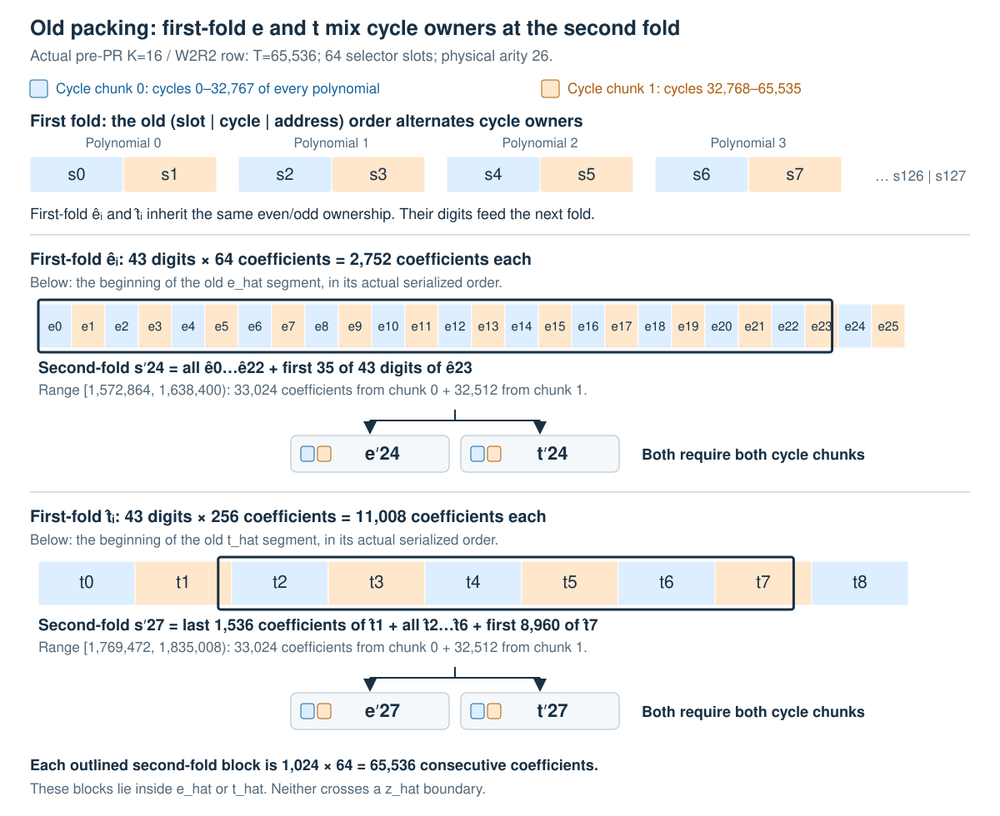

# Spec: Akita Native Trace Batching

| Field | Value |
|-------|-------|
| Created | 2026-10-04 |
| Status | implemented |
| PR | [#51](https://github.com/LayerZero-Research/jolt/pull/51) |

## Summary

Move trace-polynomial batching from Jolt's selector packing into Akita's native
batch protocol. `OneHotTrace` becomes one commitment group containing the actual
trace columns. Akita can assign the same cycle range of every column to one
chunk and account for the witness norms at the batch level. This removes the
old packing's interleaving of cycle owners and establishes first-fold cycle
locality. Later folds still cross chunk owners; recursive witness boundary
alignment is tracked by [Akita #175](https://github.com/LayerZero-Labs/akita/pull/175).

## Motivation

### Chunk locality

Chunks must partition **cycles across all polynomials**. With two chunks, chunk 0
owns every polynomial's first half of the cycles; chunk 1 owns every polynomial's
second half. They must each be able to compute the next fold's `e_i` and `t_i`
from their own data. A source block `s_i` produces `t_i = A s_i` and a partial
evaluation `e_i`; their digit decompositions enter the next witness.

**Concrete pre-PR example.** Take the K=16/W2R2 catalog row with one polynomial
at physical arity 26: `T = 65536`, 64 selector slots, and layout
`(slot || cycle || address)`. Each slot has `T × K / 256 = 4096` ring elements.
The first fold uses ring dimension 256 and 2048 positions per block, so each
column `c` occupies two blocks:

```text
s_(2c)   = column c, cycles     0–32767  → cycle chunk 0
s_(2c+1) = column c, cycles 32768–65535  → cycle chunk 1
```

Thus packing orders the first-fold `e_hat_i` and `t_hat_i` by alternating cycle
owners: even indices belong to chunk 0, odd indices to chunk 1. The old Akita
two-chunk partition instead splits the packed block range into 0–63 and 64–127,
each containing both cycle halves of 32 slots. Those physical units are **not**
the desired cycle chunks.

In the first physical unit, the schedule's three response digits give a
1572864-coefficient `z_hat` prefix. Each `e_hat_i` then occupies `43 × 64 = 2752`
coefficients, and each `t_hat_i` occupies `43 × 256 = 11008`. Consequently,
`e_hat_0..63` occupies `[1572864, 1748992)` and `t_hat_0..63` occupies
`[1748992, 2453504)`. The second fold uses ring dimension 64 and 1024 positions
per block: 65536 consecutive coefficients per new block.



The figure traces two actual second-fold blocks, using zero-based indices and
half-open coefficient ranges:

| Second-fold source | First-fold contents | Chunk 0 coefficients | Chunk 1 coefficients |
|--------------------|---------------------|---------------------:|---------------------:|
| `s'_24`: `[1572864, 1638400)` | All 43 digits of `e_hat_0..22`, first 35 digits of `e_hat_23` | 33024 | 32512 |
| `s'_27`: `[1769472, 1835008)` | Last 1536 coefficients of `t_hat_1`, all of `t_hat_2..6`, first 8960 coefficients of `t_hat_7` | 33024 | 32512 |

Both `e'_24` and `t'_24` depend on both cycle chunks; so do `e'_27` and `t'_27`.
The crossing occurs entirely inside the `e_hat` and `t_hat` segments. Every full
second-fold block inside either segment spans multiple alternating owners,
defeating self-contained cycle chunking. Moving such a block to either owner
still requires transferring the other owner's data.

Akita permits different ways to compute the individual `z_j`; the required
relation involves their sum `z = sum_j z_j`. That freedom does not remove the
interleaving of first-fold `e_i` and `t_i` in the packed representation.

Native batching makes the block range **within each polynomial** the ownership
key, so a chunk receives the same cycle range from every column. The recursive
witness is still treated as a flat witness and halved, so the boundary block
and tail can cross owners from the second fold onward.
[Akita #175](https://github.com/LayerZero-Labs/akita/pull/175) addresses that
boundary issue by aligning witness bodies to successor source blocks and
inheriting producer ownership. That change is outside this PR's pinned revision.

The example uses the [pre-PR catalog](https://github.com/LayerZero-Research/jolt/blob/bed9c67e79821bd966a0bc4c0f3e301c7e1d765b/crates/jolt-akita/schedules/jolt-fp128-onehot-k16-w2r2.aks),
Akita's [canonical witness layout](https://github.com/LayerZero-Labs/akita/blob/e2c49ed450f1999a743e7fd4a648f230ce45472f/crates/akita-params/src/witness.rs),
and its [recursive block indexing](https://github.com/LayerZero-Labs/akita/blob/e2c49ed450f1999a743e7fd4a648f230ce45472f/crates/akita-cpu-backend/src/opaque/recursive/witness/opening_and_flat.rs).

### Witness norms and SIS sizing

The packed representation exposed one witness over a padded selector domain and
hid the column boundaries from Akita's batching protocol. Native batching exposes
each column's arity, the actual polynomial count, and its one-hot source contract.
Akita can therefore apply its norm and fold-response bounds to the individual
sources and account for their combination itself.

This permits more accurate SIS parameter pricing at the required security level.
Jolt supplies the source geometry and bounds; Akita's planner owns the
resulting parameters. The existing `{0,1}` coefficient bound is preserved.

## Layout and opening statement

Let `T = 2^log_T`, `K = 2^log_K`, and `M` be the number of trace columns. Previously,
Jolt used a fixed selector capacity `C`: 64 slots for K=16 or 32 slots for K=256.
The packed polynomial was

```text
P(s, x) = sum_{i < M} eq(s, i) P_i(x)
```

with unused slots zero. Its variable order was `(slot || cycle || address)` and
its arity was `log_C + log_T + log_K`. Stage 8 sampled the selector point and
reduced the column claims to one evaluation of `P`.

The new statement is the ordered native batch

```text
P_0(x) = v_0, ..., P_{M-1}(x) = v_{M-1}
```

Each polynomial has `log_T + log_K` variables in `(cycle || address)` order.
There are exactly `M` polynomials, with no selector slots or padding to a column
capacity. Canonical column order, digit-zero semantics, and the logical
address/cycle point permutation are preserved.

Stage 8 uses the shared `one_hot_trace_claim` assembler to collect all evaluations
at the common point. It performs no trace selector reduction. Advice, field
increments, and committed-program objects retain their own layouts and join the
trace group in one joint Akita opening proof. Jolt still carries one trace
commitment slot.

## Implementation

`OneHotTraceLayout` in `jolt-claims` owns column order, arity, count, point mapping,
and the layout digest. Setup and grouped schedule requests now carry
`PolynomialGroupLayout(log_T + log_K, M)`. Batch capacity counts every native
column plus the auxiliary polynomials.

`TraceOneHotColumn` replaces `TracePackedOneHot`. Each column is a lightweight view
over the same `Arc<dyn TraceOneHotRows>`, with its own column index. The adapter
imports the ordered views as one native Akita group. Batch construction rejects
different trace owners, dimensions, or column order.

Commitment, evaluation/folding, decomposition, and coefficient packing are fused
across columns. Each kernel traverses the shared rows once and produces the
required per-column outputs or per-chunk responses. Existing sparse, rotation,
SIMD, and tiling optimizations are retained, without materializing dense one-hot
tables or duplicating trace-sized storage per column.

For decomposition, challenges are indexed by `(column, block)`, while chunk
ownership depends only on the block within a column. Akita supplies the canonical
dyadic ranges, and the adapter validates them against the per-column block count.
Existing chunk profiles retain their activation depths.

Schedules are regenerated for native arity and polynomial count using the pinned
Akita revision `83574331`. This PR intentionally owns the upgrade from
`e2c49ed`: its immediate successor `83574331` merges
[Akita #169](https://github.com/LayerZero-Labs/akita/pull/169), providing batched
opening preparation and source evaluation, including batch-only source kernels.
The fused trace opening uses that batch dispatch. This pin does not include
Akita #175's recursive ownership alignment.

K=16 catalogs cover production shapes through `2^30` cycles. Both K values also
retain the base branch's one- and two-polynomial adapter and grouped-planner grids,
including the smaller profile-specific arities. The shipped K=256 native trace
keys remain limited to the explicit benchmark, cutover, advice, and forced-guest
fixtures listed in the [schedule policy](../crates/jolt-akita/schedules/README.md).
Arbitrary K=256 trace shapes require a deployment-owned catalog containing the
exact shape; grouped provisioning rejects missing shapes during setup. The
streaming witness's `u64` digit-zero mask limits the trace to 64 columns.

## Invariants and compatibility

- Prover and verifier derive exactly the same ordered column claims and common
  opening point. Missing claims, point disagreement, or incorrect arity fail
  before the PCS call.
- Commitment and setup metadata match the canonical layout digest, K, arity,
  and actual polynomial count.
- Commitments, group roles, points, and ordered evaluations are absorbed before
  Akita derives batching challenges.
- Streamed outputs agree with Akita's materialized native one-hot kernels,
  including committed zero rows and chunked responses.

The trace layout digest advances to `native-batch/v8`, and the grouped transcript
domains advance to v4. Akita proofs and preprocessing from the packed layout are
incompatible with this layout.

## Validation

Acceptance requires native/materialized kernel agreement, one row visit per fused
kernel, correct chunk geometry, canonical batch rejection, and exact catalog key
coverage. Existing Akita end-to-end and tamper tests must pass for ordinary and
field-inline proofs, including advice and committed programs. Catalog freshness
is checked separately with `gen_jolt_schedules --check`.

The performance requirements are to retain fused streaming and avoid selector
overhead. The [base/head performance comparison](akita-native-trace-batching-performance.md)
records proving, verification, proof size, setup, and process memory for Single,
W2R2, W4R2, and W8R2, including the level-3 witness growth at `log_T=24`.
Full chunk locality across recursive folds also needs
[Akita #175](https://github.com/LayerZero-Labs/akita/pull/175) and regeneration of
the affected Jolt multi-chunk catalogs after upgrading the pin.

## References

- [Canonical trace layout](../crates/jolt-claims/src/protocols/jolt/lattice/strategy.rs)
- [Streaming native batch kernels](../crates/jolt-akita/src/trace_onehot/)
- [Shared final claim assembly](../crates/jolt-verifier/src/stages/stage8/akita.rs)
- [Schedule policy](../crates/jolt-akita/schedules/README.md)
- [Akita statement contract](lattice-claims.md)
