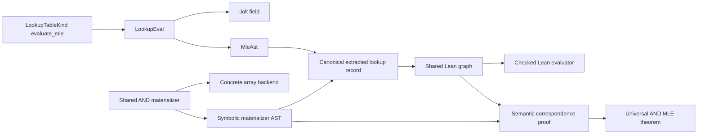

# Spec: Checked lookup evaluator extraction

| Field     | Value |
|-----------|-------|
| Author    | Quang Dao |
| Created   | 2026-08-09 |
| Status    | in review |
| PR        | [#1759](https://github.com/a16z/jolt/pull/1759) |

## Summary

Jolt defines lookup table multilinear extensions in Rust. The ZkLean extractor
also needs those polynomials as Lean definitions. This change lets the
extractor run the same modular Rust evaluator over a symbolic arithmetic type,
then writes its shared expression graph as Lean data. Lean checks the graph
before evaluation. For AND, Lean also proves that the extracted polynomial is
the multilinear extension of the Boolean lookup table.

## Intent

### Goal

Use one Rust lookup evaluator as the source for both Jolt field evaluation and
Lean extraction, while keeping the generated Lean code compact and making its
current proof scope explicit.

### Invariants

- `LookupTable::evaluate_mle` has one implementation per table. Extraction
  must not add a second handwritten formula.
- Every existing Jolt field must retain the same lookup evaluation semantics.
- A symbolic evaluator must only implement the arithmetic operations that the
  lookup formulas use. It must not need to implement a cryptographic field.
- The extracted graph must preserve shared `MleAst` nodes.
- Rust must reject unsupported graph operations and input indices outside the
  declared arity.
- Lean must check every input index, child reference, and root reference before
  a generated graph is exposed through its public evaluator.
- Direct Lean graph evaluation must agree with the algebraic expression
  reconstructed from the graph.
- A certified lookup must connect the extracted field graph to a materializer
  through pointwise polynomial equality over every commutative ring. Rust
  expression association and graph layout must not be part of this invariant.
- A certified lookup polynomial must be affine in each input coordinate and
  must agree with its materializer on every Boolean input.
- The concrete and symbolic AND materializers must run the same Rust semantic
  function through different backends.
- The concrete AND materializer must not allocate.
- Generated public lookup function names and lookup flag ordinals must remain
  compatible with the current legacy extractor consumers.
- CI must build and test the generated Lean package. Rust generation tests
  alone are not evidence that a generated theorem is valid.
- The extractor must provide a deterministic standalone lookup artifact for
  downstream formalizations. The artifact must identify the exact Jolt
  revision used by a clean checkout and hash every exported Lean file.

### Non-Goals

- This change does not move the instruction catalog out of
  `jolt-prover-legacy`.
- This change does not certify the materializers for all 40 lookup tables.
  AND is the first complete universal certificate.
- This change does not resolve the known RV32 `Pow2W` disagreement between the
  legacy and modular evaluators. Production extraction is RV64.
- This change does not remove existing `sorry` placeholders for instructions
  that have no lookup table.
- This change does not alter a proof transcript, proof format, verifier input,
  serialization format, or runtime proof acceptance rule.

## Evaluation

### Acceptance Criteria

- [x] All modular lookup evaluators accept the smaller `LookupEval` arithmetic
  interface.
- [x] Every `jolt_field::Field` receives a blanket `LookupEval`
  implementation.
- [x] A non-field symbolic type executes the real AND evaluator in a Rust
  integration test.
- [x] `MleAst` implements `LookupEval`, and lookup extraction constructs its
  symbolic inputs directly without a `JoltField` bound.
- [x] All 40 RV64 lookup graphs come from `LookupTableKind::evaluate_mle`.
- [x] One canonical extracted record owns each table name, graph, and optional
  materializer certificate data.
- [x] The extractor serializes shared graph nodes once in topological order.
- [x] Lean checks generated graph well-formedness with `decide`.
- [x] Lean proves the graph interpreter equal to reconstructed expression
  evaluation through one static theorem.
- [x] The AND materializer uses one Rust implementation for concrete and
  symbolic execution.
- [x] Concrete AND materialization uses a const-generic array and performs no
  heap allocation.
- [x] Lean proves pointwise polynomial equality between the AND graph and
  materializer arithmetization without requiring identical expression trees.
- [x] Lean proves that the AND evaluator is the multilinear extension of its
  materializer over every field.
- [x] An exhaustive ABI test checks all 40 modular and legacy table ordinals.
- [x] Random RV64 tests compare the modular symbolic AST and an independent
  graph interpreter with the legacy numeric evaluator.
- [x] Generated value guards cover all 40 public lookup functions.
- [x] CI builds the generated `Jolt` Lean library and runs its test driver.
- [x] No generated lookup source file contains thousands of generic CSE
  declarations.
- [x] A lookup-only export contains the static Lean runtime, generated lookup
  tables, exact Jolt revision, and SHA-256 file hashes.
- [x] Repeating the lookup-only export at one revision produces identical
  bytes.

### Testing Strategy

Rust validation covers four separate boundaries.

1. The lookup library unit tests preserve table materialization, field MLE,
   prefix and suffix decomposition, and instruction mapping behavior.
2. `lookup_eval_interface` executes the production AND evaluator over a small
   symbolic algebra that does not implement `Field`.
3. `prover_lookup_table_abi` checks every modular table index against the
   legacy catalog used by the current instruction extractor.
4. The extractor property test compares the modular `MleAst` result and a
   separate graph interpreter with the legacy RV64 evaluator at random field
   points.

The generated Lean package provides separate checks.

1. Every graph has a decidable well-formedness theorem.
2. The static graph proof checks interpreter semantics for every graph shape.
3. The AND correspondence theorem proves semantic polynomial equality by
   proof-producing ring normalization. Lean's kernel checks the proof term.
4. The AND lookup theorem proves multi-affinity and full Boolean agreement.
5. The test driver evaluates all 40 public lookup functions at Rust-generated
   field points.

The CI workflow must run both `lake build` and `lake test` after generation.
The Rust test jobs remain required because Lean does not check the Rust catalog
adapter or the legacy numeric oracle.

CI also runs the standalone artifact command against its exact checkout. The
command refuses a different revision or tracked local changes. Unit tests check
that the file set and manifest are deterministic.

### Performance

The generated graph format must retain shared subexpressions. The complete RV64
catalog must remain below 20,000 graph nodes, and no single table may exceed
1,000 nodes under the current formulas. These tests detect accidental loss of
sharing.

The prior expanded lookup module required about 642 seconds to compile in a
local clean measurement. The graph representation reduced the executable
lookup module to seconds. Semantic AND certification may take longer than graph
execution because it normalizes one concrete polynomial equality. It must stay
within the local theorem resource limits and pass the required CI Lean job.

Concrete lookup materialization must not move from constant-space bit logic to
per-call heap allocation. The const-generic materializer output enforces this
for AND.

This extractor and its generated Lean build are development tools rather than
prover hot paths. No proof throughput objective changes in `jolt-eval`.

## Design

### Architecture

#### Arithmetic boundary

`LookupEval` contains the constants and ring operations used by lookup MLE
formulas. The blanket field implementation preserves existing callers. The
extractor implements the same interface for `MleAst`.

`ChallengeOps` and `FieldOps` continue to express how lookup challenges
interact with evaluator outputs. The smaller bound changes applicability, not
the formula executed for real fields.

#### Canonical extracted record

The extractor converts each `LookupTableKind` once. The resulting record owns
the stable generated name, one shared MLE graph, and optional materializer data.
One emitter writes each public lookup definition. Downstream instruction,
flag, and test modules import `Jolt.LookupTables` without knowing which tables
carry universal certificates.

The current optional capability contains only AND. Adding a table family means
adding its operations to the small materializer language, implementing its
shared Rust materializer, and attaching that materializer in the central
capability dispatch. It must not create a second generated module pipeline.

#### Standalone artifact

Downstream Lean repositories need a focused input instead of the complete
generated circuit package. The standalone artifact contains the four static
lookup runtime modules and the generated `Jolt.LookupTables` module. It does
not contain instructions, constraints, sumchecks, field adapters, or tests.

The caller supplies a full Jolt revision. The exporter checks that it matches
the clean checkout, then records it in `lookup-artifact.json`. The manifest
also records the format version, word width, generator version, the SHA-256
hash of each Lean file, and one hash over the sorted file set. It omits times
and local paths so repeated exports have identical bytes.

#### Shared graph

The Rust graph converter walks the `MleAst` arena from one root. It memoizes
nodes and atoms, rejects unsupported operations, rejects invalid variables,
and writes nodes in dependency order.

Lean represents the graph as fixed-size list chunks. The evaluator uses an
array accumulator for indexed child access. A decidable well-formedness check
requires inputs to be in range, child references to point backward, and the
root to exist.

The graph evaluator is total internally, but generated public functions supply
the checked well-formedness theorem. One static Lean proof shows that direct
graph evaluation agrees with reconstructing and evaluating an algebraic
expression.

#### Materializer and certificate

`LookupMaterializer` expresses table semantics over a `MaterializerBackend`.
The concrete backend reads bits from a `u128` index and folds a const-generic
bit array into a `u64`. The symbolic backend records Boolean operations and a
most-significant-bit-first natural number expression.

The AND certificate does not compare serialized expression trees. It states
that both expressions evaluate equally at every point over every commutative
ring. Mathlib ring normalization constructs a proof for the generated concrete
expressions. The final theorem combines this semantic correspondence with a
static syntactic multi-affinity checker and a proof that Boolean
arithmetization preserves the materializer.

#### Compatibility boundary

The modular catalog owns evaluator formulas and lookup flag enumeration. The
legacy catalog temporarily supplies instruction associations and generated
names. Conversion occurs by ordinal and is guarded by an exhaustive RV64 test
that checks every table and both catalog counts.

This is staged compatibility code. It must be removed when instruction
extraction uses the modular catalog directly.

### Alternatives Considered

#### A second symbolic evaluator

Rejected because handwritten extraction formulas can drift from prover and
verifier formulas. The symbolic backend must execute the same
`evaluate_mle` method.

#### Require `MleAst` to act as a full field at the lookup boundary

Rejected because many `JoltField` operations have no sound symbolic meaning
for lookup extraction. Direct symbolic inputs and `LookupEval` state the real
contract.

#### Print nested Lean expressions or thousands of CSE definitions

Rejected because the old generated module had severe elaboration and compiler
costs. A topological graph preserves sharing as data and uses one interpreter.

#### Exact expression-tree correspondence

Rejected because harmless reassociation in Rust would break the certificate.
Pointwise equality states the intended mathematical invariant.

#### Separate certified and uncertified generation pipelines

Rejected because each new certificate family would add routing conditions and
force downstream modules to track definition ownership. One extracted record
and one emitter keep certification as data attached to a table.

#### A `Vec` in the materializer backend interface

Rejected because concrete AND materialization would allocate on every call.
Const-generic arrays retain shared semantics without changing the runtime cost
class.

## Documentation

No Jolt book change is required. This is an internal extraction and
formalization boundary. The generated Lean source includes reader-facing
documentation for each graph, materializer, correspondence theorem, and final
lookup theorem. This spec records the architecture and the deferred proof
scope for maintainers.

## Execution

1. Add `LookupEval` and blanket field support in `jolt-lookup-tables`.
2. Execute modular lookup evaluators over direct `MleAst` inputs.
3. Serialize supported AST operations into checked shared graphs.
4. Emit every table through one canonical extracted record.
5. Extract AND materialization through allocation-free concrete and symbolic
   backends.
6. Prove static graph semantics and semantic AND correspondence in Lean.
7. Build and test the complete generated Lean package in CI.
8. Export the standalone lookup artifact with exact source provenance.
9. Extend materializer operations and certificates one table family at a time.

## References

- [`crates/jolt-lookup-tables`](../crates/jolt-lookup-tables)
- [`zklean-extractor`](../zklean-extractor)
- [`CONTRIBUTING.md`](../CONTRIBUTING.md)
- [Mathlib ring tactic](https://leanprover-community.github.io/mathlib4_docs/Mathlib/Tactic/Ring/RingNF.html)
