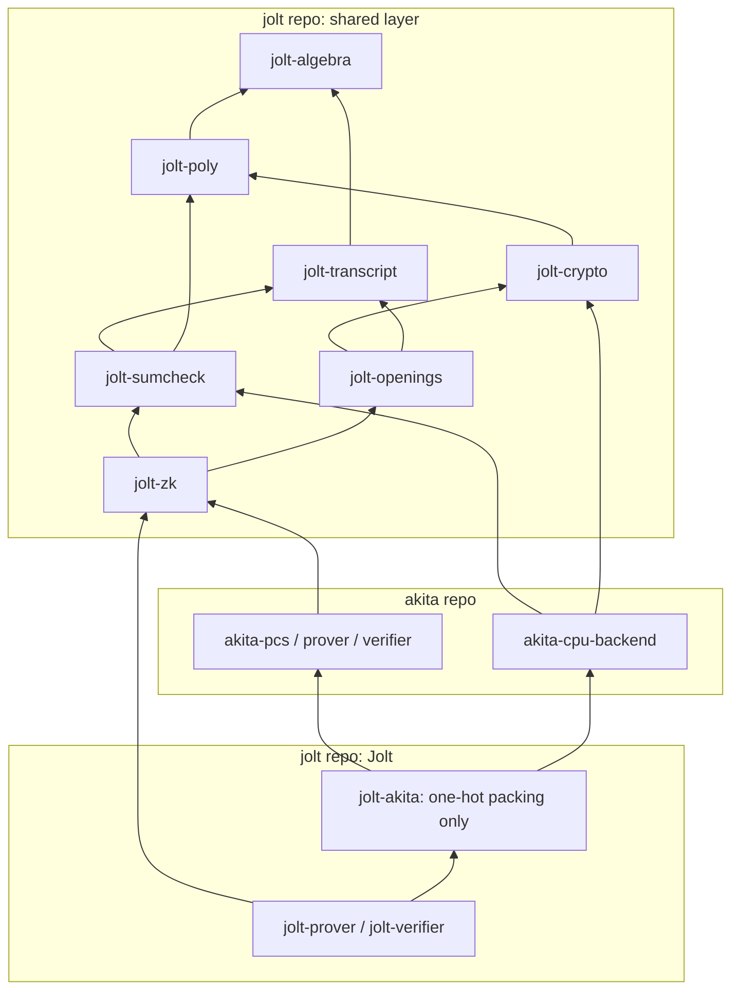
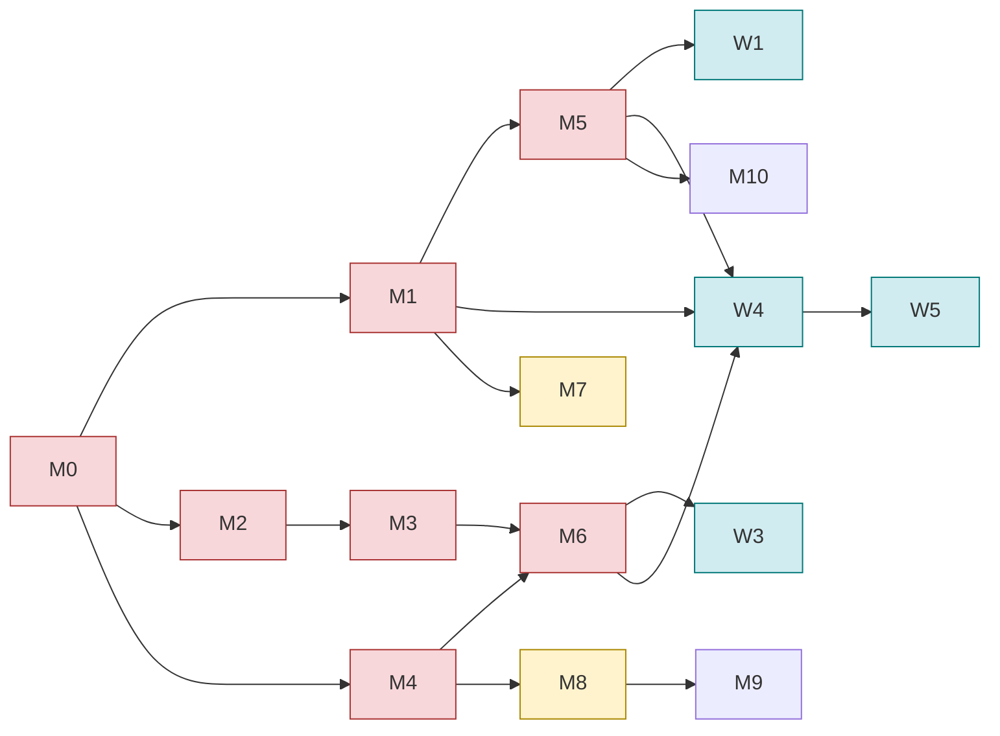

# Spec: One shared primitive layer for Jolt and Akita

| Field     | Value                                   |
| --------- | --------------------------------------- |
| Author(s) | @markosg04                              |
| Created   | 2026-10-06                              |
| Status    | proposed                                |
| PR        | (Jolt) / (Akita), per migration           |

## Summary

Jolt and Akita already share a field, polynomial, and transcript layer: after
the transcript-unification PRs (jolt #2000, akita #185), Akita depends on
`jolt-field`, `jolt-poly`, and `jolt-transcript` directly, and `akita-field` and
`akita-transcript` are gone. Most other primitives are still implemented once per
repository, or bridged:

| Concept | Copies today |
|---|---|
| Sumcheck driver | `jolt-sumcheck`, `akita-sumcheck/src/proof_stream.rs` |
| eq / bind / Gruen | `jolt-poly`, `akita-algebra/src/{eq_poly,split_eq,poly}.rs` |
| Keccak / SHAKE | spongefish (via `jolt-transcript`), `akita-challenges/src/sampler/xof.rs` |
| Signed small accumulator | `akita-sumcheck/accum.rs`, `akita-cpu-backend` range image |
| SIMD dispatch policy | compile-time (`jolt-field`), runtime `OnceLock` + env (`akita-algebra`) |
| Serialization | serde, `ark-serialize`, `akita-serialization`, spongefish codecs |
| PCS boundary | `jolt-akita` adapter (~3.7k LOC of bridge code) |

Shared crates pay off only if no consumer keeps its own copy and no consumer
needs an adapter. Whiteout makes this pressing. It masks *every* witness-dependent
field message of the Jolt PIOP and of Akita's folds 1..k with pads committed in
advance, and its Σ-protocol needs ring arithmetic, Ajtai commitments with hiding
randomness, sparse ring challenges, and Gaussian rejection sampling. With two
sumcheck drivers, the masking hook gets written twice, and the pad schedules can
drift apart, which is a soundness hazard.

This spec makes the jolt repository the single owner of the shared primitive
layer. It defines the ownership rules, the target crate layout, and the
interfaces that must serve every consumer. It also orders the migrations by
whether they block Whiteout.

## Intent

### Goal

Every proof-system or cryptographic primitive used by more than one repository
has exactly one implementation, in a jolt-repo crate, and each consumer uses it
directly, with no adapter.

### Ownership rules

These rules decide where code goes. They are the part reviewers should check most
carefully.

1. **Location.** The shared layer lives in the jolt repository. Akita pins it by
   git hash. Publishing to crates.io comes later and does not change
   the layout.
2. **Algebra vs. crypto.** `jolt-algebra` holds math that needs no hardness
   assumption. `jolt-crypto` holds anything that carries a hardness assumption or
   a security parameter: groups, Pedersen, Ajtai/SIS commitments, hiding
   randomness, samplers, ring challenge sets, and hashing.
3. **Protocol vs. primitive.** A PCS protocol (Akita's prover, verifier,
   schedules, planner, setup, and config; Dory's protocol) stays with its owner.
   So do generated parameter tables keyed by protocol types, such as Akita's SIS
   tables and the estimator that generates them. Moving those would create a
   dependency cycle.
4. **Kernels stay with their owner for now.** A consumer keeps its
   performance-tier kernels and implements the shared traits. Moving Akita's
   kernels to the `jolt-prover`/`jolt-kernels` architecture is deferred (M11).
5. **Two serialization layers only.** Proof and transcript bytes use spongefish
   codecs with shape-bounded decoding. Everything at rest (setup, preprocessing,
   keys, configs, fixtures) uses serde.

### Target layout

| Crate | Owns | Absorbs |
|---|---|---|
| `jolt-algebra` (renamed from `jolt-field`) | prime and extension fields, packed SIMD, delayed reduction, the cyclotomic ring R_q, NTT/CRT, smooth FFT, balanced digit decomposition, norms, checked and narrowing arithmetic, the one runtime SIMD dispatcher | `akita-algebra` (ring/, ntt/, fft.rs, decomposition, `cfg_try_fold_reduce!`); `akita-error::{checked,narrowing}`; `akita-sumcheck/accum.rs` |
| `jolt-poly` | multilinear, eq / split-eq / Gruen, univariate, compressed round forms, `Point<E, F>` | `akita-algebra/src/{eq_poly,split_eq,poly}.rs`, the generic parts of `offset_eq` (`eq_eval_at_index`, `OffsetEqWindow`, `EqPairTensor*`) |
| `jolt-transcript` | spongefish channel, codecs, sites, grinding, `Fork`; re-exports spongefish's `Encoding`/`NargDeserialize`; the private-message seam (Design §4) | — |
| `jolt-crypto` | groups, Pedersen, vector commitments; `lattice` (Ajtai matrix derivation, inner/outer commitment, outer hiding randomness); `challenge` (sparse ring challenges, operator-norm rejection); `sample` (uniform, discrete Gaussian, rejection rule); `hash` (SHAKE256) | `akita-challenges` (minus `fold_draw.rs`); `akita-types/proof/setup.rs` matrix derivation; `akita-cpu-backend` commitment stages (the generic Ajtai operation) |
| `jolt-sumcheck` | the one sumcheck driver, round formats, challenge policies, the recorder trait, batching | `akita-sumcheck/{proof_stream,traits,single}.rs` |
| `jolt-openings` | PCS traits, with the hiding commitment split from the ZK opening | — |
| `jolt-zk` (renamed from `jolt-blindfold`) | the masking front end (pad schedule, masking recorder, residual relation), the `blindfold` back end (curve), the `whiteout` back end (lattice Σ-protocol) | `jolt-sumcheck`'s `committed` and `r1cs` features |

`akita-algebra`, `akita-challenges`, `akita-sumcheck`, and `akita-serialization`
are deleted. `akita-error` keeps only its protocol error type. `akita-config`
gains a parameterized external-family preset, which replaces
`jolt-akita/src/configs.rs`.

The only edges that leave the shared layer go from consumers into it. The
remaining cycle between repositories (jolt-akita → akita → shared layer) involves
only Jolt-specific code and is accepted until M11.

### Invariants

- **I1. Dependency direction.** No shared-layer crate depends on an `akita-*`
  crate. `jolt-akita` is the only jolt crate that depends on Akita. A CI
  check over `cargo metadata` enforces both.
- **I2. One owner per concept.** Each concept in the Summary table has exactly
  one implementation once its migration lands. Reviewers reject a new local copy.
  There's no reliable automated check for this, so it is enforced in review.
- **I3. Refactors preserve proofs.** Every migration except M6 is a refactor. On
  fixed-seed inputs, Jolt's verifier fixtures and Akita's proof bytes are
  byte-identical before and after. This is checked during the PR (old vs. new
  prover on the same inputs) and is not kept as a permanent test. M6 changes the
  Jolt ZK proof format on purpose and regenerates the ZK fixtures.
- **I4. Bit order is a type.** Every eq, multilinear-evaluation, and bind API that
  takes a point takes `Point<E, F>`, where `E` is `HIGH_TO_LOW` or `LOW_TO_HIGH`.
  Converting between orders requires an explicit `match_endianness`. No reversal
  happens silently inside a bridge.
- **I5. Verifier input is parsed once.** Proof bytes are decoded by the transcript
  through spongefish codecs, with lengths bounded by the protocol's shape. serde
  never parses verifier input. No verifier parses the proof into a struct and then
  re-serializes it for comparison.
- **I6. The verifier closure keeps its lints.** `jolt-algebra`, `jolt-crypto`,
  `jolt-sumcheck`, and `jolt-transcript` stay in the verifier closure
  (`specs/verifier-closure-lints.md`). Code moved in must meet that crate's lints,
  or carry a narrowly scoped `#[expect]` with a reason. SIMD modules keep
  `deny(unsafe_op_in_unsafe_fn)` and a SAFETY comment at every site.
- **I7. One pad schedule.** Every witness-dependent field message, whether from
  a sumcheck round, a claimed evaluation, or an Akita partial evaluation, goes
  through the private-message seam, in schedule order, in every repository.
  Masking is defined once, in `jolt-zk`.

### Non-Goals

- Implementing Whiteout itself. Its work items (W1–W5) appear only to show which
  migrations they depend on.
- Moving Akita's PCS protocol, its SIS tables and estimator, its planner, or its
  CPU-backend kernels. M11 sketches the kernel move.
- Publishing to crates.io.

## Design

### 1. `jolt-algebra`

`jolt-field` is renamed and absorbs `akita-algebra`'s ring, NTT/CRT, FFT, and
decomposition modules unchanged. Moving the code does not rewrite it. The crate
takes over `akita-error`'s checked and narrowing arithmetic, together with a typed
`AlgebraError`, so moved code no longer returns `AkitaError`.

Kernels (NTT butterflies, signed dot products, Keccak in `jolt-crypto`) use one
runtime dispatcher: the ISA ceiling is detected once into a `OnceLock`, and a
single `JOLT_SIMD_BACKEND` environment variable can override it. Packed-field
widths stay compile-time, because they are types and cannot be chosen at runtime.

Cost of I6: the NTT and SIMD modules contain about 300 `unsafe` sites, and the
Akita verifier reaches SIMD code through `mat_vec_i16` and `ifma52_enabled`. That
is consistent with `jolt-field`'s current carve-out (`deny(unsafe_op_in_unsafe_fn)`,
no `forbid`). Unlike the SIMD code, `fft.rs` has no unsafe but has about 19
panic or assert sites, and the verifier reaches it through setup contribution. M1
must convert those to typed errors.

### 2. Bit order

Jolt uses `HIGH_TO_LOW`; Akita uses `LOW_TO_HIGH`. Both orders are
supported. `Point<const E: Endianness, F>` already exists in `jolt-poly/src/point.rs`.
The `eq` and multilinear-evaluation APIs change from `&[F]` to `&Point<E, F>`
(I4), and they are written once, generic over `E`. Akita keeps its order and
deletes its own eq code. `jolt_to_akita_evals` and `reverse_point` in `jolt-akita`
become typed `match_endianness` calls at the single place Jolt hands a point to
Akita.

### 3. The sumcheck driver

`jolt-sumcheck` becomes the only driver. It has to support the behavior of both
current drivers. The table below is the requirement; the API shape is the
implementer's choice, as long as every row holds.

| Requirement | Jolt today | Akita today |
|---|---|---|
| Base field / extension split | single `F` | `F: CanonicalEncoding`, `E: ExtField<F>` |
| Round format (which coefficient is omitted) | standard (omit c1); uni-skip (omit c0, weighted by domain size) | standard; eq-factored (omit q0, `OmittedConstantPoly`) |
| Challenge policy per round | `challenge_small` | full extension challenge, optional grind (`grinded_ext_challenge`) |
| Site tagging | none | `sumcheck_site(invocation, round, role)` |
| Fallible prover | `ProveRounds::prove_round` / `finish_rounds` return `Result<_, SumcheckError<F>>` | two traits: fallible `SumcheckKernel` (`AkitaError`), and infallible `SumcheckInstanceProver` / `EqFactoredSumcheckInstanceProver` adapted by wrappers |
| Prover self-check `s(0)+s(1) = claim` before send | no | yes |

Design decisions:

- A `RoundFormat` enum owns the rule for which coefficient is omitted and how the
  verifier recovers it: `Standard`, `EqFactored { tau }`, `UniSkip { domain }`.
  The verifier and the masking recorder (§7) both consume this one definition,
  because masking must send exactly the coefficients the clear proof sends.
- A `ChallengePolicy` is supplied per sumcheck instance and receives the site and
  round index. Policies: `Small` (Jolt's default), `Extension`, and
  `GrindedExtension { bits }`. A grind is computed from the public transcript
  only, so masking does not interact with it. Each policy reproduces the
  challenge bytes of the driver it replaces exactly: `GrindedExtension` matches
  Akita's `grinded_ext_challenge`. This is required for I3.
- Every round message and challenge carries a typed `SumcheckSite`
  (`invocation`, `round`, `role`) through `Channel::site`.
- **The prover is fallible end to end.** There is one prover trait, and every
  method that does work returns `Result`: computing the round polynomial,
  binding a challenge, and finishing. Akita's infallible traits and their
  wrappers are deleted, and no infallible variant exists. The shape (round
  count, degree bound, input claim) is a value fixed when the instance is
  built, so its getters cannot fail. The motivation is liveness: a prover
  serving requests must report a bad input or a kernel bug as an error, not
  abort the process.
- The driver is generic over the kernel's error type: `SumcheckError<E, K>` with
  a `Kernel(K)` variant. It is not `Box<dyn Error>`. The error separates two
  classes, because callers react to them differently:
  - **Invariant violations:** a shape mismatch, a degree above the bound, or a
    failed self-check. These are bugs, and retrying with the same input fails
    again.
  - **Aborts:** a randomized step failed and may be retried with fresh
    randomness. Whiteout needs this class: a one-shot fold response that
    overflows its digit range (W2) and a Σ-protocol rejection both abort, and the
    caller retries.
- The driver checks the shape of every round message, including its degree
  against the bound. The prover self-check `s(0)+s(1) = claim` runs in release
  builds and returns a typed error, so a kernel bug surfaces at the point of
  fault rather than as a verifier rejection.
- Parallel loops inside kernels propagate errors with a fallible reduction
  (`cfg_try_fold_reduce!`, moved to `jolt-algebra` in M1), not with panics.
- A fallible signature does not remove panics inside a kernel body. Kernel
  crates deny `unwrap`, `expect`, and `panic` in non-test code. Indexing in hot
  loops stays at warn level and relies on structural guarantees, because a
  checked `get` adds a branch per access and the performance gate (Evaluation)
  decides case by case. The top-level prove entry point converts any remaining
  panic into a typed error with `catch_unwind`. This works only under
  `panic = "unwind"`, and the release profile must keep that setting.

Akita's kernels in `akita-cpu-backend/src/opaque/sumcheck` implement the driver's
prover trait. `akita-sumcheck/types.rs` is a test oracle and is deleted, and the
tests that use it switch to the reference tier.

### 4. Private-message seam

Masking covers more than sumcheck rounds: Jolt's claimed evaluations and Akita's
partial-evaluation messages are witness-dependent too. `jolt-transcript` gains a
seam that separates *private* field messages, which depend on the witness, from
public ones. A public message (a commitment, a nonce, a setup-offloading claim)
goes straight to the channel. A private message goes to a `MessageRecorder`,
which in clear mode sends it unchanged. `SumcheckRecorder` is built on the same
seam. The seam must sit in a crate Akita already depends on, which is why it goes
in `jolt-transcript` and not `jolt-zk`. Jolt's `jolt-prover/src/recorder.rs`
`ClaimRecorder` becomes one implementation.

### 5. Commitment traits

`jolt-openings` splits the current `ZkOpeningScheme` into two capabilities:

- `HidingCommitment`: commit with a blind. The opening proof need not be zero
  knowledge.
- `ZkOpening`: the opening proof reveals nothing beyond the evaluation.

Dory implements both. Akita implements only `HidingCommitment`, because under
Whiteout the opening is covered by later folds and the Σ-protocol. `akita-pcs`
implements `CommitmentScheme`, `BatchOpeningScheme`, and `HidingCommitment`
natively. This deletes `jolt-akita/src/{scheme.rs (adapter parts), adapters.rs
(adapter parts), native_batching.rs, shape_guard.rs}`.

### 6. `jolt-crypto`

- `lattice`: derivation of Ajtai public matrices (Akita's SHAKE256 paged sampler),
  the inner/outer commitment operation, and outer hiding randomness. The
  randomness is drawn from a box with unit differences and fresh per slice, as
  in Whiteout §4.1. Akita's planner keeps choosing ranks and moduli, and its SIS
  tables stay in Akita (rule 3).
- `challenge`: `SparseChallenge`, the challenge-set configuration, and
  operator-norm rejection. Akita's `fold_draw.rs` (grinding preview over its fold
  schedule) stays in Akita.
- `sample`: uniform sampling mod q (one rejection sampler, replacing Akita's xof
  cursor and the transcript's exact challenge), a discrete Gaussian, and the joint rejection rule. The Gaussian
  and the rejection rule are new code, and both are **constant time** with
  respect to secret data. The Gaussian sampler's running time, branches, and
  memory addresses do not depend on the sampled value or the witness. For
  example, a CDT sampler scans its whole table with constant-time comparisons;
  it never uses an early-exit binary search. The rejection rule evaluates its
  acceptance probability and compares against uniform randomness without
  data-dependent branches. The only value that leaves the rejection step is the
  accept/reject bit, and rejection sampling makes that bit independent of the
  secret. Public-coordinate handling (y = 0 where s is public) branches only on
  public layout.
- `hash`: SHAKE256 for Akita's challenge sampler and public-matrix derivation,
  replacing the hand-rolled sponge in `akita-challenges/src/sampler/xof.rs`.
  `jolt-transcript` keeps spongefish's own Keccak sponge. Where spongefish
  accepts an external permutation, the transcript may use `jolt-crypto`'s
  instead, and both are supported. The single-state permutation inside
  spongefish is a third-party dependency, so I2 does not count it as a copy.
- `commitment`: `VectorCommitment` takes an associated `Blind` type, replacing
  today's scalar `blinding: &F`, so one trait covers Pedersen (a scalar blind)
  and Ajtai (a vector of randomness digits drawn as in `lattice`). `jolt-zk`'s
  pad commitment is a `VectorCommitment` with a hiding blind, so the masking
  front end is generic over the curve and lattice back ends.

### 7. `jolt-zk`

`jolt-blindfold` is renamed to `jolt-zk` and split into three modules.

- `masking` (shared front end): the pad schedule (pads indexed in schedule order,
  committed before the first challenge), the masking `MessageRecorder` and
  `SumcheckRecorder` (send `m + p` for every coefficient the `RoundFormat`
  sends), and the residual relation: field-level affine rows and product rows
  over the pads and the residual witness. The PCS supplies a cut point and its
  private messages up to that cut. Dory's cut is at the start of its opening,
  since its own recursion handles ZK. Akita's cut is fold k ∈ {2, 3, 4}.
- `blindfold` (curve back end): the existing Nova random-instance fold and the
  outer/inner sumcheck, now fed the residual relation over committed pads instead
  of per-round Pedersen commitments. It takes over `jolt-sumcheck`'s `committed`
  and `r1cs` features, so `jolt-sumcheck` drops its optional dependencies on
  `jolt-crypto` and `jolt-r1cs`.
- `whiteout` (lattice back end): the constant-term lift, the Σ-protocol with a
  Gaussian mask and joint rejection, and the response statement. Proving that
  statement is PCS-specific, so `whiteout` defines a `ResponseProver` trait and
  Akita implements it. Akita's fold verifier likewise implements a
  `ResidualRows` trait defined in `masking`. Both traits are defined in
  `jolt-zk` and implemented in Akita, so the dependency runs from Akita into the
  shared layer (I1).

The two back ends follow the same recipe: fold the residual relation with a random
satisfying instance, then prove the folded instance with an argument that is not
zero knowledge. They share no fold code. The random instance (uniform field vs.
Gaussian ring element), the rejection step, and the ring lift differ, so no
generic fold trait is defined. The only planned code sharing is evaluating the
quadratic form and its polar form over residual rows.

### 8. Serialization and errors

- `akita-serialization` is deleted. Its implementing types fall into three groups:
  - **Transcript-facing:** `SetupPrefixSlotId`, the instance-descriptor and
    selection digests, and `CommittedGroup`/`Commitment` inside Jolt's proof.
    These get spongefish codecs with shape bounds.
  - **At rest:** setup, expanded setup, registries, `FlatMatrix`, seeds. These
    move to serde.
  - **Test oracles only:** `SumcheckProof`, `EqFactoredSumcheckProof`,
    `PhysicalL2NormProof`, `TerminalResponse`'s serialize path. These are deleted.
- `ark-serialize` leaves `jolt-algebra`, `jolt-crypto`, `jolt-riscv`,
  `jolt-program`, and `jolt-verifier`. `jolt-crypto` keeps a serde wrapper for
  arkworks curve points, which is the one place it remains.
- Each layer has its own typed error. `AkitaError` stays inside Akita's protocol
  crates.

### Alternatives considered

- **A separate primitives repository.** Rejected by the owner. Shared code stays in
  the jolt repo, pinned by hash, until it is published.
- **A separate `jolt-ring` crate.** Rejected in favor of one algebra crate. The
  case for a split was keeping SIMD-heavy NTT code out of a lint-strict crate,
  but `jolt-field` already carries an unsafe carve-out, so the split buys
  nothing (I6).
- **Naming the crate `jolt-whiteout`.** Rejected. Whiteout names the lattice
  transformation; the crate also contains the curve back end.
- **A generic fold trait across back ends.** Rejected. No code is shared beyond
  the residual rows; see §7.
- **Moving the SIS tables and estimator.** Rejected. The tables are keyed by Akita
  types, and `akita-sis-estimator` depends on `akita-types`, so moving them
  creates a cycle.
- **One canonical bit order.** Rejected. Supporting both through the type costs
  nothing at runtime and avoids changing Akita's transcript.

## Migrations

Priority tags:

- **P0**: blocks Whiteout.
- **P1**: should land before Whiteout, either to avoid writing Whiteout code
  against an API that is about to move, or because it fixes a soundness surface.
- **P2**: independent cleanup.
- **P3**: deferred.

| ID | Migration | Repos | Priority | Depends on | Changes proofs? |
|---|---|---|---|---|---|
| M0 | Land transcript unification (jolt #2000, akita #185) | jolt, akita | P0 | — | already in review |
| M1 | `jolt-field` → `jolt-algebra`; absorb `akita-algebra` ring/NTT/FFT/digits, checked arithmetic, signed accumulators, runtime SIMD dispatch | jolt, akita | P0 | M0 | no |
| M2 | One fallible sumcheck driver (§3); port Akita's driver and kernels; delete `akita-sumcheck` | jolt, akita | P0 | M0 | no |
| M3 | Private-message seam (§4); route Jolt claims and Akita partial evaluations through it | jolt, akita | P0 | M2 | no |
| M4 | Split `HidingCommitment` / `ZkOpening` (§5) | jolt | P0 | M0 | no |
| M5 | `jolt-crypto::{lattice, challenge, sample}` and `VectorCommitment::Blind` (§6); constant-time Gaussian and rejection; delete `akita-challenges` | jolt, akita | P0 | M1 | no |
| M6 | `jolt-blindfold` → `jolt-zk`; masking front end + residual relation; BlindFold on committed pads (Dory) | jolt | P0 | M2, M3, M4 | yes, ZK proof format |
| M7 | eq / multilinear evaluation into `jolt-poly` with typed bit order (§2); port Akita | jolt, akita | P1 | M1 | no |
| M8 | `akita-pcs` implements `jolt-openings` natively; delete the `jolt-akita` adapter (§5); `jolt-akita`'s configs become an `akita-config` preset | jolt, akita | P1 | M4 | no |
| M9 | Delete `akita-serialization` and `ark-serialize` (§8) | jolt, akita | P2 | M8 | no |
| M10 | `jolt-crypto::hash`; delete Akita's hand-rolled XOF | jolt, akita | P2 | M5 | no |
| M11 | `akita-cpu-backend` → `jolt-prover`/`jolt-kernels` architecture | jolt, akita | P3 | M2, M7 | no |

Whiteout work items and the migrations they wait on:

| ID | Whiteout work | Waits on |
|---|---|---|
| W1 | Akita: outer hiding randomness per slice; randomness joins the next fold's witness | M5 |
| W2 | Akita: one-shot fold responses, removing the witness-dependent retry nonce | — |
| W3 | Akita fold verifier implements `ResidualRows` (range-tree and relation final checks) | M6 |
| W4 | `jolt-zk::whiteout`: lattice pad commitment, constant-term lift, Σ-protocol, rejection | M1, M5, M6 |
| W5 | Akita implements `ResponseProver`, including the ring-quadratic reduction and setup offloading | W4 |

The critical path to Whiteout is M0 → M2 → M3 → M6 → W4 → W5. M1 → M5 runs in
parallel with it. Landing M6 first on Dory tests the whole masking front end
against an existing back end and the existing clear, ZK, and verifier fixtures,
before any lattice ZK code exists. W2 depends on nothing and can start now.

## Evaluation

### Acceptance Criteria

- [ ] I1 holds: a CI step fails if a shared-layer crate depends on `akita-*`, or
      if any jolt crate other than `jolt-akita` depends on Akita.
- [ ] After each migration, every row of the Summary table that it covers has one
      implementation. The deleted crates listed under Target layout no longer
      exist.
- [ ] I3 holds for M1–M5 and M7–M11: on fixed-seed inputs, Jolt's verifier
      fixtures pass unchanged, and Akita's proof bytes are byte-identical to the pre-change prover. Shown in each PR.
- [ ] M2: Akita's sumcheck kernels run through `jolt-sumcheck`, and its test
      suites pass, including the eq-factored and grinded-challenge
      paths. No infallible prover trait remains. A kernel that returns an error
      and a kernel that panics both surface as a typed `SumcheckError` from the
      prove entry point, without aborting the process.
- [ ] M6: clear, ZK, and verifier-fixture suites pass, and the ZK fixtures are
      regenerated. A tamper sweep over masked messages and the pad commitment is
      rejected.
- [ ] M5: the Gaussian sampler and the rejection rule have no branch, loop
      bound, or memory address that depends on secret data, confirmed by review
      of the generated code. A documented dudect-style timing tool
      (fixed-vs.-random secret inputs) shows no detectable timing difference.
      The tool is kept as an intentional diagnostic, not a CI test.
- [ ] I4: no shared eq or multilinear-evaluation API takes an untyped `&[F]`
      point.
- [ ] I5: no verifier re-serializes decoded proof data.
- [ ] I6: workspace clippy passes in both modes
      (`--features host` and `--features host,zk`) after each migration.

### Testing Strategy

The Jolt CI suites (standard, ZK, akita, verifier fixtures) and the Akita
workspace suites must pass at every migration. Moved tests move with their code. Under the repo's testing
guidelines, an old-vs.-new equivalence harness is part of the PR process and is
not added to the permanent suite. The one new permanent test is the I1
dependency check.

### Performance

Each migration that touches a hot path (M1, M2, M7, M10) must show no regression
beyond run-to-run noise. Noise is measured on the same machine with five runs
before and after, on:

- `jolt-prover profile` for `fibonacci` and `sha2-chain`, both `--features akita`
  and the default build;
- Akita's commit and opening benchmarks.

M2 is the riskiest. Akita's kernels currently call `send_all` directly, and the
recorder indirection must stay monomorphized.

## Ambiguity register

- **Spongefish permutation hook.** It is unverified whether spongefish accepts an
  external Keccak permutation. Either outcome is acceptable (§6): if it doesn't,
  the transcript uses only spongefish's Keccak.
- **Upstream `GruenSplitEq` equivalence.** It is unverified whether Akita's
  `GruenSplitEq` and `jolt-poly::GruenSplitEqPolynomial` compute the same thing
  with different conventions, or differ in semantics.
- **`offset_eq` boundary.** `eval_affine_digit_intervals` is generic math, but
  its API is shaped around Akita's digit layout. Proposed: it stays in Akita
  until a second consumer exists.

## Documentation

The book's architecture page gets the target layout and the ownership rules. The
`jolt-zk` module docs replace `specs/jolt-prover-blindfold.md`'s description of
per-round Pedersen commitments once M6 lands.

## References

- Whiteout draft: `akita-paper/whiteout.tex`, §3 (residual relation) and §4
  (protocol).
- `specs/jolt-transcript-narg.md` (M0), `specs/jolt-prover-blindfold.md`,
  `specs/verifier-closure-lints.md`, `specs/consolidate-field-traits.md`.
- Surveys behind the Summary table: the transcript-unification branches at jolt
  27267cdae and akita c521f8f1.
